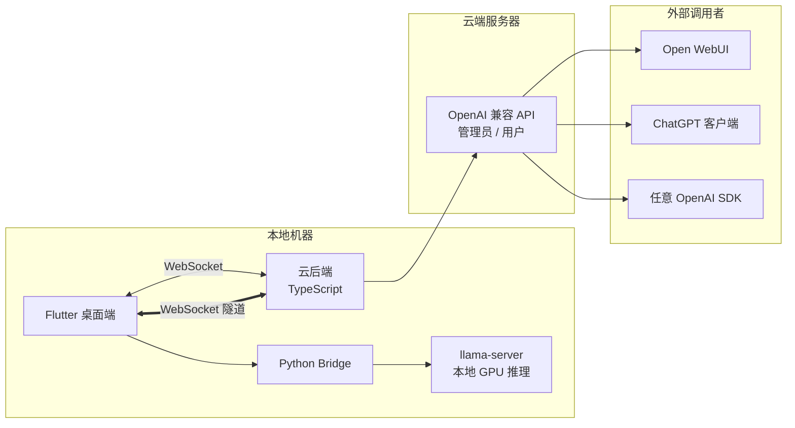

# OpenMyModel


> [**English**](README_EN.md) | **中文**


> **让本地 GPU 算力走出局域网，以标准 OpenAI API 触达世界。**
>
> OpenMyModel 帮助你将本地运行的 llama.cpp 大模型无缝推送到自有云服务器，通过业界通用的 OpenAI 兼容接口对外提供服务。无论你是有闲置 GPU 的个人开发者、想折腾自部署模型的技术爱好者，还是需要为小团队搭建私有推理节点的运维者，这里都有你所需的一切——无需公网 IP，无需复杂运维，一条 WebSocket 隧道即可将本机模型变为云端 API。
>
> #### 为什么自己部署？
> 免费在线大模型虽触手可及，却几乎都经过过度量化——提供给你的是智力"降级版"。我实测对比：一台消费级显卡上跑 **Qwen 3.5 9B INT8**，在逻辑推理和数学推导上明显优于所谓"旗舰级"的免费在线服务。免费 API 为了成本极致压缩，你拿到的其实只是同名模型的一张影子。而当你自己掌控精度和参数，每一轮推理都在真实权重上完成，体验的差距会超出你的预期。
>
> #### 不止自用，更可共享与变现
> OpenMyModel 的设计初衷不止于"自己用"——它同时为算力共享而生。你可以为团队成员、朋友甚至社区用户分发 API Key，按需管理配额与用量。闲置 GPU 不再是沉没成本：从零开始的算力变现，从一枚 `sk-` 密钥开始。

**将本地 llama.cpp 算力通过 WebSocket 隧道暴露到云端，以 OpenAI 兼容 API 供外部调用。**

> 你的 GPU，你的模型，你自己的 API 服务 —— 无需公网 IP。

---

## 🏗 架构总览



### 三组件职责

| 组件 | 技术栈 | 角色 |
|------|--------|------|
| **Flutter 桌面端** | Flutter + Dart | UI 界面 / llama-server 管理 / API Key 管理（本地存储+本地验证）/ 模型对话 |
| **Python Bridge** | Python | 进程管理 / llama-server 启动停止 / WebSocket 隧道客户端 |
| **云后端** | TypeScript + Node.js | WebSocket 服务端 / 请求透明转发到 llama-server / CLI 管理工具 |

---

## ✨ 核心特性

- **🖥 本地 GPU 推理**：llama.cpp 全参数控制，Q8 缓存、GPU 加速
- **🌐 WebSocket 隧道**：无需公网 IP，家庭主机也能上云
- **🔑 纯本地密钥管理**：API Key 仅存储在前端本地，云端零存储，杜绝泄漏
- **🔄 OpenAI 兼容 API**：`/v1/chat/completions`、`/v1/models`，支持流式 (SSE)
- **🖼 多模态支持**：mmproj 视觉投影，图片识别能力
- **💬 内置对话界面**：多图上传 + 文字，流式响应
- **📦 参数档案**：预置多份 llama 推理配置，一键切换
- **🛠 中文 CLI**：云后端通过向导式命令行完成初始化和管理
- **⚡ 实时状态**：llama-server 状态、云端连接状态实时跟踪


## 📸 界面截图

### 首页 — 模型配置与启动


### 云端连接 — API Key 管理与节点状态


---
## 📂 目录结构

```
output_my_model/
├── frontend/                 # Flutter 桌面应用
│   ├── lib/
│   │   ├── main.dart         # 入口
│   │   ├── models/           # 数据模型
│   │   ├── pages/            # 页面（首页/配置/对话/云端/插件）
│   │   ├── plugins/          # 联网插件
│   │   ├── services/         # WebSocket / API 服务
│   │   └── widgets/          # UI 组件
│   ├── windows/              # Windows 平台文件
│   ├── pubspec.yaml
│   └── pubspec.lock
├── python/                   # Python 业务层
│   ├── bridge_server.py      # WebSocket 桥梁 + HTTP API
│   ├── server_manager.py     # llama-server 进程管理
│   ├── config_manager.py     # 配置档案管理
│   ├── chat_handler.py       # 对话处理
│   └── requirements.txt
├── backend/                  # TypeScript 云后端
│   ├── src/
│   │   ├── index.ts          # Express + WebSocket 入口
│   │   ├── cli.ts            # 中文 CLI 交互
│   │   ├── config.ts         # 配置文件管理
│   │   ├── db/               # 数据库层 (SQLite)
│   │   ├── routes/           # API 路由
│   │   │   ├── openai.ts     # OpenAI 兼容代理
│   │   │   └── admin.ts      # 管理接口
│   │   └── services/         # 业务服务
│   │       ├── websocket.ts  # WebSocket 连接池
│   │       └── auth.ts       # 认证
│   ├── data/                 # 运行时数据（不提交）
│   ├── package.json
│   └── tsconfig.json
├── scripts/                  # 工具脚本
│   └── mock_node.js          # 模拟节点（测试用）
├── docs/                     # 文档与截图
├── OpenMyModel.png                 # README 头图
├── logo.png                  # 应用图标
├── LICENSE
└── README.md
```

---

## 🚀 快速开始

### 环境要求

- **Flutter** 3.x+（Windows/macOS/Linux）
- **Python** 3.10+，conda 虚拟环境推荐
- **Node.js** 18+ (云后端)
- **llama.cpp** 编译好的 `llama-server` 可执行文件
- **模型文件**（GGUF 格式，如 Qwen 3.5 9B Q8）+ 可选 mmproj 文件

### 1. 前端 (Windows)

```bash
cd frontend
flutter pub get
flutter run -d windows
```

### 2. Python 业务层

```bash
cd python
conda activate myenv              # 或创建新环境
pip install -r requirements.txt
python bridge_server.py
```

### 3. 云后端

```bash
cd backend
npm install
npm run dev                        # 默认端口 3000
```

### 4. CLI 管理（云后端）

```bash
cd backend
npx ts-node src/cli.ts
```

向导式设置域名、密码、查看节点状态。

---


## ☁️ 云后端部署指南（宝塔面板 · 超详细）

> **目标**：在阿里云/腾讯云服务器上使用宝塔面板部署 OpenMyModel 云后端，对接自有域名。

### 前置条件

| 条件 | 说明 |
|------|------|
| 服务器 | 阿里云 ECS / 腾讯云 CVM，最低 1 核 2G |
| 系统 | CentOS 7+ / Ubuntu 20.04+ / Debian 11+ |
| 域名 | 已备案域名，DNS 已解析到服务器 IP |
| 宝塔面板 | 已安装并可登录 |
| SSH | root 权限 |

---

### 第一步：宝塔面板环境准备

#### 1.1 登录宝塔 → 软件商店 → 安装

| 软件 | 用途 | 说明 |
|------|------|------|
| Nginx | 反向代理（80/443 端口 → 后端 3000） | 免费，一键安装 |
| Node.js 版本管理器 | 管理多版本 Node.js 运行时 | 免费，一键安装 |

#### 1.2 安装 Node.js（关键！）

宝塔 → 软件商店 → Node.js 版本管理器 → 安装 **v22.x**（v24 亦可，推荐 v22 LTS）

**⚠️ 宝塔 PM2 管理器的坑（重要！）**：

- 宝塔的「PM2 管理器」插件默认绑定宝塔自带的 Node.js 版本（通常是 v16/v18）
- 你用 Node.js 版本管理器切换到 v22 后，宝塔 PM2 管理器找不到正确的 node 路径
- **推荐做法**：**不装宝塔 PM2 管理器**，直接用 npm 全局安装 PM2
- 如果已装了宝塔 PM2 管理器：软件商店 → 卸载 PM2 管理器，然后继续

#### 1.3 创建项目目录（绕过宝塔 www 限制）

**⚠️ 关于宝塔的 `/www/wwwroot/` 限制**：

宝塔「网站」功能默认把站点绑定到 `/www/wwwroot/` 下，但这只是宝塔管理静态网站的惯例，并非技术限制。我们的后端是独立 Node.js 进程，可以放在**任意路径**，只要 Nginx 反向代理指向正确端口即可。

```bash
# 创建独立工作目录（不在 /www/wwwroot/ 内）
mkdir -p /aiapi
cd /aiapi
```

---

### 第二步：云服务器安全组配置

阿里云/腾讯云控制台 → 安全组 → 入方向规则 → 添加：

| 端口 | 协议 | 授权对象 | 说明 |
|------|------|----------|------|
| 80 | TCP | 0.0.0.0/0 | HTTP（Nginx 对外） |
| 443 | TCP | 0.0.0.0/0 | HTTPS（SSL，推荐配置） |
| 22 | TCP | 你的出口 IP | SSH 远程管理 |

**⚠️ 3000 端口不要对外开放！** 安全策略：

```
外部请求 → Nginx(80/443) → 反向代理 → 127.0.0.1:3000(后端)
                                     ↑ 仅本机可访问
```

如果之前误开了 3000 端口对外，现在去安全组**删除**那条规则。

---

### 第三步：部署后端代码

SSH 登录服务器：

```bash
# 创建工作目录
mkdir -p /aiapi
cd /aiapi

# 方案 A：git clone（推荐）
git clone https://github.com/tianxingstarsky/OpenMyModel.git backend
cd backend/backend

# 方案 B：本机打包上传（如果服务器网络差）
# 本机执行：tar -czf backend.tar.gz 你的项目路径/backend/
# scp backend.tar.gz root@你的服务器:/aiapi/
# 服务器：cd /aiapi && mkdir -p backend && tar -xzf backend.tar.gz

# 安装依赖
npm install

# 编译 TypeScript（关键步骤！）
npm run build
```

**⚠️ 为什么必须 `npm run build`？**

`tsconfig.json` 已配置 `"module": "commonjs"`，编译后的 `dist/index.js` 使用 `require()` 而非 `import`。如果直接运行 `src/index.ts` 或用 `tsx` 跑源码，会报：

```
SyntaxError: Cannot use import statement outside a module
```

编译后验证：

```bash
# 确认 dist 目录存在
ls dist/

# 确认是 CommonJS 格式（第一行应为 require）
head -3 dist/index.js
# 正确输出示例：
# "use strict";
# var __importDefault = ...
# const fastify_1 = __importDefault(require("fastify"));
```

---

### 第四步：初始化配置（两种方式任选）

#### 方式 A：CLI 向导（推荐，中文交互）

```bash
cd /aiapi/backend/backend
npm run setup
```

交互对话示例：

```
╔══════════════════════════════════════════════╗
║       OpenMyModel 云后端 - 初始化向导          ║
╚══════════════════════════════════════════════╝

Step 1: 域名 (如 aiapi.topofmoon.com)
域名: aiapi.topofmoon.com          ← 输入你的域名

Step 2: 管理员密码（至少6字符，用于前端连接）
密码: ********                     ← 设置强密码
确认密码: ********

Step 3: 端口
端口 [3000]:                       ← 回车默认 3000

╔══════════════════════════════════════════════╗
║          配置完成                             ║
║  域名: aiapi.topofmoon.com                  ║
║  端口: 3000                                  ║
║  配置文件: data/config.json                  ║
╚══════════════════════════════════════════════╝
```

#### 方式 B：环境变量（适合自动化）

```bash
cd /aiapi/backend/backend

export ADMIN_PASSWORD="你的强密码"
export DOMAIN="aiapi.topofmoon.com"
export PORT=3000

# 首次启动时，后端检测到缺失 config.json 会自动创建
```

**⚠️ 密码持久化说明**：密码以 SHA-256 + salt 哈希存储在 `data/config.json` 中，非明文。首次通过环境变量初始化后，后续 PM2 启动无需再设环境变量。

---

### 第五步：PM2 进程守护

```bash
cd /aiapi/backend/backend

# 1. 全局安装 PM2（不用宝塔 PM2 管理器）
npm install -g pm2

# 2. 确认安装成功
which pm2
pm2 -v

# 3. 启动后端
pm2 start dist/index.js --name openmymodel

# 4. 保存进程列表
pm2 save

# 5. 设置开机自启（执行输出的那行命令）
pm2 startup
# 输出示例: sudo env PATH=$PATH:/usr/bin pm2 startup systemd -u root --hp /root
# 复制并执行上面那行命令！

# 6. 查看运行状态
pm2 status

# 7. 查看启动日志
pm2 logs openmymodel --lines 20
```

**启动成功的标志**——日志中应看到：

```
╔══════════════════════════════════════════════╗
║  OpenMyModel 云服务已启动                      ║
║  地址: http://0.0.0.0:3000                  ║
║  域名: aiapi.topofmoon.com                  ║
║  WebSocket: /ws/node                        ║
║  API: /v1/chat/completions                  ║
║  管理员接口: /admin/*                        ║
╚══════════════════════════════════════════════╝
```

如果看到 `SyntaxError: Cannot use import statement outside a module`，说明没执行 `npm run build`，回到第三步重新编译。

---

### 第六步：宝塔反向代理（WebSocket 关键配置！）

#### 6.1 添加站点

宝塔面板 → 网站 → 添加站点：

| 字段 | 值 |
|------|-----|
| 域名 | `aiapi.topofmoon.com` |
| 根目录 | `/www/wwwroot/aiapi`（建个空目录即可） |
| PHP 版本 | **纯静态** |

```bash
mkdir -p /www/wwwroot/aiapi
```

#### 6.2 配置反向代理

站点列表 → `aiapi.topofmoon.com` → 反向代理 → 添加反向代理：

| 字段 | 值 |
|------|-----|
| 代理名称 | `openmymodel` |
| 目标 URL | `http://127.0.0.1:3000` |
| 发送域名 | `$host` |

#### 6.3 编辑配置文件（WebSocket 支持 —— 最重要的一步！）

站点 → 配置文件 → 找到 `location /` 块，**完整替换**为：

```nginx
location / {
    proxy_pass http://127.0.0.1:3000;
    proxy_http_version 1.1;

    # WebSocket 支持（必须！缺少会导致前端连不上云端）
    proxy_set_header Upgrade $http_upgrade;
    proxy_set_header Connection "upgrade";

    # 标准代理头
    proxy_set_header Host $host;
    proxy_set_header X-Real-IP $remote_addr;
    proxy_set_header X-Forwarded-For $proxy_add_x_forwarded_for;
    proxy_set_header X-Forwarded-Proto $scheme;

    # 超时设置（WebSocket 长连接）
    proxy_read_timeout 3600s;
    proxy_send_timeout 3600s;

    # 关闭缓冲（SSE 流式响应需要）
    proxy_buffering off;

    # 上传限制
    client_max_body_size 50m;
}
```

**⚠️ 这是最容易出错的步骤**：

- 缺少 `Upgrade` 和 `Connection` 头 → WebSocket 瞬间断开（「闪一下就断了」的 Bug 根因）
- 缺少 `proxy_buffering off` → SSE 流式响应被缓冲，看不到逐字输出
- 目标 URL 必须是 `http://127.0.0.1:3000`，不是 `http://localhost:3000`

保存后宝塔会自动 reload Nginx。

---

### 第七步：HTTPS/SSL 证书（推荐）

宝塔面板 → 网站 → `aiapi.topofmoon.com` → SSL：

1. 选择「Let's Encrypt」或「宝塔 SSL」
2. 勾选域名 → 申请
3. 开启「强制 HTTPS」

**申请后再次检查 Nginx 配置**，确认 `location /` 块仍包含第六步的 WebSocket 配置（有时宝塔 SSL 会覆盖之前的手动修改）。

---

### 第八步：验证部署

#### 8.1 浏览器测试

访问 `http://你的域名/`，应返回：

```json
{"name":"OpenMyModel Cloud API","version":"1.0.0","domain":"你的域名","endpoints":{"models":"/v1/models","chat":"/v1/chat/completions","admin":"/admin/*","websocket":"/ws/node"}}
```

#### 8.2 WebSocket 测试

```bash
npm install -g wscat
wscat -c ws://你的域名/ws/node
# 连接后手动输入：
{"type":"auth","password":"你的管理员密码"}
# 应收到：
{"type":"auth_ok","nodeId":"xxx-xxx-xxx","message":"认证成功，节点已注册"}
```

#### 8.3 PM2 确认

```bash
pm2 status
pm2 logs openmymodel --lines 10
```

---

### 第九步：Flutter 前端连接云端

打开 OpenMyModel 桌面端 → 云端连接：

| 字段 | 值 | 说明 |
|------|-----|------|
| 服务器地址 | `aiapi.topofmoon.com` | **不加 http://，不加端口号！** |
| 密码 | 你设置的管理员密码 | 第四步 `npm run setup` 设置的密码 |

**⚠️ 为什么不能加端口号？**

```
错误: aiapi.topofmoon.com:3000 → 直连后端 3000 端口 → 安全组已禁止外部访问 → 超时
正确: aiapi.topofmoon.com      → Nginx 80/443 → 反向代理到 127.0.0.1:3000 → 成功
```

**连接成功标志**：状态指示灯绿色 → 显示「已连接」→ 可生成 API Key。

---

## 🐛 排错指南（真实踩坑记录）

### PM2 相关

| 问题 | 原因 | 解决 |
|------|------|------|
| 宝塔提示「PM2 未安装」 | 宝塔 PM2 管理器用了自带的旧 Node.js | 卸载宝塔 PM2 管理器，用 `npm install -g pm2` 全局安装 |
| PM2 报 `Cannot use import statement outside a module` | 直接跑了 TS 源码 | 执行 `npm run build` 后再启动 |
| `ERR_MODULE_NOT_FOUND: Cannot find module './config'` | 之前 tsconfig 是 ESM 模式 | 已改为 CommonJS，重新 `npm run build` 即可 |

### WebSocket / 连接相关

| 问题 | 原因 | 解决 |
|------|------|------|
| 前端连接「闪一下就断开」 | Nginx 缺 WebSocket 代理头 | 第六步 → 确认 `Upgrade` 和 `Connection` 头存在 |
| 浏览器 JSON 正常，前端连不上 | HTTP 不需要 WebSocket 头，所以浏览器 OK | 同上，改 Nginx 配置 |
| 显示「无在线节点」 | Flutter 还没连 | 正常——打开桌面端连上后才有节点 |
| `RangeError: Not in inclusive range 0.69: 200` | HTTP 状态码解析异常 | 检查后端错误日志 `pm2 logs openmymodel --err` |

### API Key 相关

| 问题 | 原因 | 解决 |
|------|------|------|
| `HTTP 401: Invalid API Key` | 密钥未同步到当前 WebSocket 节点 | **新建一个密钥**（v0.3.1+ 连接前会自动加载密钥） |
| 旧密钥用不了，新建才行 | 节点重连后旧映射可能失效 | 正常行为——重连后建议新建密钥 |
| 已有密钥但 401 | 密钥加载时序问题 | 已修复，确保用的是最新版 |

### 网络 / 端口

| 问题 | 原因 | 解决 |
|------|------|------|
| 域名访问无响应 | 安全组未开 80/443 | 云控制台 → 安全组 → 添加规则 |
| `wscat` 超时 | DNS 未解析 或 安全组未开 | `ping 你的域名` 检查；查安全组 |

---

## 🔄 后续运维

### 日常管理

```bash
# PM2 管理
pm2 status                          # 查看状态
pm2 logs openmymodel                # 实时日志
pm2 logs openmymodel --err          # 只看错误
pm2 restart openmymodel             # 重启
pm2 stop openmymodel                # 停止
pm2 delete openmymodel              # 删除进程

# 查看配置
cat /aiapi/backend/backend/data/config.json

# 修改管理员密码
cd /aiapi/backend/backend && npm run setup
# 选择「重置密码」→ pm2 restart openmymodel

# 更新代码
cd /aiapi/backend/backend
git pull origin main
npm install
npm run build                       # 每次更新必须重新编译！
pm2 restart openmymodel
pm2 logs openmymodel --lines 10     # 确认启动成功
```

### 服务器目录结构

```
/aiapi/
└── backend/
    └── backend/              # 后端项目根目录
        ├── dist/             # 编译产物（实际运行）
        │   ├── index.js      # PM2 启动的入口
        │   ├── config.js
        │   ├── db/
        │   └── routes/
        ├── data/
        │   ├── config.json   # 配置文件（密码哈希、域名等）
        │   └── openmymodel.db # SQLite 数据库
        ├── src/              # TypeScript 源码
        ├── node_modules/
        ├── package.json
        └── tsconfig.json
```

> 💡 重装系统前，备份 `data/` 目录即可保留所有配置和节点数据。

---

## 🔐 安全设计

```
API Key 验证流程:
  用户请求 → 云后端 → 提取 API Key
                      → 查找对应 WebSocket 节点
                      → 发送 { action: "validate_key", key: "sk-xxx" }
                      → Flutter 前端 本地检查密钥
                      → 返回验证结果
                      → 通过后透明转发请求到 llama-server

关键原则：云后端 NEVER 存储 API Key，全权由算力提供者控制
```

---

## 🔗 使用示例

### 配置 Open WebUI

在 Open WebUI 中添加 OpenAI 兼容连接：

- **API URL**: `https://你的域名/v1`
- **API Key**: 前端生成的 `sk-` 开头密钥

### curl 测试

```bash
curl https://你的域名/v1/chat/completions \
  -H "Content-Type: application/json" \
  -H "Authorization: Bearer sk-你的密钥" \
  -d '{"model":"qwen","messages":[{"role":"user","content":"你好"}]}'
```

---

## 📝 许可证

MIT License — 详见 [LICENSE](LICENSE)

---

## 🙏 鸣谢

- [llama.cpp](https://github.com/ggerganov/llama.cpp) — GGUF 推理引擎
- [Open WebUI](https://github.com/open-webui/open-webui) — 对话前端参考
- [unsloth](https://github.com/unslothai/unsloth) — 参数设计灵感

