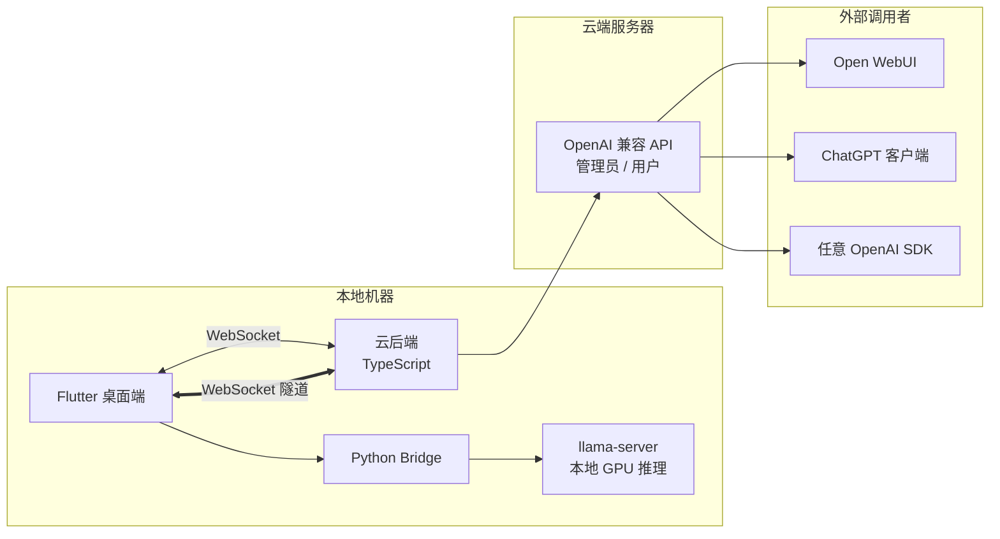
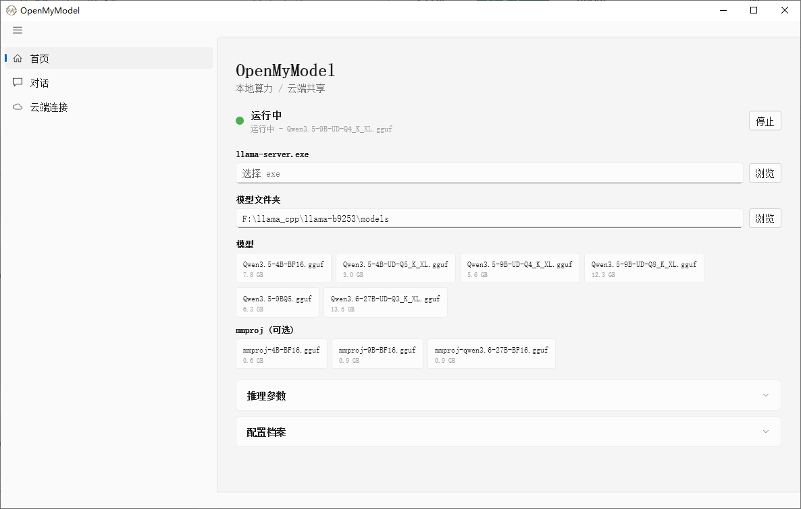
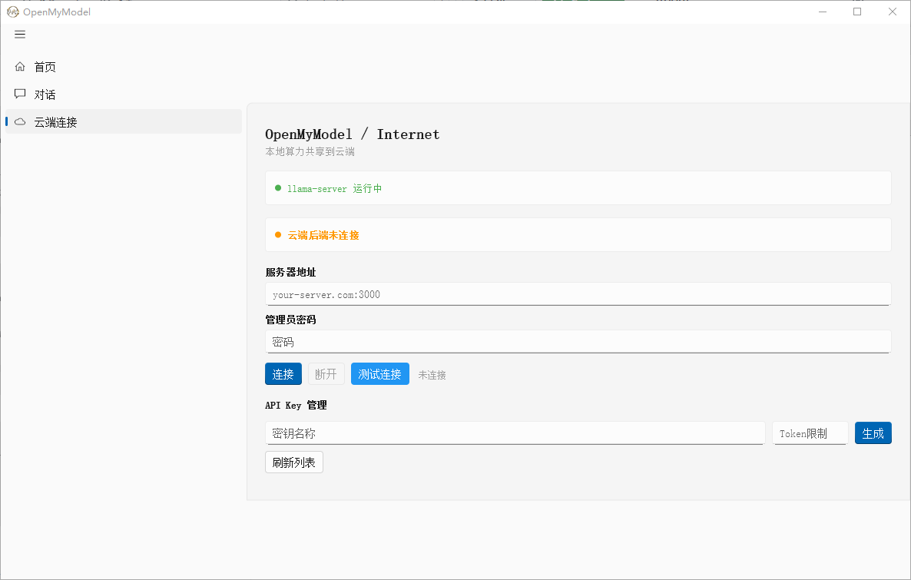

# OpenMyModel


> [**English**](README_EN.md) | **中文**


> **让本地 GPU 算力走出局域网，以标准 OpenAI API 触达世界。**
>
> OpenMyModel 帮助你将本地运行的 llama.cpp 大模型无缝推送到自有云服务器，通过业界通用的 OpenAI 兼容接口对外提供服务。无论你是有闲置 GPU 的个人开发者、想折腾自部署模型的技术爱好者，还是需要为小团队搭建私有推理节点的运维者，这里都有你所需的一切——无需公网 IP，无需复杂运维，一条 WebSocket 隧道即可将本机模型变为云端 API。
>
> #### 为什么自己部署？
> 免费在线大模型虽触手可及，却几乎都经过过度量化——提供给你的是智力"降级版"。我实测对比：一台消费级显卡上跑 **Qwen 3.5 9B INT8**，在逻辑推理和数学推导上明显优于所谓"旗舰级"的免费在线服务。免费 API 为了成本极致压缩，你拿到的其实只是同名模型的一张影子。而当你自己掌控精度和参数，每一轮推理都在真实权重上完成，体验的差距会超出你的预期。
>
> #### 不止自用，更可共享与变现
> OpenMyModel 的设计初衷不止于"自己用"——它同时为算力共享而生。你可以为团队成员、朋友甚至社区用户分发 API Key，按需管理配额与用量。闲置 GPU 不再是沉没成本：从零开始的算力变现，从一枚 `sk-` 密钥开始。

**将本地 llama.cpp 算力通过 WebSocket 隧道暴露到云端，以 OpenAI 兼容 API 供外部调用。**

> 你的 GPU，你的模型，你自己的 API 服务 —— 无需公网 IP。

---

## 🏗 架构总览



### 三组件职责

| 组件 | 技术栈 | 角色 |
|------|--------|------|
| **Flutter 桌面端** | Flutter + Dart | UI 界面 / llama-server 管理 / API Key 管理（本地存储+本地验证）/ 模型对话 |
| **Python Bridge** | Python | 进程管理 / llama-server 启动停止 / WebSocket 隧道客户端 |
| **云后端** | TypeScript + Node.js | WebSocket 服务端 / 请求透明转发到 llama-server / CLI 管理工具 |

---

## ✨ 核心特性

- **🖥 本地 GPU 推理**：llama.cpp 全参数控制，Q8 缓存、GPU 加速
- **🌐 WebSocket 隧道**：无需公网 IP，家庭主机也能上云
- **🔑 纯本地密钥管理**：API Key 仅存储在前端本地，云端零存储，杜绝泄漏
- **🔄 OpenAI 兼容 API**：`/v1/chat/completions`、`/v1/models`，支持流式 (SSE)
- **🖼 多模态支持**：mmproj 视觉投影，图片识别能力
- **💬 内置对话界面**：多图上传 + 文字，流式响应
- **📦 参数档案**：预置多份 llama 推理配置，一键切换
- **🛠 中文 CLI**：云后端通过向导式命令行完成初始化和管理
- **⚡ 实时状态**：llama-server 状态、云端连接状态实时跟踪


## 📸 界面截图

### 首页 — 模型配置与启动


### 云端连接 — API Key 管理与节点状态


---
## 📂 目录结构

```
output_my_model/
├── frontend/                 # Flutter 桌面应用
│   ├── lib/
│   │   ├── main.dart         # 入口
│   │   ├── models/           # 数据模型
│   │   ├── pages/            # 页面（首页/配置/对话/云端/插件）
│   │   ├── plugins/          # 联网插件
│   │   ├── services/         # WebSocket / API 服务
│   │   └── widgets/          # UI 组件
│   ├── windows/              # Windows 平台文件
│   ├── pubspec.yaml
│   └── pubspec.lock
├── python/                   # Python 业务层
│   ├── bridge_server.py      # WebSocket 桥梁 + HTTP API
│   ├── server_manager.py     # llama-server 进程管理
│   ├── config_manager.py     # 配置档案管理
│   ├── chat_handler.py       # 对话处理
│   └── requirements.txt
├── backend/                  # TypeScript 云后端
│   ├── src/
│   │   ├── index.ts          # Express + WebSocket 入口
│   │   ├── cli.ts            # 中文 CLI 交互
│   │   ├── config.ts         # 配置文件管理
│   │   ├── db/               # 数据库层 (SQLite)
│   │   ├── routes/           # API 路由
│   │   │   ├── openai.ts     # OpenAI 兼容代理
│   │   │   └── admin.ts      # 管理接口
│   │   └── services/         # 业务服务
│   │       ├── websocket.ts  # WebSocket 连接池
│   │       └── auth.ts       # 认证
│   ├── data/                 # 运行时数据（不提交）
│   ├── package.json
│   └── tsconfig.json
├── scripts/                  # 工具脚本
│   └── mock_node.js          # 模拟节点（测试用）
├── docs/                     # 文档与截图
├── OpenMyModel.png                 # README 头图
├── logo.png                  # 应用图标
├── LICENSE
└── README.md
```

---

## 🚀 快速开始

### 环境要求

- **Flutter** 3.x+（Windows/macOS/Linux）
- **Python** 3.10+，conda 虚拟环境推荐
- **Node.js** 18+ (云后端)
- **llama.cpp** 编译好的 `llama-server` 可执行文件
- **模型文件**（GGUF 格式，如 Qwen 3.5 9B Q8）+ 可选 mmproj 文件

### 1. 前端 (Windows)

```bash
cd frontend
flutter pub get
flutter run -d windows
```

### 2. Python 业务层

```bash
cd python
conda activate myenv              # 或创建新环境
pip install -r requirements.txt
python bridge_server.py
```

### 3. 云后端

```bash
cd backend
npm install
npm run dev                        # 默认端口 3000
```

### 4. CLI 管理（云后端）

```bash
cd backend
npx ts-node src/cli.ts
```

向导式设置域名、密码、查看节点状态。

---


## ☁️ 云后端部署指南（宝塔面板 · 按钮级操作）

> **目标**：在阿里云/腾讯云服务器上，通过宝塔面板以纯图形化方式部署 OpenMyModel 云后端。
>
> 全程无需手动敲 PM2 命令，全部通过宝塔面板的「Node项目」和「反向代理」功能完成。编译全部在服务器上进行，零平台适配问题。

### 前置条件

| 条件 | 说明 |
|------|------|
| 服务器 | 阿里云 ECS / 腾讯云 CVM，最低 1 核 2G |
| 系统 | CentOS 7+ / Ubuntu 20.04+ / Debian 11+ |
| 域名 | 已备案，DNS 已解析到服务器 IP |
| 宝塔面板 | 已安装并可登录 |
| SSH | root 权限（上传代码用） |

---

### 第一步：宝塔软件商店安装环境

登录宝塔面板，左侧菜单 **「软件商店」**，搜索并安装以下软件（点击「安装」按钮即可）：

| 软件 | 用途 | 安装方式 |
|------|------|----------|
| **Nginx** | 反向代理（80/443 转发到后端 3000） | 软件商店 -> 搜索 Nginx -> 点击「安装」-> 选最新稳定版 |
| **Node.js版本管理器** | 管理多版本 Node.js | 软件商店 -> 搜索 Node -> 点击「安装」 |
| **PM2管理器** | 进程守护，面板内启停 | 软件商店 -> 搜索 PM2 -> 点击「安装」 |

> **关于 PM2 管理器**：宝塔的 PM2 管理器可以在面板中独立管理不同 Node.js 版本的项目。它和 Node.js 版本管理器协同工作 -- 你在版本管理器里装好 Node 后，PM2 管理器会自动识别。

---

### 第二步：安装 Node.js 版本

宝塔面板，左侧菜单 **「软件商店」**，找到已安装的 **「Node.js版本管理器」**，点击右侧 **「设置」** 按钮：

1. 在弹出窗口中，看到 Node.js 版本列表
2. 找到 **v22.x**（推荐 v22 LTS），点击右侧的 **「安装」** 按钮
3. 等待安装完成，状态变为「已安装」
4. 点击 v22.x 右侧的 **「命令行版本」** 按钮，设为默认版本

> 如果服务器上已有其他版本（如 v16、v18），不影响 -- 可以共存。在 Node项目 中可以为每个项目单独选择版本。

---

### 第三步：云服务器安全组配置

阿里云/腾讯云控制台 -> 安全组 -> 入方向 -> 添加规则：

| 端口 | 协议 | 授权对象 | 说明 |
|------|------|----------|------|
| 80 | TCP | 0.0.0.0/0 | HTTP（Nginx 对外入口） |
| 443 | TCP | 0.0.0.0/0 | HTTPS（SSL，强烈建议） |
| 22 | TCP | 你的出口 IP | SSH 管理 |

> **3000 端口不需要对外开放！** 流量路径：
>
> 外部请求 -> Nginx(80) -> 反向代理 -> 127.0.0.1:3000(后端)
>                                       仅本机可访问
>
> 如果之前误开了 3000 端口对外，现在去安全组删除那条规则。

---

### 第四步：上传后端代码

SSH 登录服务器：

```bash
# 创建工作目录
mkdir -p /aiapi
cd /aiapi

# 克隆代码
git clone https://github.com/tianxingstarsky/OpenMyModel.git backend backend
cd backend/backend

# 安装依赖
npm install

# 编译 TypeScript（关键！！！）
npm run build
```

> **必须执行 `npm run build`**：源码是 TypeScript，`tsconfig.json` 配置输出 CommonJS 格式。编译后 `dist/index.js` 才是可运行文件。不编译会报 `Cannot use import statement outside a module`。

验证编译结果：
```bash
ls dist/
# 应有：index.js  config.js  db/  routes/
head -3 dist/index.js
# 正确输出（CommonJS 格式）：
# "use strict";
# var __importDefault = ...
# const fastify_1 = __importDefault(require("fastify"));
```

---

### 第五步：宝塔「Node项目」启动后端（纯面板操作，不敲命令！）

#### 5.1 进入 Node 项目管理

宝塔面板 -> 左侧菜单 **「网站」** -> 顶部标签栏切换到 **「Node项目」**：

```
[ 网站 ]  [ Node项目 ]  [ ... ]
          ^^^^^^^^^^^^
          点这个标签
```

#### 5.2 添加 Node 项目

点击 **「添加Node项目」** 按钮（通常位于列表右上角），弹出配置窗口，逐项填写：

**项目目录**：
```
/aiapi/backend/backend
```
-> 点右侧「选择」按钮浏览目录，或直接粘贴路径。

**启动选项**：
```
dist/index.js
```
-> 下拉选择「启动文件」，输入 `dist/index.js`
-> **注意：不是 `src/index.ts`！必须是编译后的 dist 目录下的文件！**

**项目名称**：
```
openmymodel
```
-> 自定义名称，在面板列表中识别用。

**运行端口**：
```
3000
```

**Node版本**：
-> 下拉选择 **v22.x**

**项目备注**（可选）：
```
OpenMyModel 云端 API 服务
```

**绑定域名**：
-> 先留空，后面通过反向代理配置

**开机启动**：
-> 勾选 ✅

填写完毕后，点击窗口底部 **「提交」** 按钮。

#### 5.3 启动项目

回到「Node项目」列表，找到刚创建的 `openmymodel`：

| 项目名称 | 端口 | 状态 | 操作 |
|----------|------|------|------|
| openmymodel | 3000 | ● 已停止 | [启动] [重启] [设置] [删除] [日志] |

点击 **「启动」** 按钮。状态变为 **● 运行中** 即成功。

#### 5.4 查看日志确认成功

在 `openmymodel` 所在行，点击 **「日志」** 按钮，应看到：

```
╔══════════════════════════════════════════════╗
║  OpenMyModel 云服务已启动                      ║
║  地址: http://0.0.0.0:3000                  ║
║  域名: api.your-domain.com                  ║
║  WebSocket: /ws/node                        ║
║  API: /v1/chat/completions                  ║
║  管理员接口: /admin/*                        ║
╚══════════════════════════════════════════════╝
```

#### 5.5 PM2 管理器确认（可选）

宝塔面板 -> 左侧菜单 **「软件商店」** -> 找到 **「PM2管理器」** -> 点击 **「设置」**：

你会看到 `openmymodel` 进程已经在列表中，状态为 `online`。宝塔已经自动通过 PM2 管理了这个进程。

---


---

### 第六步：创建网站站点 + 反向代理（精确到按钮！）

#### 7.1 添加网站站点

宝塔面板 -> 左侧菜单 **「网站」** -> 顶部标签 **「网站」**（默认就是）-> 点击 **「添加站点」**（绿色按钮）：

弹出窗口填写：

| 字段 | 值 |
|------|-----|
| 域名 | `api.your-domain.com` |
| 根目录 | `/www/wwwroot/aiapi` |
| PHP版本 | **纯静态** |

其他字段保持默认，点击 **「提交」**。

> 如果没有 `/www/wwwroot/aiapi` 目录，宝塔会自动创建。

#### 6.2 进入网站站点设置（注意：是"网站"设置，不是"Node项目"设置！）

在「网站」列表中找到刚创建的 `api.your-domain.com`，点击站点域名打开设置窗口。顶部标签栏：

```
[ 域名管理 ] [ SSL ] [ 反向代理 ] [ 配置文件 ] [ ... ]
            ↑                            ↑
       反向代理在这里配             WebSocket 配置在这里改
```

> ⚠️ **关键区别**："Node项目"的设置页面里**没有**反向代理标签。反向代理只能通过"网站"站点来配置。两个是独立的：
> - **网站站点**：负责域名绑定 + 反向代理 + SSL
> - **Node项目**：只负责运行 Node.js 进程

#### 6.3 添加反向代理

站点设置窗口 -> 点击 **「反向代理」** 标签 -> 点击 **「添加反向代理」** 按钮：

| 字段 | 值 |
|------|-----|
| 代理名称 | `openmymodel` |
| 目标URL | `http://127.0.0.1:3000` |
| 发送域名 | `$host` |
| 内容替换 | 留空 |

点击「提交」。

#### 6.4 编辑配置文件（WebSocket 支持 —— 最关键一步！）

在站点设置窗口（注意，是"网站"站点的设置，不是 Node项目的），点击 **「配置文件」** 标签。找到 `location /` 块，**完整替换**为：

```nginx
location / {
    proxy_pass http://127.0.0.1:3000;
    proxy_http_version 1.1;
    proxy_set_header Upgrade $http_upgrade;
    proxy_set_header Connection "upgrade";
    proxy_set_header Host $host;
    proxy_set_header X-Real-IP $remote_addr;
    proxy_set_header X-Forwarded-For $proxy_add_x_forwarded_for;
    proxy_set_header X-Forwarded-Proto $scheme;
    proxy_read_timeout 3600s;
    proxy_send_timeout 3600s;
    proxy_buffering off;
    client_max_body_size 50m;
}
```

点击「保存」，宝塔自动重载 Nginx。

---

### 第七步：HTTPS/SSL 证书（强烈推荐）

在站点设置窗口中，点击 **「SSL」** 标签：

1. 证书类型选择 **「Let's Encrypt」**
2. 勾选你的域名 `api.your-domain.com`
3. 点击 **「申请」** 按钮
4. 等待申请完成
5. 打开 **「强制HTTPS」** 开关

> **SSL 申请后务必回去检查「配置文件」标签！** 宝塔 SSL 有时会覆盖你之前手动添加的 WebSocket 配置。确认 `location /` 块里仍有 `proxy_set_header Upgrade $http_upgrade;` 和 `Connection "upgrade";` 两行。如果被覆盖了，重新按 7.4 步骤编辑。

---

### 第八步：验证部署

#### 9.1 浏览器测试

访问 `http://api.your-domain.com/`（或 `https://`），应返回：

```json
{"name":"OpenMyModel Cloud API","version":"1.0.0","domain":"api.your-domain.com","endpoints":{"models":"/v1/models","chat":"/v1/chat/completions","admin":"/admin/*","websocket":"/ws/node"}}
```

#### 9.2 WebSocket 测试

```bash
npm install -g wscat
wscat -c ws://api.your-domain.com/ws/node

# 连接后手动输入：
{"type":"auth","password":"你的管理员密码"}

# 应收到：
{"type":"auth_ok","nodeId":"xxx-xxx","message":"认证成功，节点已注册"}
```

#### 9.3 宝塔面板内确认

回到 **「网站」->「Node项目」**，`openmymodel` 状态为 **● 运行中**。

---

### 第九步：Flutter 桌面端连接云端

打开 OpenMyModel 桌面端 -> **「云端连接」** 标签页：

| 字段 | 值 | 说明 |
|------|-----|------|
| 服务器地址 | `api.your-domain.com` | **不加 http://，不加端口号！** |
| 密码 | 你在首次启动日志中自动生成的密码 | |

> **为什么不能加端口号？**
>
> `api.your-domain.com:3000` = 直连后端 3000 = 安全组已禁止外部访问 = 超时 ❌
> `api.your-domain.com` = Nginx(80) = 反向代理到 127.0.0.1:3000 = 成功 ✅

**连接成功标志**：状态灯变绿 -> 显示「已连接」-> 可生成 API Key。

---

## 🐛 排错指南（真实踩坑记录）

### PM2 / Node项目 相关

| 问题 | 原因 | 解决 |
|------|------|------|
| PM2管理器里找不到项目 | 手动 `pm2 start` 启动的，没通过宝塔「Node项目」添加 | 在 PM2 管理器里删掉手动进程，回 Node项目 -> 添加Node项目 |
| 启动报 `Cannot use import statement outside a module` | 启动文件选了 `src/index.ts`（源码） | Node项目设置 -> 启动文件改为 `dist/index.js`；SSH 执行 `npm run build` |
| `ERR_MODULE_NOT_FOUND: ./config` | 旧的 ESM tsconfig 残留 | 重新 `npm run build`（当前已是 CommonJS） |

### WebSocket 连接相关

| 问题 | 原因 | 解决 |
|------|------|------|
| 前端「闪一下就断开」 | Nginx 缺少 WebSocket 代理头 | 第六步 6.4 -> 确认 `Upgrade` 和 `Connection` 头存在 |
| 浏览器 JSON 正常，前端连不上 | HTTP 不需要 WebSocket 头（所以浏览器 OK），但 WebSocket 需要 | 同上：只有 WebSocket 会暴露配置缺失 |
| 在Node项目设置里找不到"反向代理"标签 | Node项目的设置里没有反向代理功能 | 反向代理要到「网站」-> 站点设置里配置，不是 Node项目设置 |

| Node项目运行中，域名访问无响应 | 反向代理目标URL填错 或 安全组没开 80 | 检查目标URL是 `http://127.0.0.1:3000`；检查安全组 |

### API Key 相关

| 问题 | 原因 | 解决 |
|------|------|------|
| 测试报 `HTTP 401: Invalid API Key` | 密钥未同步到当前节点 | 在桌面端「云端连接」页面**新建一个密钥**后再测试 |
| 旧密钥失效，新密钥才能用 | 节点重连后旧映射可能过期 | 正常行为；重连后新建密钥即可 |
| 已有密钥但始终 401 | 密钥加载时序竞争 | 已修复（v0.3.1+）；升级到最新版 |

### 网络 / 端口

| 问题 | 原因 | 解决 |
|------|------|------|
| 域名访问无响应 | 安全组未开放 80/443 | 云控制台 -> 安全组 -> 添加入方向规则 |
| `wscat` 连接超时 | DNS 未解析 或 安全组问题 | `ping 你的域名` 确认解析 |
| Nginx 配置保存后不生效 | 需要手动重载 | 宝塔「网站」-> Nginx 服务 -> 重载配置 |

---

## 🔄 后续运维（全在宝塔面板操作）

### 启动 / 停止 / 重启

**操作路径**：宝塔 -> **「网站」** -> **「Node项目」** -> 找到 `openmymodel`：

点击 [启动] [停止] [重启] [设置] [删除] [日志] 按钮即可。

### 查看日志

点击 **「日志」** 按钮查看实时运行日志。错误信息也会显示在这里。

### 修改配置

**修改管理员密码**：SSH 执行：
```bash
cd /aiapi/backend/backend
npm run setup
# 选择「重置密码」
```
然后回到 Node项目 页面点击 **「重启」**。

**查看当前配置**：
```bash
cat /aiapi/backend/backend/data/config.json
```
（密码是哈希过的，安全无害）

### 更新后端代码

```bash
cd /aiapi/backend/backend
git pull origin main
npm install`r`n# ⚠️ 如果报 NODE_MODULE_VERSION 错误，先执行：`r`n# rm -rf node_modules && npm install`r`nnpm run build        # 每次更新必须重新编译！
```
然后回到宝塔 Node项目 页面，点击 **「重启」**。

### 服务器目录结构

```
/aiapi/
└── OpenMyModel/
    └── backend/              # 项目根目录
        ├── dist/             # 编译产物（Node项目实际运行的文件）
        │   ├── index.js      # 入口文件
        │   ├── config.js
        │   ├── db/
        │   └── routes/
        ├── data/
        │   ├── config.json   # 中心配置
        │   └── openmymodel.db # SQLite 数据库
        ├── src/              # TypeScript 源码
        ├── node_modules/
        ├── package.json
        └── tsconfig.json
```

> 💡 重装系统前，备份 `data/` 目录即可保留全部配置和数据库。

---

### 完整 Nginx 配置参考

如果宝塔的配置编辑器混乱，可以直接全量替换为以下模板：

```nginx
server {
    listen 80;
    server_name api.your-domain.com;
    client_max_body_size 50m;

    location / {
        proxy_pass http://127.0.0.1:3000;
        proxy_http_version 1.1;
        proxy_set_header Upgrade $http_upgrade;
        proxy_set_header Connection "upgrade";
        proxy_set_header Host $host;
        proxy_set_header X-Real-IP $remote_addr;
        proxy_set_header X-Forwarded-For $proxy_add_x_forwarded_for;
        proxy_set_header X-Forwarded-Proto $scheme;
        proxy_read_timeout 3600s;
        proxy_send_timeout 3600s;
        proxy_buffering off;
    }
}
```

---

## 🔐 安全设计

```
API Key 验证流程:
  用户请求 → 云后端 → 提取 API Key
                      → 查找对应 WebSocket 节点
                      → 发送 { action: "validate_key", key: "sk-xxx" }
                      → Flutter 前端 本地检查密钥
                      → 返回验证结果
                      → 通过后透明转发请求到 llama-server

关键原则：云后端 NEVER 存储 API Key，全权由算力提供者控制
```

---

## 🔗 使用示例

### 配置 Open WebUI

在 Open WebUI 中添加 OpenAI 兼容连接：

- **API URL**: `https://你的域名/v1`
- **API Key**: 前端生成的 `sk-` 开头密钥

### curl 测试

```bash
curl https://你的域名/v1/chat/completions \
  -H "Content-Type: application/json" \
  -H "Authorization: Bearer sk-你的密钥" \
  -d '{"model":"qwen","messages":[{"role":"user","content":"你好"}]}'
```

---

## 📝 许可证

MIT License — 详见 [LICENSE](LICENSE)

---

## 🙏 鸣谢

- [llama.cpp](https://github.com/ggerganov/llama.cpp) — GGUF 推理引擎
- [Open WebUI](https://github.com/open-webui/open-webui) — 对话前端参考
- [unsloth](https://github.com/unslothai/unsloth) — 参数设计灵感

