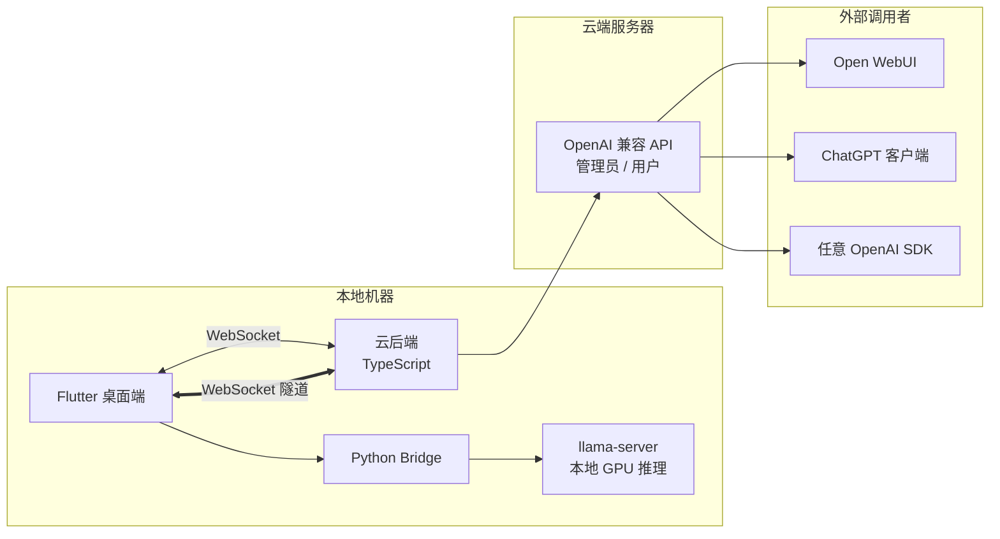

# OpenMyModel


> **让本地 GPU 算力走出局域网，以标准 OpenAI API 触达世界。**
>
> OpenMyModel 帮助你将本地运行的 llama.cpp 大模型无缝推送到自有云服务器，通过业界通用的 OpenAI 兼容接口对外提供服务。无论你是有闲置 GPU 的个人开发者、想折腾自部署模型的技术爱好者，还是需要为小团队搭建私有推理节点的运维者，这里都有你所需的一切——无需公网 IP，无需复杂运维，一条 WebSocket 隧道即可将本机模型变为云端 API。
>
> #### 为什么自己部署？
> 免费在线大模型虽触手可及，却几乎都经过过度量化——提供给你的是智力"降级版"。我实测对比：一台消费级显卡上跑 **Qwen 3.5 9B INT8**，在逻辑推理和数学推导上明显优于所谓"旗舰级"的免费在线服务。免费 API 为了成本极致压缩，你拿到的其实只是同名模型的一张影子。而当你自己掌控精度和参数，每一轮推理都在真实权重上完成，体验的差距会超出你的预期。
>
> #### 不止自用，更可共享与变现
> OpenMyModel 的设计初衷不止于"自己用"——它同时为算力共享而生。你可以为团队成员、朋友甚至社区用户分发 API Key，按需管理配额与用量。闲置 GPU 不再是沉没成本：从零开始的算力变现，从一枚 `sk-` 密钥开始。

**将本地 llama.cpp 算力通过 WebSocket 隧道暴露到云端，以 OpenAI 兼容 API 供外部调用。**

> 你的 GPU，你的模型，你自己的 API 服务 —— 无需公网 IP。

---

## 🏗 架构总览



### 三组件职责

| 组件 | 技术栈 | 角色 |
|------|--------|------|
| **Flutter 桌面端** | Flutter + Dart | UI 界面 / llama-server 管理 / API Key 管理（本地存储+本地验证）/ 模型对话 |
| **Python Bridge** | Python | 进程管理 / llama-server 启动停止 / WebSocket 隧道客户端 |
| **云后端** | TypeScript + Node.js | WebSocket 服务端 / 请求透明转发到 llama-server / CLI 管理工具 |

---

## ✨ 核心特性

- **🖥 本地 GPU 推理**：llama.cpp 全参数控制，Q8 缓存、GPU 加速
- **🌐 WebSocket 隧道**：无需公网 IP，家庭主机也能上云
- **🔑 纯本地密钥管理**：API Key 仅存储在前端本地，云端零存储，杜绝泄漏
- **🔄 OpenAI 兼容 API**：`/v1/chat/completions`、`/v1/models`，支持流式 (SSE)
- **🖼 多模态支持**：mmproj 视觉投影，图片识别能力
- **💬 内置对话界面**：多图上传 + 文字，流式响应
- **📦 参数档案**：预置多份 llama 推理配置，一键切换
- **🛠 中文 CLI**：云后端通过向导式命令行完成初始化和管理
- **⚡ 实时状态**：llama-server 状态、云端连接状态实时跟踪

---

## 📂 目录结构

```
output_my_model/
├── frontend/                 # Flutter 桌面应用
│   ├── lib/
│   │   ├── main.dart         # 入口
│   │   ├── models/           # 数据模型
│   │   ├── pages/            # 页面（首页/配置/对话/云端/插件）
│   │   ├── plugins/          # 联网插件
│   │   ├── services/         # WebSocket / API 服务
│   │   └── widgets/          # UI 组件
│   ├── windows/              # Windows 平台文件
│   ├── pubspec.yaml
│   └── pubspec.lock
├── python/                   # Python 业务层
│   ├── bridge_server.py      # WebSocket 桥梁 + HTTP API
│   ├── server_manager.py     # llama-server 进程管理
│   ├── config_manager.py     # 配置档案管理
│   ├── chat_handler.py       # 对话处理
│   └── requirements.txt
├── backend/                  # TypeScript 云后端
│   ├── src/
│   │   ├── index.ts          # Express + WebSocket 入口
│   │   ├── cli.ts            # 中文 CLI 交互
│   │   ├── config.ts         # 配置文件管理
│   │   ├── db/               # 数据库层 (SQLite)
│   │   ├── routes/           # API 路由
│   │   │   ├── openai.ts     # OpenAI 兼容代理
│   │   │   └── admin.ts      # 管理接口
│   │   └── services/         # 业务服务
│   │       ├── websocket.ts  # WebSocket 连接池
│   │       └── auth.ts       # 认证
│   ├── data/                 # 运行时数据（不提交）
│   ├── package.json
│   └── tsconfig.json
├── scripts/                  # 工具脚本
│   └── mock_node.js          # 模拟节点（测试用）
├── docs/                     # 文档与截图
├── topic.png                 # README 头图
├── logo.png                  # 应用图标
├── LICENSE
└── README.md
```

---

## 🚀 快速开始

### 环境要求

- **Flutter** 3.x+（Windows/macOS/Linux）
- **Python** 3.10+，conda 虚拟环境推荐
- **Node.js** 18+ (云后端)
- **llama.cpp** 编译好的 `llama-server` 可执行文件
- **模型文件**（GGUF 格式，如 Qwen 3.5 9B Q8）+ 可选 mmproj 文件

### 1. 前端 (Windows)

```bash
cd frontend
flutter pub get
flutter run -d windows
```

### 2. Python 业务层

```bash
cd python
conda activate myenv              # 或创建新环境
pip install -r requirements.txt
python bridge_server.py
```

### 3. 云后端

```bash
cd backend
npm install
npm run dev                        # 默认端口 3000
```

### 4. CLI 管理（云后端）

```bash
cd backend
npx ts-node src/cli.ts
```

向导式设置域名、密码、查看节点状态。

---

## 🔐 安全设计

```
API Key 验证流程:
  用户请求 → 云后端 → 提取 API Key
                      → 查找对应 WebSocket 节点
                      → 发送 { action: "validate_key", key: "sk-xxx" }
                      → Flutter 前端 本地检查密钥
                      → 返回验证结果
                      → 通过后透明转发请求到 llama-server

关键原则：云后端 NEVER 存储 API Key，全权由算力提供者控制
```

---

## 🔗 使用示例

### 配置 Open WebUI

在 Open WebUI 中添加 OpenAI 兼容连接：

- **API URL**: `https://你的域名/v1`
- **API Key**: 前端生成的 `sk-` 开头密钥

### curl 测试

```bash
curl https://你的域名/v1/chat/completions \
  -H "Content-Type: application/json" \
  -H "Authorization: Bearer sk-你的密钥" \
  -d '{"model":"qwen","messages":[{"role":"user","content":"你好"}]}'
```

---

## 📝 许可证

MIT License — 详见 [LICENSE](LICENSE)

---

## 🙏 鸣谢

- [llama.cpp](https://github.com/ggerganov/llama.cpp) — GGUF 推理引擎
- [Open WebUI](https://github.com/open-webui/open-webui) — 对话前端参考
- [unsloth](https://github.com/unslothai/unsloth) — 参数设计灵感
