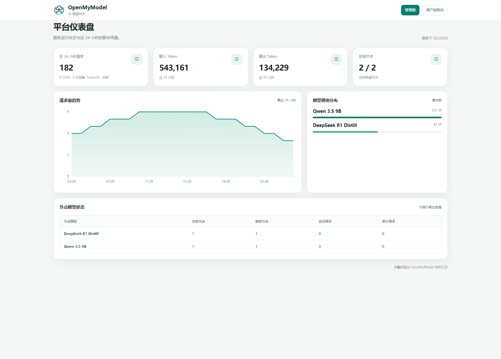
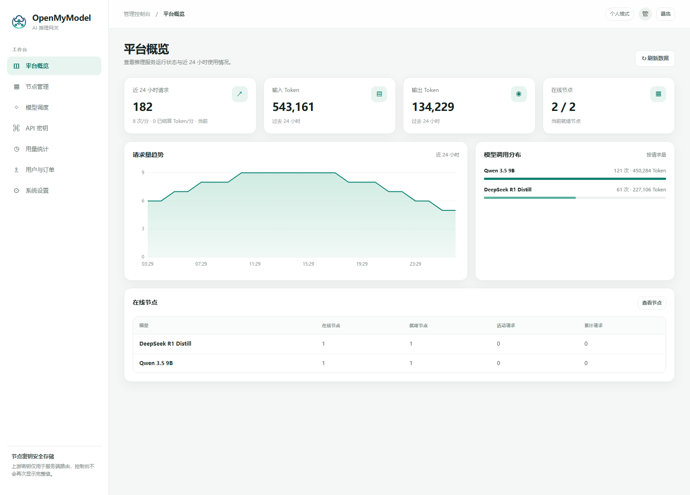
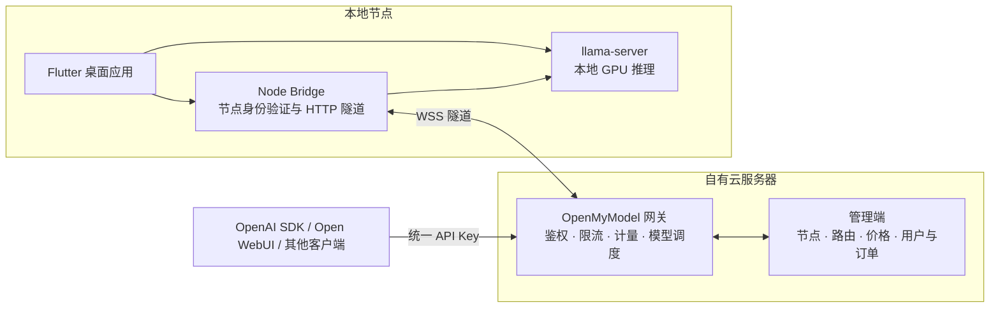

<p align="center">
  
</p>
<h1 align="center">OpenMyModel</h1>
<p align="center"><strong>在本地运行模型，通过自己的云端网关提供 OpenAI 兼容 API。</strong></p>
<p align="center">本地推理 · WebSocket 隧道 · 多节点模型调度 · 用量计量</p>
<p align="center"><a href="README_EN.md">English</a>　|　中文</p>

<p align="center"></p>
<p align="center"><sub>仪表盘截图来自隔离演示环境，包含两台模拟节点和演示用量，仅用于展示界面。</sub></p>

---

OpenMyModel 将桌面电脑上的 <code>llama-server</code> 通过 WebSocket 隧道连接到自有服务器。节点无需公网 IP；调用者使用统一网关地址和 API Key，由服务器按模型路由到合适节点。

## 能做什么

- **本地 GPU 推理**：桌面应用管理内置 llama.cpp 引擎、模型参数、对话和节点连接；Windows 发布包包含 CPU、CUDA 与 Vulkan 引擎。
- **保护节点服务**：每个节点使用独立的 llama-server API Key。管理端加密保存节点 Key，并在路由时交给对应节点使用。
- **统一网关与模型调度**：为调用者发放统一 API Key；公开模型名可映射到节点真实模型名，并配置多节点权重与路由。
- **兼容 OpenAI 客户端**：提供 <code>/v1/models</code> 和 <code>/v1/chat/completions</code>，支持流式 SSE，可接入 Open WebUI 与 OpenAI SDK。
- **个人与服务商模式**：个人模式关闭用户注册；服务商模式提供邮箱验证码账户、用户专属 Key、用量和订单、支付宝充值与按 Token 计费。
- **运行状态与统计**：管理端汇总请求、Token 和节点状态；个人模式可展示公开聚合仪表盘，不暴露节点地址、密钥或对话内容。

## 管理端

<p align="center"></p>
<p align="center"><sub>截图来自临时本地数据库。用量和在线节点为演示数据，不含真实用户或凭据。</sub></p>

## 架构


```mermaid
flowchart LR
    subgraph Local["本地节点"]
        UI["Flutter 桌面应用"] --> Engine["llama-server<br/>本地 GPU 推理"]
        UI --> Bridge["Node Bridge<br/>节点身份验证与 HTTP 隧道"]
        Bridge --> Engine
    end
    subgraph Cloud["自有云服务器"]
        Gateway["OpenMyModel 网关<br/>鉴权 · 限流 · 计量 · 模型调度"]
        Admin["管理端<br/>节点 · 路由 · 价格 · 用户与订单"]
        Gateway <--> Admin
    end
    Clients["OpenAI SDK / Open WebUI / 其他客户端"] -->|"统一 API Key"| Gateway
    Bridge <-->|"WSS 隧道"| Gateway
```

节点 Key 保护对应机器上的 llama-server HTTP 服务；网关 Key 用于识别调用者、执行访问控制、限流和计量。

| 组件 | 用途 |
| --- | --- |
| Flutter 桌面端 | 管理引擎进程、GGUF 模型、推理参数、本地 API Key 与云端连接 |
| Node Bridge | 建立认证后的 WebSocket 隧道，并转发 HTTP/SSE 请求 |
| 云端后端 | Node.js 22、Fastify、SQLite；提供模型调度、API 网关、管理端和用户控制台 |

## 快速开始

### 下载桌面版

从 [GitHub Releases](https://github.com/tianxingstarsky/OpenMyModel/releases/latest) 下载 Windows 安装包或压缩包。Windows 10 及以上系统可直接启动；引擎已随包提供，无需安装 Python。

### 从源码运行桌面端

需要 Node.js 22+、支持 Dart 3.11+ 的 Flutter stable、CMake 3.28+ 与 Visual Studio 2022 C++ 工具集。

```bash
npm --prefix scripts ci
cd frontend
flutter pub get
flutter run -d windows
```

### 启动云端后端

在服务器或本机安装 Node.js 22+，初始化管理员密码后启动：

```bash
cd backend
npm ci
npm run setup
npm run dev
```

默认监听端口为 <code>3000</code>。也可先设置 <code>ADMIN_PASSWORD</code> 环境变量。桌面端在“云端连接”页面填写服务器地址和管理员密码后连接；公网部署使用 HTTPS/WSS。

## 模式与入口

| 模式 | 使用方式 |
| --- | --- |
| 个人模式 | 不提供终端用户注册。管理员在 <code>/admin</code> 创建统一网关 Key；<code>/dashboard</code> 展示聚合用量，<code>/</code> 展示公开节点状态。桌面端也可使用自己的节点 Key 直连对应节点。 |
| 服务商模式 | 管理员配置 HTTPS 公网地址、SMTP 和支付宝参数后才能启用。用户通过邮箱验证码注册/登录，在 <code>/console</code> 管理账户、申请 API Key、查看用量和订单并充值。 |

服务商模式要求 SMTP 主机、发信账户与密码，以及支付宝应用 ID、商户 ID、RSA2 应用私钥和支付宝公钥全部配置完成。管理端设置输入和输出 Token 单价（每百万 Token）；缓存 Token 暂无单独价格。当前预扣费支持文本聊天消息，节点需提供 llama-server 的 <code>/apply-template</code> 与 <code>/tokenize</code> 接口。

## 接入客户端

管理端创建网关 Key 后，客户端使用服务器地址加 <code>/v1</code>。把 <code>qwen</code> 换成管理端配置的公开模型名：

```bash
curl https://api.example.com/v1/chat/completions -H "Content-Type: application/json" -H "Authorization: Bearer sk-your-gateway-key" -d '{"model":"qwen","messages":[{"role":"user","content":"你好"}]}'
```

Open WebUI 等 OpenAI 兼容客户端使用：

- **API 地址**：<code>https://api.example.com/v1</code>
- **API Key**：管理端创建的 <code>sk-</code> 网关 Key

## 部署到服务器

### Docker Compose

复制 <code>.env.example</code> 为 <code>.env</code>，设置强管理员密码，再从仓库根目录启动：

```bash
docker compose up -d --build
```

### Node.js + Nginx / 宝塔面板

1. 在 Linux 服务器克隆仓库，在 <code>backend/</code> 执行 <code>npm ci && npm run build</code>。
2. 用 Node.js 22 启动 <code>backend/dist/index.js</code>，监听默认 <code>3000</code> 端口，并配置持久化数据目录。
3. 反向代理到 <code>http://127.0.0.1:3000</code>。Nginx 需支持 WebSocket Upgrade、关闭代理缓冲，并为公网域名配置 HTTPS 证书。
4. 首次启动前运行 <code>npm run setup</code> 创建管理员密码；保留数据目录和服务器加密密钥，以保留节点凭据和用户数据。

WebSocket 代理至少需要：

```nginx
proxy_http_version 1.1;
proxy_set_header Upgrade $http_upgrade;
proxy_set_header Connection "upgrade";
proxy_read_timeout 600s;
proxy_buffering off;
```

部署细节和问题排查见 [开发、验证与发布说明](docs/DEVELOPMENT.md) 与 [验证记录](docs/VERIFICATION.md)。

## 安全与数据

- 生产环境使用 HTTPS/WSS；远程节点连接不要使用明文 HTTP/WebSocket。
- 节点 Key 在服务器端加密存储；网关 Key 只保存哈希，创建时仅显示一次。
- 数据库、加密密钥文件和备份都属于敏感数据，应限制文件权限并定期备份。
- 公开页面只展示聚合统计，不返回节点标识、名称、地址或密钥。

## 开发验证

```bash
npm --prefix scripts ci
npm --prefix scripts test
npm --prefix scripts run check:release
npm --prefix backend ci
npm --prefix backend run build
npm --prefix backend test
cd frontend
flutter analyze
flutter test
```

Windows 引擎构建、打包和故障排查见 [docs/DEVELOPMENT.md](docs/DEVELOPMENT.md)。

## 致谢与许可证

- [llama.cpp](https://github.com/ggml-org/llama.cpp) 提供 GGUF 推理引擎。
- [Open WebUI](https://github.com/open-webui/open-webui) 是 OpenAI 兼容客户端示例。

本项目采用 [MIT License](LICENSE)。