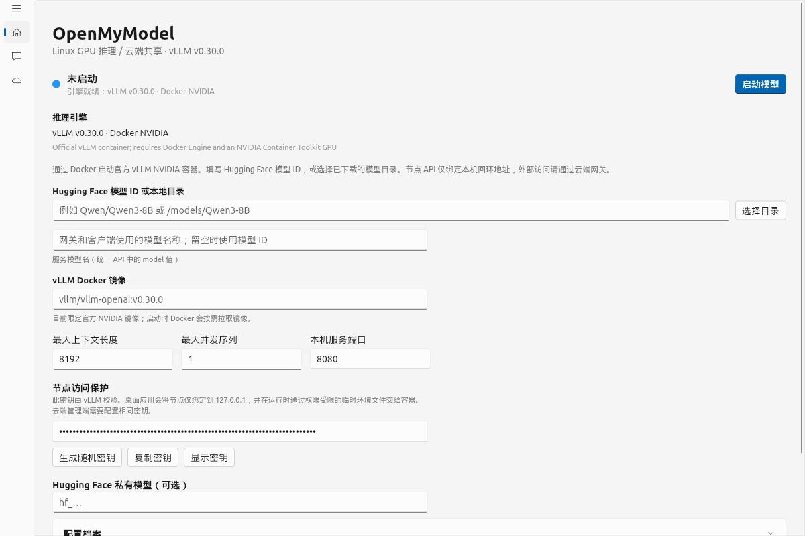
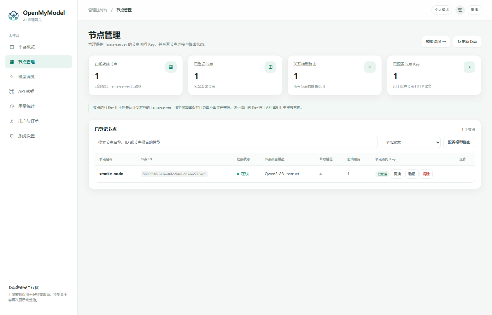
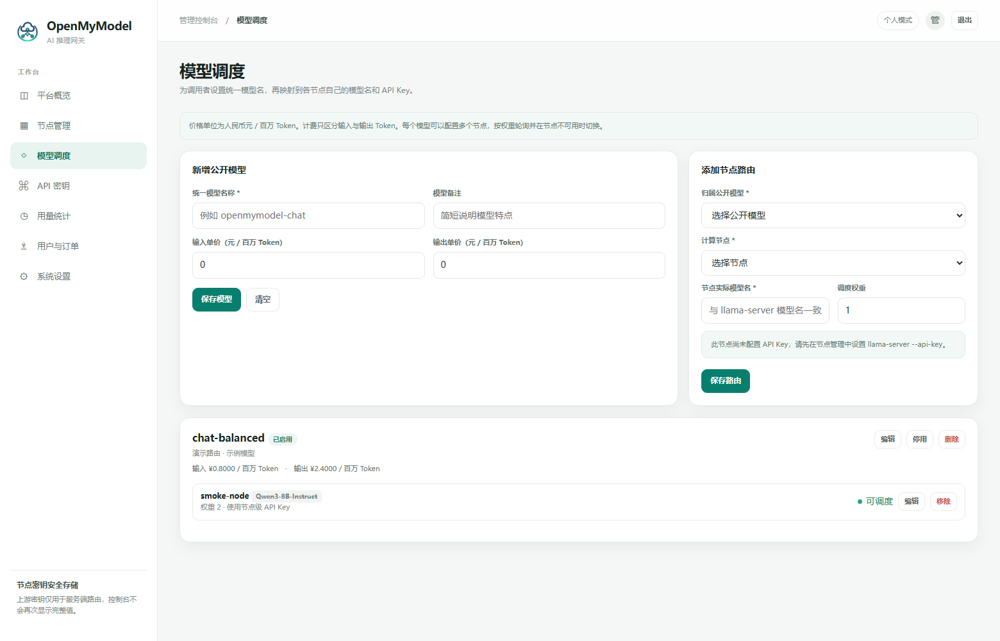
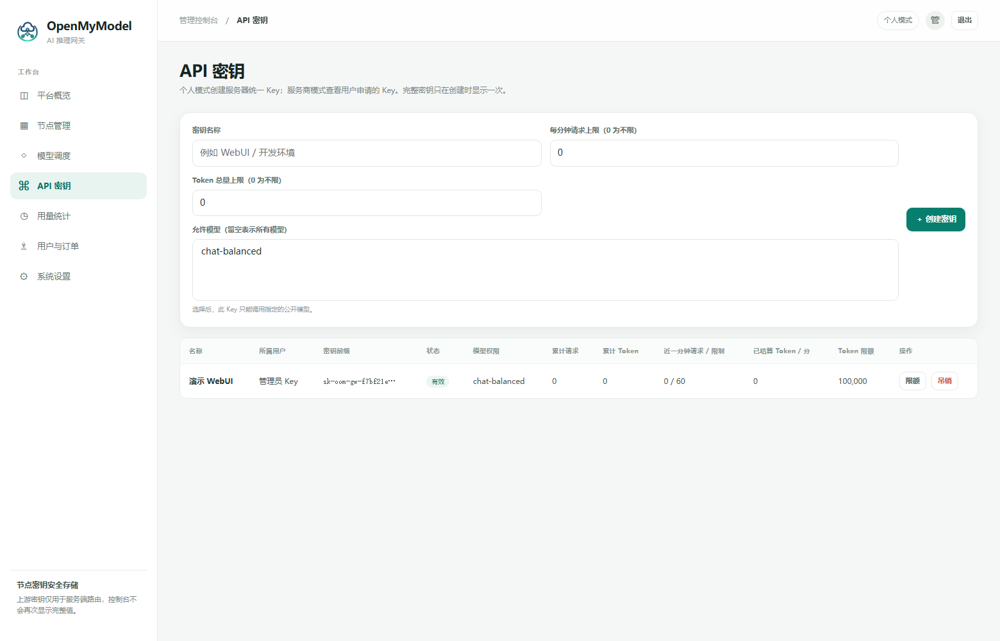
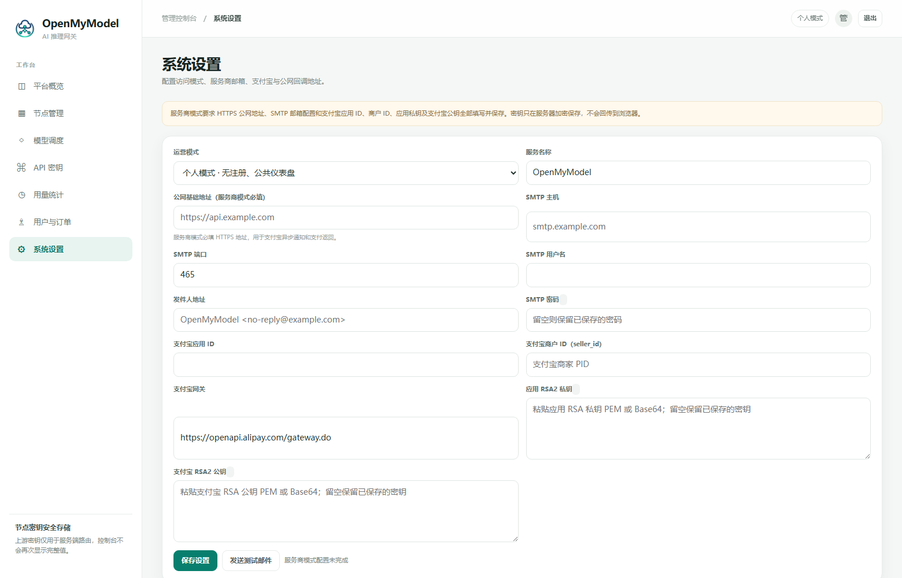
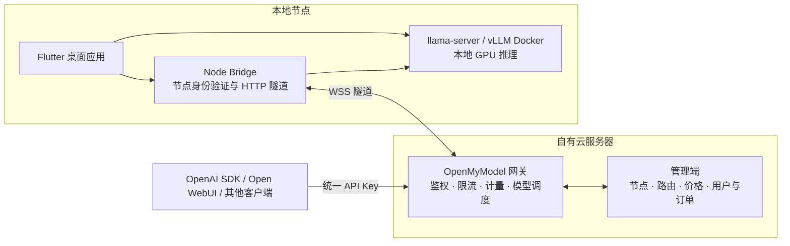

<p align="center">
  
</p>
<h1 align="center">OpenMyModel</h1>
<p align="center"><strong>在本地运行模型，通过自己的云端网关提供 OpenAI 兼容 API。</strong></p>
<p align="center">本地推理 · WebSocket 隧道 · 多节点模型调度 · 用量计量</p>
<p align="center"><a href="README_EN.md">English</a>　|　中文</p>

<p align="center"></p>
<p align="center"><sub>仪表盘截图来自隔离演示环境，包含两台模拟节点和演示用量，仅用于展示界面。</sub></p>

---

OpenMyModel 将本地推理节点通过 WebSocket 隧道连接到自有服务器。Windows 桌面端运行 <code>llama-server</code>；Linux 桌面端可通过 Docker 管理 NVIDIA vLLM 节点；Linux 服务器也可运行无界面节点包。节点无需公网 IP；调用者使用统一网关地址和 API Key，由服务器按模型路由到合适节点。

## 能做什么

- **本地 GPU 推理**：Windows 桌面版管理 llama.cpp（CPU、CUDA、Vulkan）；Linux 桌面版通过 Docker 管理 NVIDIA vLLM，支持 Hugging Face 模型 ID 和本地模型目录。
- **保护节点服务**：每个节点使用独立 API Key。管理端加密保存节点 Key，并在路由时交给对应节点使用。
- **统一网关与模型调度**：为调用者发放统一 API Key；公开模型名可映射到节点真实模型名，并配置多节点权重与路由。
- **兼容 OpenAI 客户端**：提供 <code>/v1/models</code> 和 <code>/v1/chat/completions</code>，支持流式 SSE，可接入 Open WebUI 与 OpenAI SDK。
- **个人与服务商模式**：个人模式关闭用户注册；服务商模式提供邮箱验证码账户、用户专属 Key、用量和订单、支付宝充值与按 Token 计费。
- **用户自有节点代转发模式**：用户注册后接入自己的节点，设置私有模型别名与调度路由，并创建仅能访问本人节点的网关 Key；平台不收取 Token 费用，可选免费或支付宝月度订阅。
- **运行状态与统计**：管理端汇总请求、Token 和节点状态；个人模式可展示公开聚合仪表盘，不暴露节点地址、密钥或对话内容。

## 管理端

<p align="center"></p>
<p align="center"><sub>截图来自临时本地数据库。用量和在线节点为演示数据，不含真实用户或凭据。</sub></p>

## 图解使用流程

下面按“启动节点 → 接入服务器 → 配置模型 → 发放密钥 → 调用与查看用量”的顺序操作。示例中的节点名、模型名、价格和用量均为演示数据；请替换成自己的配置。

### 1. 在桌面端启动本地模型

Windows 用户打开桌面版，在首页选择推理引擎、模型目录和 GGUF 文件，再点击“启动模型”。首次使用时可展开推理参数调整上下文长度、GPU 层数等设置。

Linux 用户可安装桌面版 vLLM 节点管理器。当前默认镜像为官方 <code>vllm/vllm-openai:v0.30.0</code>（NVIDIA CUDA）；Linux 主机需先安装 Docker Engine 与 NVIDIA Container Toolkit，并确认 <code>nvidia-smi</code> 能正常识别 GPU。运行应用后，在首页填写 Hugging Face 模型 ID（例如 <code>Qwen/Qwen3-8B</code>）或选取本地模型目录，设置服务模型名、上下文长度、并发数、端口和节点 API Key；私有模型可填写 Hugging Face Token。按“启动模型”后，应用会拉取镜像并等待模型就绪。首次下载模型会占用较多时间和磁盘空间。

<p align="center"></p>
<p align="center"><sub>Ubuntu 测试会话中的配置界面截图。节点密钥保持隐藏；本截图没有连接服务器或启动模型。</sub></p>

可从 Linux x86_64 主机源码构建桌面包：

```bash
npm ci --prefix scripts
python3 scripts/package_linux.py --output dist/linux --format both --node "$(command -v node)"
```

在仓库根目录安装 Debian 包：

```bash
sudo apt install ./dist/linux/openmymodel_1.0.0-1_amd64.deb
```

或解压便携包并启动：

```bash
tar -xzf dist/linux/openmymodel-1.0.0-linux-x86_64.tar.gz
./openmymodel/openmymodel
```

安装后也可从应用菜单启动 OpenMyModel；将节点连接到服务器的步骤与 Windows 版相同。Linux vLLM API 仅监听本机回环地址，再由桌面端云端连接页建立加密隧道，不会为了公网访问而直接开放 vLLM 端口。该包适用于 Linux x86_64。启动 vLLM 还需要已配置 NVIDIA GPU 的 Docker 主机；应用本身不会捆绑 CUDA 驱动、Docker 或模型权重。

<p align="center"></p>

如果要让服务器安全访问该节点，在首页的推理参数中为节点设置 API Key，然后重启模型使密钥生效。服务器端稍后要录入同一把 Key。该节点 Key 保护本机 llama-server HTTP 接口，不是发给 OpenAI 客户端的统一网关 Key。

### 2. 将桌面节点连接到云端

打开桌面端“云端连接”页面，填写已部署的服务器地址和管理员密码，然后点击“连接”。公网服务使用 HTTPS 地址；连接建立后，服务器的“节点管理”中会出现这台桌面节点。不要把管理员密码发给 API 客户端。

<p align="center"></p>
<p align="center"><sub>截图用于标示连接设置位置；截图当时模型和云端尚未连接。实际操作时请先启动模型，再输入自己的服务器地址并点击“连接”。</sub></p>

桌面端此页的本机 API Key 管理用于直接访问该节点，密钥保存在本机，也不提供服务器 Token 计量。需要统一调度、调用限额和用量统计时，请继续使用服务器网关 Key。

### 3. 在管理端登记节点 Key

浏览器打开 `https://你的域名/admin` 并使用管理员密码登录。进入“节点管理”，找到刚连接的节点，点击“设置”或“更换”，填入与桌面端节点 API Key 完全一致的值。页面只显示是否已配置，不会再次回显完整 Key。每台节点只需配置一次；该节点的模型路由都会使用这把密钥。

<p align="center"></p>

截图中的 `smoke-node` 和节点 ID 是隔离演示数据。实际部署时节点名由桌面连接信息提供，节点在线并且引擎就绪后才可接受调度。

### 4. 设置统一模型名和节点路由

进入“模型调度”，先创建调用者要使用的公开模型名，例如 `chat-balanced`，填写模型备注以及输入、输出价格（元 / 百万 Token）。个人模式可以按需保留零价格；服务商模式应先确定计费标准再启用销售。

然后在右侧添加节点路由：选择公开模型和计算节点，填写该节点真实的模型名，并设置权重。同一公开模型可添加多条路由；即使不同节点上的模型名称或节点 API Key 不同，调用者仍只需使用同一个公开模型名。网关会在可用路由间按权重调度，节点不可用时切换到其他可用节点。

<p align="center"></p>

### 5. 创建网关 API Key

个人模式下进入“API 密钥”，填写密钥名称，可选设置每分钟请求上限、Token 总量上限和允许访问的模型，然后点击“创建密钥”。完整密钥只在创建时显示一次；请立即复制到安全的密码管理器中。以后可在此查看累计请求、Token 和近一分钟请求频率，也可修改限额或吊销密钥。

<p align="center"></p>

这里发放的网关 Key 是客户端凭据，和桌面端节点 Key 分属两层：调用者只拿到网关 Key，服务器用已保存的节点 Key 请求 llama-server。

### 6. 配置客户端并发起请求

在 Open WebUI 或其他 OpenAI 兼容客户端中填写：

- **API 地址**：`https://你的域名/v1`
- **API Key**：刚创建的 `sk-` 网关 Key
- **模型名**：第 4 步配置的公开模型名，例如 `chat-balanced`

也可以用 `curl` 验证。将域名、Key 和模型名替换为自己的值：

```bash
curl https://api.example.com/v1/chat/completions \
  -H "Content-Type: application/json" \
  -H "Authorization: Bearer sk-your-gateway-key" \
  -d '{"model":"chat-balanced","messages":[{"role":"user","content":"你好，请简单介绍一下自己。"}]}'
```

流式客户端使用相同地址和密钥；请求成功后，可在管理端“用量统计”查看请求频率和输入、输出 Token。个人模式的 `/dashboard` 展示公开聚合数据，`/` 展示公开节点状态。

### 服务商模式：启用注册、计费和用户控制台

管理员在“系统设置”中先填写 HTTPS 公网基础地址、SMTP 主机/端口/用户名/发件人/密码，以及支付宝应用 ID、商户 ID、RSA2 应用私钥和支付宝公钥，保存全部设置后再选择“服务商模式”。这些项目不齐全时不能启用服务商模式。服务器只加密保存密钥，不会回传已保存的私钥或 SMTP 密码。

<p align="center"></p>

启用后：

1. 在“模型调度”为每个模型填写输入与输出单价，单位均为元 / 百万 Token；当前没有缓存 Token 单独计价。
2. 用户打开 `https://你的域名/console`，通过邮箱验证码注册或登录，在自己的控制台查看用量和订单、充值并申请个人 API Key。
3. 用户使用自己的 API Key 调用 `/v1`。管理员可在“用户与订单”查看用户和订单，并在“用量统计”检查平台请求与 Token 情况。

服务商模式的预扣费目前支持文本聊天消息；llama.cpp 节点使用 `/apply-template` 和 `/tokenize`，vLLM 节点使用其聊天 `/tokenize` 接口。正式开放注册与支付前，请先在 HTTPS 域名下完成 SMTP 发信测试和支付宝异步通知验证。

### 代转发模式：用户接入自己的节点

管理员在“系统设置”选择“代转发模式”。免费方案需配置 HTTPS 公网地址和 SMTP 邮件服务；月度订阅还需填写支付宝 RSA2 参数、订阅价格和请求额度。未完成对应必填设置时，服务器不会启用账户注册。代转发模式不对输入或输出 Token 计价，也没有缓存 Token 单独计价；用户和管理员仍可查看请求、Token 用量及访问频率。

用户打开 `https://你的域名/console`，通过邮箱验证码注册或登录，在“我的节点”创建节点并复制一次性接入令牌。之后可以在桌面端“云端连接”粘贴该令牌，或在无界面 Linux 节点的 `.env` 中填写 `NODE_TOKEN`。本地引擎仍应配置自己的节点 API Key；代转发连接令牌与节点 API Key 作用不同，分别用于连接服务器和保护本地推理服务。

用户在控制台为节点创建公开模型别名，并为每个别名添加一个或多个本人节点路由。真实模型名可以因节点而异，例如公开名 `team-chat` 可调度到不同节点上的 `Qwen3-8B` 和 `my-local-qwen`。创建的网关 API Key 只返回该用户可用的模型；请求只会转发到该账户名下、仍在线且已就绪的节点。其他用户的模型、节点和本地密钥不会进入此用户的调度范围。管理员可查看账户、节点数量、订单和平台运行统计，但代转发用户的节点 API Key 由用户保存在各自节点上，管理员不能读取或代为修改。

## 架构


```mermaid
flowchart LR
    subgraph Local["本地节点"]
        UI["Flutter 桌面应用"] --> Engine["llama-server / vLLM Docker<br/>本地 GPU 推理"]
        UI --> Bridge["Node Bridge<br/>节点身份验证与 HTTP 隧道"]
        Bridge --> Engine
    end
    subgraph Cloud["自有云服务器"]
        Gateway["OpenMyModel 网关<br/>鉴权 · 限流 · 计量 · 模型调度"]
        Admin["管理端<br/>节点 · 路由 · 价格 · 用户与订单"]
        Gateway <--> Admin
    end
    Clients["OpenAI SDK / Open WebUI / 其他客户端"] -->|"统一 API Key"| Gateway
    Bridge <-->|"WSS 隧道"| Gateway
```

节点 Key 保护对应机器上的模型服务；网关 Key 用于识别调用者、执行访问控制、限流和计量。vLLM API Key 只校验部分 API 路径，因此桌面端把本机端口限制在回环地址，再通过云端隧道提供服务。

| 组件 | 用途 |
| --- | --- |
| Flutter 桌面端 | Windows 管理 llama.cpp；Linux 管理 vLLM Docker 容器；两端均提供对话与云端连接 |
| Node Bridge | 建立认证后的 WebSocket 隧道，并转发 HTTP/SSE 请求 |
| 云端后端 | Node.js 22、Fastify、SQLite；提供模型调度、API 网关、管理端和用户控制台 |

## 快速开始

### 下载桌面版

从 [GitHub Releases](https://github.com/tianxingstarsky/OpenMyModel/releases/latest) 下载 Windows 安装包或压缩包。Windows 10 及以上系统可直接启动；llama.cpp 引擎已随包提供，无需安装 Python。Linux 用户可使用上面的打包命令生成 vLLM 桌面包；Docker 和 NVIDIA Container Toolkit 需预先安装。

### 从源码运行桌面端

Windows 开发需要 Node.js 22+、Flutter stable、CMake 3.28+ 与 Visual Studio 2022 C++ 工具集。Linux 桌面构建需要 Flutter stable、CMake、Ninja、GTK 3 开发库和 Node.js 22+。

```bash
npm --prefix scripts ci
cd frontend
flutter pub get
flutter run -d windows
```

### 启动云端后端

在服务器或本机安装 Node.js 22+，初始化管理员密码后启动：

```bash
cd backend
npm ci
npm run setup
npm run dev
```

默认监听端口为 <code>3000</code>。也可先设置 <code>ADMIN_PASSWORD</code> 环境变量。桌面端在“云端连接”页面填写服务器地址和管理员密码后连接；公网部署使用 HTTPS/WSS。

## 模式与入口

| 模式 | 使用方式 |
| --- | --- |
| 个人模式 | 不提供终端用户注册。管理员在 <code>/admin</code> 创建统一网关 Key；<code>/dashboard</code> 展示聚合用量，<code>/</code> 展示公开节点状态。桌面端也可使用自己的节点 Key 直连对应节点。 |
| 服务商模式 | 管理员配置 HTTPS 公网地址、SMTP 和支付宝参数后才能启用。用户通过邮箱验证码注册/登录，在 <code>/console</code> 管理账户、申请 API Key、查看用量和订单并充值。 |
| 代转发模式 | 用户通过邮箱验证码注册/登录，在 <code>/console</code> 创建并管理自己的节点、模型别名、路由和网关 Key；平台仅转发到该用户的在线节点，不对 Token 计价，可选择免费或月度请求订阅。 |

服务商模式要求 SMTP 主机、发信账户与密码，以及支付宝应用 ID、商户 ID、RSA2 应用私钥和支付宝公钥全部配置完成。管理端设置输入和输出 Token 单价（每百万 Token）；缓存 Token 暂无单独价格。当前预扣费支持文本聊天消息；llama.cpp 节点使用 <code>/apply-template</code> 与 <code>/tokenize</code>，vLLM 节点使用其聊天 <code>/tokenize</code> 接口。

## 接入客户端

管理端创建网关 Key 后，客户端使用服务器地址加 <code>/v1</code>。把 <code>qwen</code> 换成管理端配置的公开模型名：

```bash
curl https://api.example.com/v1/chat/completions -H "Content-Type: application/json" -H "Authorization: Bearer sk-your-gateway-key" -d '{"model":"qwen","messages":[{"role":"user","content":"你好"}]}'
```

Open WebUI 等 OpenAI 兼容客户端使用：

- **API 地址**：<code>https://api.example.com/v1</code>
- **API Key**：管理端创建的 <code>sk-</code> 网关 Key

## 部署到服务器

### Linux vLLM 计算节点

仓库提供独立的无界面 Linux 节点包：Docker 在 Linux 上运行官方 vLLM OpenAI 服务，轻量 Connector 通过 HTTPS/WSS 接入 OpenMyModel。当前包面向 Linux x86_64 + NVIDIA GPU；vLLM 不原生支持 Windows，GPU、驱动和 vLLM 镜像需符合官方要求。该节点包不安装或启动 Windows 桌面界面，也不替代云端网关。

先在 Linux 主机安装 Docker Engine、Compose 插件和 NVIDIA Container Toolkit，并确认 Docker 能访问 GPU。克隆本仓库后运行：

```bash
cd OpenMyModel/deploy/vllm-node
cp .env.example .env
chmod 600 .env
```

编辑 <code>.env</code>：将 <code>CLOUD_URL</code> 设置为 OpenMyModel 服务地址。个人或服务商共享节点填写管理员密码 <code>ADMIN_PASSWORD</code>，并设置唯一的 <code>NODE_ID</code> 和可读的 <code>NODE_NAME</code>；代转发模式则在用户控制台创建节点，把一次性接入令牌填入 <code>NODE_TOKEN</code>，并留空前三项中的管理员密码、节点 ID 和节点名。两种凭据只能选择一种。设置受 GPU 显存支持的 <code>VLLM_MODEL</code>、对应的 <code>PUBLIC_MODEL_NAME</code>，并将 <code>NODE_API_KEY</code> 换成足够长的随机值。可用 <code>openssl rand -hex 32</code> 生成密钥。需要访问 Hugging Face 受限模型时，另外填写 <code>HF_TOKEN</code>。

启动节点：

```bash
docker compose up -d
docker compose logs -f vllm connector
```

首次运行会下载模型，耗时取决于模型大小和网络。vLLM API 只在 Compose 内部网络开放，不发布主机端口；客户端通过 OpenMyModel 网关访问。vLLM 的 API Key 只保护部分端点，`/tokenize` 等接口不受它保护，因此不要自行添加端口映射，详情见 [vLLM 安全说明](https://docs.vllm.ai/en/latest/usage/security.html#api-key-authentication-limitations)。Connector 等待模型就绪后会建立隧道。个人或服务商共享模式下，Connector 使用管理员凭据，节点会显示在管理端；将该节点的 `NODE_API_KEY` 配置到管理端，再设置共享模型路由。代转发模式下，Connector 使用用户的一次性节点令牌，节点由该用户在 `/console` 管理，用户在自己的控制台填写实际模型名并添加路由；管理员无需也不能登记用户本地的 `NODE_API_KEY`。

镜像版本固定在 vLLM v0.30.0，升级时可在 <code>.env</code> 修改 <code>VLLM_IMAGE</code>。不同 GPU、驱动和模型对镜像/CUDA 组合及可用显存的要求不同，请先核对 [vLLM GPU 安装要求](https://docs.vllm.ai/en/latest/getting_started/installation/gpu/)；[官方 vLLM 发布页](https://github.com/vllm-project/vllm/releases)列出可用版本和镜像标签。<code>VLLM_MAX_MODEL_LEN</code> 默认设为 8192，可按模型、上下文需求与 GPU 显存调整。

### Docker Compose

复制 <code>.env.example</code> 为 <code>.env</code>，设置强管理员密码，再从仓库根目录启动：

```bash
docker compose up -d --build
```

### Node.js + Nginx / 宝塔面板

1. 在 Linux 服务器克隆仓库，在 <code>backend/</code> 执行 <code>npm ci && npm run build</code>。
2. 用 Node.js 22 启动 <code>backend/dist/index.js</code>，监听默认 <code>3000</code> 端口，并配置持久化数据目录。
3. 反向代理到 <code>http://127.0.0.1:3000</code>。Nginx 需支持 WebSocket Upgrade、关闭代理缓冲，并为公网域名配置 HTTPS 证书。
4. 首次启动前运行 <code>npm run setup</code> 创建管理员密码；保留数据目录和服务器加密密钥，以保留节点凭据和用户数据。

WebSocket 代理至少需要：

```nginx
proxy_http_version 1.1;
proxy_set_header Upgrade $http_upgrade;
proxy_set_header Connection "upgrade";
proxy_read_timeout 600s;
proxy_buffering off;
```

部署细节和问题排查见 [开发、验证与发布说明](docs/DEVELOPMENT.md) 与 [验证记录](docs/VERIFICATION.md)。

## 安全与数据

- 生产环境使用 HTTPS/WSS；远程节点连接不要使用明文 HTTP/WebSocket。
- 节点 Key 在服务器端加密存储；网关 Key 只保存哈希，创建时仅显示一次。
- 数据库、加密密钥文件和备份都属于敏感数据，应限制文件权限并定期备份。
- 公开页面只展示聚合统计，不返回节点标识、名称、地址或密钥。

## 开发验证

```bash
npm --prefix scripts ci
npm --prefix scripts test
npm --prefix scripts run check:release
npm --prefix backend ci
npm --prefix backend run build
npm --prefix backend test
cd frontend
flutter analyze
flutter test
```

Windows 引擎构建、打包和故障排查见 [docs/DEVELOPMENT.md](docs/DEVELOPMENT.md)。

## 致谢与许可证

- [llama.cpp](https://github.com/ggml-org/llama.cpp) 提供 GGUF 推理引擎。
- [Open WebUI](https://github.com/open-webui/open-webui) 是 OpenAI 兼容客户端示例。

本项目采用 [MIT License](LICENSE)。
