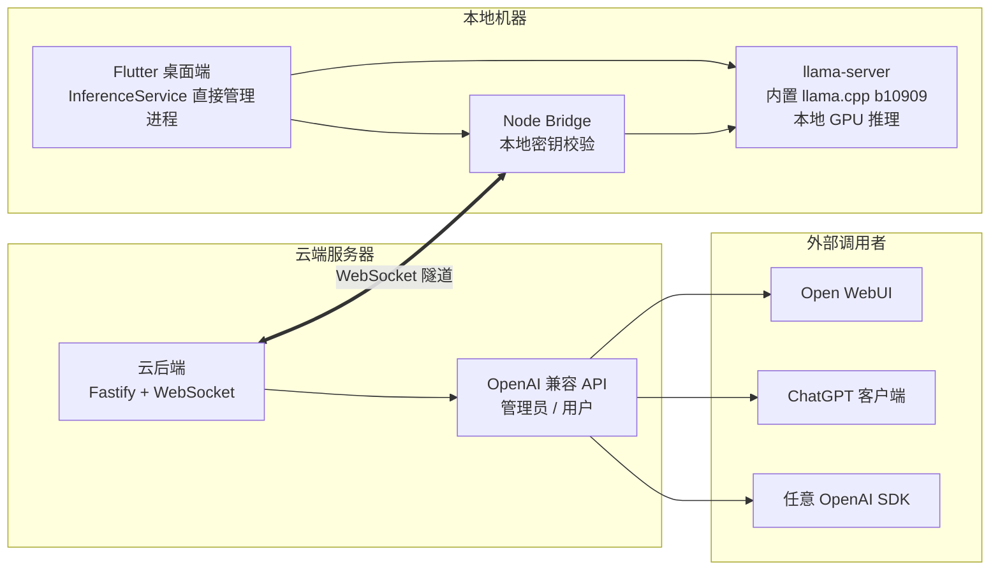
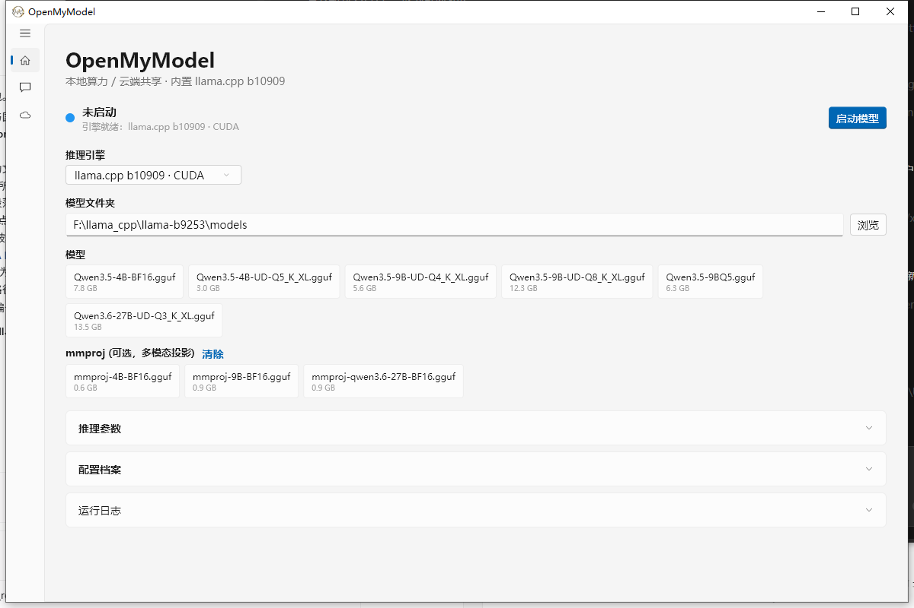
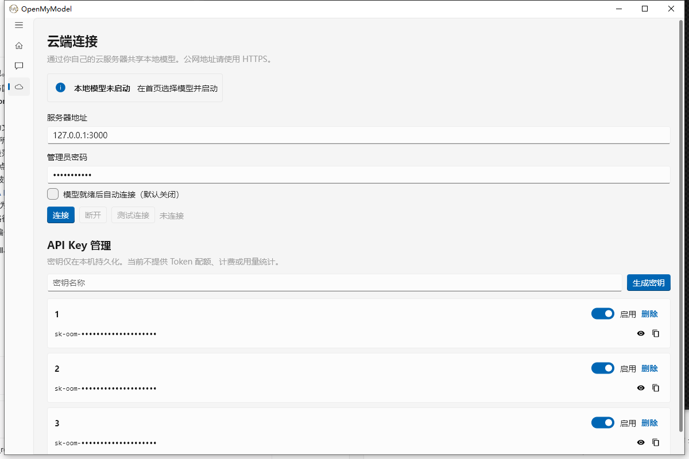

# OpenMyModel


> [**English**](README_EN.md) | **中文**


> **让本地 GPU 算力走出局域网，以标准 OpenAI API 触达世界。**
>
> OpenMyModel 帮助你将本地运行的 llama.cpp 大模型无缝推送到自有云服务器，通过业界通用的 OpenAI 兼容接口对外提供服务。无论你是有闲置 GPU 的个人开发者、想折腾自部署模型的技术爱好者，还是需要为小团队搭建私有推理节点的运维者，这里都有你所需的一切——无需公网 IP，无需复杂运维，一条 WebSocket 隧道即可将本机模型变为云端 API。
>
> #### 为什么自己部署？
> 免费在线大模型虽触手可及，却几乎都经过过度量化——提供给你的是智力"降级版"。我实测对比：一台消费级显卡上跑 **Qwen 3.5 9B INT8**，在逻辑推理和数学推导上明显优于所谓"旗舰级"的免费在线服务。免费 API 为了成本极致压缩，你拿到的其实只是同名模型的一张影子。而当你自己掌控精度和参数，每一轮推理都在真实权重上完成，体验的差距会超出你的预期。
>
> #### 不止自用，更可共享与变现
> OpenMyModel 的设计初衷不止于"自己用"——它同时为算力共享而生。你可以为团队成员、朋友或社区用户分发 API Key，并在本机启用、停用或删除。当前版本不实现 Token 配额、计费或用量统计，不应将其用于需要精确计量的收费服务。

**将本地 llama.cpp 算力通过 WebSocket 隧道暴露到云端，以 OpenAI 兼容 API 供外部调用。**

> 你的 GPU，你的模型，你自己的 API 服务 —— 无需公网 IP。

---

## 🏗 架构总览


```mermaid
flowchart LR
    subgraph 本地机器
        A[Flutter 桌面端<br/>InferenceService 直接管理进程] --> C[llama-server<br/>内置 llama.cpp b10909<br/>本地 GPU 推理]
        A --> N[Node Bridge<br/>本地密钥校验]
        N --> C
    end

    subgraph 云端服务器
        D[云后端<br/>Fastify + WebSocket] --> E[OpenAI 兼容 API<br/>管理员 / 用户]
    end

    subgraph 外部调用者
        E --> F[Open WebUI]
        E --> G[ChatGPT 客户端]
        E --> H[任意 OpenAI SDK]
    end

    D <== WebSocket 隧道 ==> N
```

### 组件职责

| 组件 | 技术栈 | 角色 |
|------|--------|------|
| **Flutter 桌面端** | Flutter + Dart | UI 界面 / 内置 llama-server 进程管理（启动、健康检查、停止）/ API Key 管理（本地存储+本地验证）/ 模型对话（直连引擎 OpenAI API） |
| **内置引擎** | llama.cpp b10909（Git submodule 固定版本） | 官方 OpenAI 兼容 HTTP API；CPU/CUDA 后端源码构建，Vulkan 后端官方预编译（均经 SHA-256 校验），按显卡自动选择，无需安装 Python 或任何运行环境 |
| **Node Bridge** | Node.js + ws | Flutter stdin/stdout 控制 / 本地 Key 验证 / WebSocket HTTP 隧道 |
| **云后端** | TypeScript + Node.js | WebSocket 服务端 / 请求透明转发到 llama-server / CLI 管理工具 |

> 历史说明：早期版本通过一个本地 Python HTTP 桥管理 llama-server；当前版本已由 Dart 的
> `InferenceService` 直接管理引擎进程，无需安装 Python，旧桥代码已从仓库移除
> （需要查阅历史实现请翻看 Git 历史）。

---

## ✨ 核心特性

- **📦 内置推理引擎**：llama.cpp b10909 随应用分发（CPU/CUDA 源码构建 + Vulkan 官方预编译，均经 SHA-256 校验），启动即用，无需安装 Python；按真实硬件自动选择后端，N 卡/A 卡/I 卡都能用上 GPU
- **🖥 本地 GPU 推理**：完整 llama.cpp 参数（GPU 层数 auto/all、`--fit` 显存自适应、KV 量化、Flash Attention 三态开关）
- **🌐 WebSocket 隧道**：无需公网 IP，家庭主机也能上云；断线自动有界退避重连，主动断开不重连
- **🔑 本地密钥管理**：API Key 持久化在本机，云端不持久化；验证时仍经过云后端和隧道，生产环境必须使用 HTTPS/WSS，并保护本机用户数据。
- **🔄 OpenAI 兼容 API**：`/v1/chat/completions`、`/v1/models`，支持流式 (SSE)；思考型模型的 `reasoning_content` 在对话界面单独展示
- **🖼 多模态支持**：mmproj 视觉投影，图片识别能力
- **💬 内置对话界面**：多图上传 + 文字，流式响应，停止生成即断开底层连接
- **📦 参数档案**：配置档案本地保存（兼容旧版本导出的档案文件），一键切换
- **🛠 中文 CLI**：云后端通过向导式命令行完成初始化和管理
- **⚡ 实时状态**：引擎启动/加载/就绪/错误状态、云端连接状态实时跟踪


## 📸 界面截图

### 首页 — 模型配置与启动


### 云端连接 — API Key 管理与节点状态


---
## 📂 目录结构

```
output_my_model/
├── frontend/                 # Flutter 桌面应用
│   ├── lib/
│   │   ├── main.dart         # 入口
│   │   ├── models/           # 数据模型
│   │   ├── pages/            # 页面（首页/配置/对话/云端）
│   │   ├── services/         # InferenceService / WebSocket / 配置档案
│   │   └── widgets/          # UI 组件
│   ├── windows/              # Windows 平台文件
│   ├── pubspec.yaml
│   └── pubspec.lock
├── third_party/llama.cpp/    # llama.cpp b10909（Git submodule，固定版本）
├── third_party/llama.cpp.lock.json  # 版本锁定与官方预编译包 SHA-256
├── backend/                  # TypeScript 云后端
│   ├── src/
│   │   ├── index.ts          # Fastify + WebSocket 入口
│   │   ├── cli.ts            # 中文 CLI 交互
│   │   ├── config.ts         # 配置文件管理
│   │   ├── db/               # 数据库层 (SQLite)
│   │   ├── routes/           # API 路由
│   │   │   ├── openai.ts     # OpenAI 兼容代理
│   │   │   └── admin.ts      # 管理接口
│   │   └── services/         # 业务服务
│   │       ├── websocket.ts  # WebSocket 连接池
│   │       └── auth.ts       # 认证
│   ├── data/                 # 运行时数据（不提交）
│   ├── package.json
│   └── tsconfig.json
├── scripts/                  # 工具脚本（引擎构建 / 打包 / 云端桥接）
│   ├── build_llama_windows.py
│   ├── package_windows.py
│   ├── cloud_bridge.js
│   └── mock_node.js          # 模拟节点（测试用）
├── docs/                     # 文档与截图
├── OpenMyModel.png                 # README 头图
├── logo.png                  # 应用图标
├── LICENSE
└── README.md
```

---

## 🚀 快速开始

### 环境要求

- **桌面端（发布包）**：Windows 10+，无需安装 Python；CPU/CUDA/Vulkan 引擎随包内置，自动按显卡选择后端
- **从源码构建桌面端**：Flutter 3.x+、CMake 3.28+、Visual Studio 2022 C++ 工具集（CUDA 后端另需 CUDA toolkit；Vulkan 后端另需 Vulkan SDK）
- **Node.js** 22+（云后端与本地云端桥接）
- **模型文件**（GGUF 格式，如 Qwen 3.5 9B Q8）+ 可选 mmproj 文件

### 1. 桌面端 (Windows)

```bash
npm --prefix scripts ci            # 云端 Node 桥接依赖
cd frontend
flutter pub get
flutter run -d windows
```

引擎可从源码构建并放置到 `artifacts/engine/`（打包脚本会自动收集）：

```bash
python scripts/build_llama_windows.py --backends cpu,cuda
python scripts/fetch_official_engine.py --backend vulkan   # 无 Vulkan SDK 时用官方预编译包
```

### 2. 云后端

```bash
cd backend
npm ci
npm run setup                      # 首次配置管理员密码
npm run dev                        # 默认端口 3000
```

### 3. CLI 管理（云后端）

```bash
cd backend
npm run setup
```

向导式设置域名、密码、查看节点状态。

---


## ☁️ 云后端部署指南（宝塔面板）

> 在云服务器上通过宝塔面板部署 OpenMyModel 后端，三步完成。

### 前置条件

- 云服务器（1核2G起步）+ 已备案域名 DNS 已解析
- 宝塔面板已安装
- 安全组已开放 80/443 端口
- 软件商店已安装：**Nginx**、**Node.js版本管理器**、**PM2管理器**

---

### 第一步：服务器编译部署

```bash
ssh root@你的服务器
cd /aiapi
git clone https://github.com/tianxingstarsky/OpenMyModel.git backend
cd backend/backend

# 安装依赖并编译
npm install
npm run build
```

> ⚠️ `npm install` 必须在服务器上执行（`better-sqlite3` 是原生模块，需 Linux 编译）。
> 如果报 `NODE_MODULE_VERSION` 错误：`rm -rf node_modules && npm install`

---

### 第二步：宝塔 Node 项目启动

「网站」→「Node项目」→ 添加项目：

| 设置项 | 值 |
|--------|-----|
| 项目目录 | `/aiapi/backend/backend` |
| 启动文件 | `dist/index.js` |
| 项目名称 | `openmymodel` |
| 运行端口 | `3000` |

**关键**：Node版本选择栏里选你安装的 **v22.x**（不是系统默认的旧版本）。

首次启动前设置项目环境变量 `ADMIN_PASSWORD`，或在 `backend/` 运行 `npm run setup` 创建管理员密码。服务不会把密码打印到日志。

> 已存在的 `data/config.json` 会保留；修改环境变量不会覆盖原密码。重置密码请使用 `npm run setup`，不要删除数据库。

---

### 第三步：反向代理配置

「网站」→顶部「反向代理」页 → 添加反向代理：

| 设置项 | 值 |
|--------|-----|
| 域名 | `api.your-domain.com` |
| 目标URL | `http://127.0.0.1:3000` |
| 发送域名 | `$host` |

然后编辑该站点的 Nginx 配置文件，在 `location /` 块中确保包含：

```nginx
proxy_http_version 1.1;
proxy_set_header Upgrade $http_upgrade;
proxy_set_header Connection "upgrade";
proxy_read_timeout 600s;
proxy_buffering off;
```

并在文件最外层（`server` 块之前）添加：

```nginx
map $http_upgrade $connection_upgrade {
    default upgrade;
    ''      close;
}
```

---

### 验证

浏览器访问 `http://你的域名/`，返回 JSON 即成功。

---

### 更新代码

```bash
cd /aiapi/backend/backend
git pull && npm install && npm run build
```
然后在宝塔 Node 项目中点击「重启」。

---

### 常见问题

| 问题 | 原因 | 解决 |
|------|------|------|
| 启动闪退 | 源码未编译或 Node 版本不对 | `npm run build`，Node 选 v22 |
| `NODE_MODULE_VERSION` | 本机带了 node_modules | 服务器上 `rm -rf node_modules && npm install` |
| WebSocket 闪断 | Nginx 缺 Upgrade 头 | 加上 `proxy_set_header Upgrade $http_upgrade;` |
| 域名不通 | 反向代理目标 IP 错误 | 确保是 `http://127.0.0.1:3000` 不是 `172.0.0.1` |
| API Key 401 | 密钥未启用或不属于在线节点 | 检查密钥所属桌面节点在线且已启用该 Key，无需盲目重建 |
| 首次启动拒绝运行 | 尚未配置管理员密码 | 设置 `ADMIN_PASSWORD` 或运行 `npm run setup` |
| 桥接协议错误 | 桌面与云端版本不匹配 | 同时更新云后端和桌面的 Node 桥接 |


---

## 🔐 安全设计

```
API Key 验证流程:
  用户请求 → 云后端 → 提取 API Key
                      → 查找对应 WebSocket 节点
                      → 发送 { action: "validate_key", key: "sk-xxx" }
                      → 本机 Node Bridge 检查 Flutter 同步的密钥
                      → 返回验证结果
                      → 通过后透明转发请求到 llama-server

关键原则：云后端 NEVER 存储 API Key，全权由算力提供者控制
```

---

## 🔗 使用示例

### 配置 Open WebUI

在 Open WebUI 中添加 OpenAI 兼容连接：

- **API URL**: `https://你的域名/v1`
- **API Key**: 前端生成的 `sk-` 开头密钥

### curl 测试

```bash
curl https://你的域名/v1/chat/completions \
  -H "Content-Type: application/json" \
  -H "Authorization: Bearer sk-你的密钥" \
  -d '{"model":"qwen","messages":[{"role":"user","content":"你好"}]}'
```

---

## 开发验证与发布

请参阅 [开发、测试与发布说明](docs/DEVELOPMENT.md)，包括中继协议、内置引擎构建、故障排查、自动化测试和 Windows 可追溯打包。更新时应同时部署后端和桌面桥接，旧桥接不会提供正确的上游状态码。

```bash
npm --prefix scripts ci
npm --prefix scripts test
npm --prefix scripts run check:release
npm --prefix backend ci
npm --prefix backend run build
npm --prefix backend test
cd frontend && flutter analyze && flutter test && flutter build windows --release
python scripts/build_llama_windows.py --backends cpu,cuda   # 内置引擎源码构建
python scripts/package_windows.py --output artifacts/OpenMyModel-win-x64-<rev>
```

Docker 首次启动前将 `.env.example` 复制为 `.env` 并填写强密码，再运行 `docker compose up -d --build`。公网部署请在反向代理终止 TLS，并使用 `https://` 地址连接桌面端；仓库内 nginx 示例本身不提供证书。

## 📝 许可证

MIT License — 详见 [LICENSE](LICENSE)

---

## 🙏 鸣谢

- [llama.cpp](https://github.com/ggerganov/llama.cpp) — GGUF 推理引擎
- [Open WebUI](https://github.com/open-webui/open-webui) — 对话前端参考
- [unsloth](https://github.com/unslothai/unsloth) — 参数设计灵感

