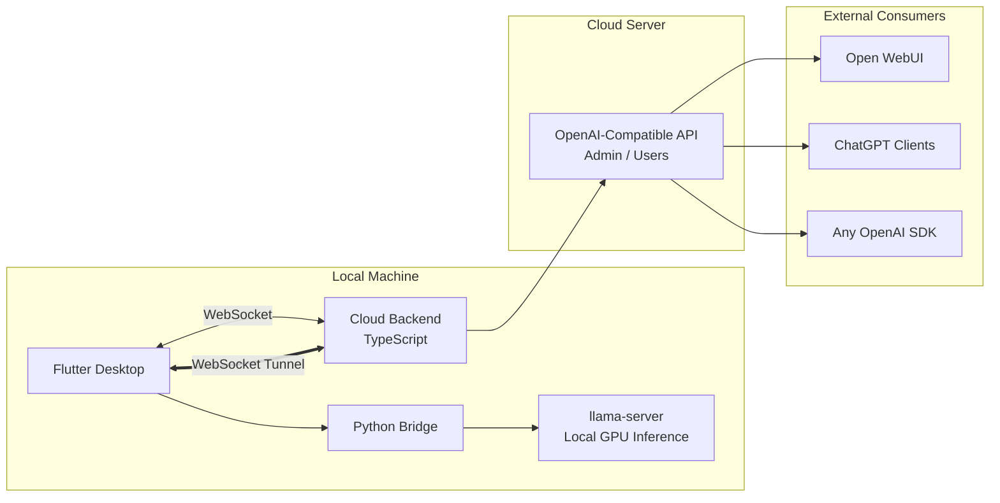

# OpenMyModel

> [**中文**](README.md) | **English**


> **Bring your local GPU compute to the cloud -- accessible via standard OpenAI API.**
>
> OpenMyModel seamlessly tunnels your locally running llama.cpp models to your own cloud server through WebSocket, exposing them as industry-standard OpenAI-compatible endpoints. Whether you are a solo developer with spare GPU cycles, a hobbyist who loves self-hosting, or an operator building private inference nodes for a small team -- OpenMyModel has everything you need. No public IP required, no complex ops: a single WebSocket tunnel turns your local model into a cloud API.
>
> #### Why Self-Host?
> Free online LLM platforms are everywhere, but nearly all serve aggressively quantized models -- a downgraded version of intelligence. I have tested this firsthand: **Qwen 3.5 9B at INT8** running on a consumer GPU consistently outperforms the so-called flagship free-tier online services on logic and mathematical reasoning tasks. Free APIs compress quality for cost at scale -- what you get is merely a shadow of the same model name. When you control precision and parameters yourself, every inference runs on real weights, and the difference exceeds expectations.
>
> #### Beyond Solo Use: Share and Monetize
> OpenMyModel was designed for more than personal use -- it is built for compute sharing. Distribute API keys to teammates, friends, or community users, with per-key quota management and usage tracking. Idle GPUs are no longer sunk cost: start monetizing spare compute with a single `sk-` key.

**Tunnel local llama.cpp compute to the cloud via WebSocket, exposed as an OpenAI-compatible API.**

> Your GPU, your model, your API service -- no public IP needed.

---

## Architecture



### Three Components

| Component | Stack | Role |
|-----------|-------|------|
| **Flutter Desktop** | Flutter + Dart | UI / llama-server management / API Key management (local-only, no cloud storage) / Chat interface |
| **Python Bridge** | Python | Process management / llama-server lifecycle / WebSocket tunnel client |
| **Cloud Backend** | TypeScript + Node.js | WebSocket server / Request transparent proxying to llama-server / CLI management |

---

## Key Features

- **Local GPU Inference**: Full llama.cpp parameter control, Q8 cache, GPU acceleration
- **WebSocket Tunnel**: No public IP needed -- home lab goes cloud
- **Local-Only Key Management**: API keys stored exclusively on your machine, zero cloud storage -- no leaks
- **OpenAI-Compatible API**: `/v1/chat/completions`, `/v1/models`, SSE streaming
- **Multimodal Support**: mmproj vision projector, image understanding
- **Built-in Chat**: Multi-image upload + text, streaming responses
- **Parameter Profiles**: Save multiple inference configs, switch with one click
- **Chinese CLI**: Wizard-driven command-line setup for the cloud backend
- **Real-Time Status**: llama-server health and cloud connection status tracked live

---

## Quick Start

### Prerequisites

- **Flutter** 3.x+ (Windows/macOS/Linux)
- **Python** 3.10+ (conda virtual env recommended)
- **Node.js** 18+ (cloud backend)
- **llama.cpp** compiled `llama-server` binary
- **GGUF model files** (e.g., Qwen 3.5 9B Q8) + optional mmproj

### 1. Frontend (Windows)

```bash
cd frontend
flutter pub get
flutter run -d windows
```

### 2. Python Bridge

```bash
cd python
conda activate myenv
pip install -r requirements.txt
python bridge_server.py
```

### 3. Cloud Backend

```bash
cd backend
npm install
npm run dev
```

### 4. CLI Management

```bash
cd backend
npx ts-node src/cli.ts
```

---


## ☁️ Cloud Backend Deployment Guide (Baota Panel · Ultra-Detailed)

> **Goal**: Deploy the OpenMyModel cloud backend on an Alibaba Cloud / Tencent Cloud server using the Baota panel, with your own domain.

### Prerequisites

| Condition | Details |
|-----------|---------|
| Server | Alibaba Cloud ECS / Tencent Cloud CVM, minimum 1 core 2 GB |
| OS | CentOS 7+ / Ubuntu 20.04+ / Debian 11+ |
| Domain | A registered domain with DNS pointing to the server IP |
| Baota Panel | Installed and accessible |
| SSH | Root access |

---

### Step 1: Baota Panel Environment Setup

#### 1.1 Login to Baota → App Store → Install

| Software | Purpose | Notes |
|----------|---------|-------|
| Nginx | Reverse proxy (port 80/443 → backend 3000) | Free, one-click install |
| Node.js Version Manager | Manage multiple Node.js versions | Free, one-click install |

#### 1.2 Install Node.js (Critical!)

Baota → App Store → Node.js Version Manager → Install **v22.x** (v20+ also works, v22 LTS recommended)

**⚠️ The Baota PM2 Manager Trap (Important!)**:

- The Baota "PM2 Manager" plugin is hardwired to Baota's own Node.js (usually v16/v18)
- After you switch to v22 via Node.js Version Manager, the Baota PM2 Manager cannot find the correct `node` binary
- **Recommended approach**: **Do NOT install the Baota PM2 Manager plugin**. Install PM2 globally via npm instead.
- If you already installed it: App Store → Uninstall PM2 Manager, then continue below.

```bash
# Verify Node.js version
node -v
# Should output: v22.x.x

# Install PM2 globally
npm install -g pm2

# Verify PM2
pm2 -v
```

#### 1.3 Create Project Directory (Bypassing Baota www constraints)

> ⚠️ Baota's website feature defaults to `/www/wwwroot/`, but this is just a convention for static sites. Our backend is an independent Node.js process — it can live **anywhere** on the filesystem. The only requirement is that Nginx reverse-proxies to the correct port.

```bash
mkdir -p /aiapi
cd /aiapi
```

---

### Step 2: Cloud Security Group Configuration

Cloud provider console → Security Groups → Inbound Rules → Add:

| Port | Protocol | Source | Purpose |
|------|----------|--------|---------|
| 80 | TCP | 0.0.0.0/0 | HTTP (Nginx public) |
| 443 | TCP | 0.0.0.0/0 | HTTPS (SSL, recommended) |
| 22 | TCP | Your IP | SSH management |

**⚠️ Do NOT open port 3000 to the public!** Security model:

```
External traffic → Nginx(80/443) → reverse proxy → 127.0.0.1:3000(backend)
                                                   ↑ loopback only
```

If you previously opened port 3000 publicly, remove that rule now.

---

### Step 3: Deploy Backend Code

SSH into your server:

```bash
mkdir -p /aiapi
cd /aiapi

# Option A: git clone (recommended for easy updates)
git clone https://github.com/tianxingstarsky/OpenMyModel.git backend
cd backend/backend

# Option B: Upload zip from your local machine (if GitHub is slow)
# On your PC: zip the backend/ folder → scp to server → unzip

# Install dependencies
npm install

# Compile TypeScript → JavaScript (critical step!)
npm run build
```

**⚠️ Why `npm run build` is mandatory:**

`tsconfig.json` is set to `"module": "commonjs"`. The compiled `dist/index.js` uses `require()`, not `import`. If you run the TypeScript source directly, you'll get:

```
SyntaxError: Cannot use import statement outside a module
```

Verify the build:

```bash
ls dist/
# Should contain: index.js  config.js  db/  routes/ ...

head -3 dist/index.js
# Expected output (CommonJS format):
# "use strict";
# var __importDefault = ...
# const fastify_1 = __importDefault(require("fastify"));
```

---

### Step 4: Initialize Configuration (Two Methods)

#### Method A: CLI Wizard (Recommended, Chinese prompts)

```bash
cd /aiapi/backend/backend
npm run setup
```

Interactive wizard:

```
╔══════════════════════════════════════════════╗
║       OpenMyModel Cloud Backend - Setup       ║
╚══════════════════════════════════════════════╝

Step 1: Domain (e.g. aiapi.topofmoon.com)
Domain: aiapi.topofmoon.com          ← Enter your domain

Step 2: Admin password (min 6 chars, used by the desktop app to connect)
Password: ********
Confirm: ********

Step 3: Port
Port [3000]:                         ← Press Enter for default 3000

╔══════════════════════════════════════════════╗
║          Setup Complete                       ║
║  Domain: aiapi.topofmoon.com                ║
║  Port: 3000                                  ║
║  Config: data/config.json                    ║
╚══════════════════════════════════════════════╝
```

#### Method B: Environment Variables (for automation)

```bash
cd /aiapi/backend/backend

export ADMIN_PASSWORD="your-strong-password"
export DOMAIN="aiapi.topofmoon.com"
export PORT=3000

# On first start, the backend auto-creates data/config.json
```

**⚠️ Password persistence**: The password is stored as SHA-256 + salt hash in `data/config.json`. After the first initialization via env vars, subsequent PM2 restarts do not need environment variables.

---

### Step 5: PM2 Process Manager

```bash
cd /aiapi/backend/backend

# 1. Install PM2 globally (NOT the Baota PM2 Manager plugin)
npm install -g pm2

# 2. Verify
which pm2 && pm2 -v

# 3. Start the backend
pm2 start dist/index.js --name openmymodel

# 4. Save the process list
pm2 save

# 5. Enable auto-start on boot (copy and run the command it outputs)
pm2 startup
# Example output: sudo env PATH=$PATH:/usr/bin pm2 startup systemd -u root --hp /root
# ← Copy & run that command!

# 6. Check status
pm2 status

# 7. View logs
pm2 logs openmymodel --lines 20
```

**Success indicator** — the logs should show:

```
╔══════════════════════════════════════════════╗
║  OpenMyModel Cloud API Started                ║
║  Address: http://0.0.0.0:3000                ║
║  Domain: aiapi.topofmoon.com                ║
║  WebSocket: /ws/node                         ║
║  API: /v1/chat/completions                   ║
║  Admin: /admin/*                             ║
╚══════════════════════════════════════════════╝
```

If you see `SyntaxError: Cannot use import statement outside a module`, you forgot `npm run build` — go back to Step 3.

---

### Step 6: Baota Reverse Proxy (WebSocket Configuration — Critical!)

#### 6.1 Add a Website

Baota Panel → Websites → Add Site:

| Field | Value |
|-------|-------|
| Domain | `aiapi.topofmoon.com` |
| Root Directory | `/www/wwwroot/aiapi` (empty directory is fine) |
| PHP Version | **Static** |

```bash
mkdir -p /www/wwwroot/aiapi
```

#### 6.2 Configure Reverse Proxy

Site list → `aiapi.topofmoon.com` → Reverse Proxy → Add:

| Field | Value |
|-------|-------|
| Proxy Name | `openmymodel` |
| Target URL | `http://127.0.0.1:3000` |
| Send Domain | `$host` |

#### 6.3 Edit Nginx Config (WebSocket Support — Most Important Step!)

Site → Config File → Find the `location /` block → **Replace entirely** with:

```nginx
location / {
    proxy_pass http://127.0.0.1:3000;
    proxy_http_version 1.1;

    # WebSocket support (MANDATORY! Without this, the desktop app cannot connect)
    proxy_set_header Upgrade $http_upgrade;
    proxy_set_header Connection "upgrade";

    # Standard proxy headers
    proxy_set_header Host $host;
    proxy_set_header X-Real-IP $remote_addr;
    proxy_set_header X-Forwarded-For $proxy_add_x_forwarded_for;
    proxy_set_header X-Forwarded-Proto $scheme;

    # Timeout for long-lived WebSocket connections
    proxy_read_timeout 3600s;
    proxy_send_timeout 3600s;

    # Disable buffering (required for SSE streaming responses)
    proxy_buffering off;

    # Upload limit
    client_max_body_size 50m;
}
```

**⚠️ This is the step where most things go wrong**:

- Missing `Upgrade` and `Connection` headers → WebSocket disconnects immediately (the "flash connect then disconnect" bug)
- Missing `proxy_buffering off` → SSE streaming is buffered, no token-by-token output
- Target URL must be `http://127.0.0.1:3000`, NOT `http://localhost:3000`

After saving, Baota will auto-reload Nginx.

---

### Step 7: HTTPS / SSL Certificate (Recommended)

Baota Panel → Websites → `aiapi.topofmoon.com` → SSL:

1. Choose "Let's Encrypt" or "Baota SSL"
2. Select your domain → Apply
3. Enable "Force HTTPS"

**After applying SSL, re-check the Nginx config** to ensure the `location /` block from Step 6 is intact (Baota SSL sometimes overwrites manual edits).

---

### Step 8: Verify the Deployment

#### 8.1 Browser Test

Visit `http://your-domain/` (or `https://` if SSL is set up). The response should be:

```json
{"name":"OpenMyModel Cloud API","version":"1.0.0","domain":"your-domain","endpoints":{"models":"/v1/models","chat":"/v1/chat/completions","admin":"/admin/*","websocket":"/ws/node"}}
```

#### 8.2 WebSocket Test

```bash
npm install -g wscat
wscat -c ws://your-domain/ws/node
# (use wss:// for HTTPS)

# Type in:
{"type":"auth","password":"your-admin-password"}

# Expected response:
{"type":"auth_ok","nodeId":"xxx-xxx-xxx","message":"Authentication successful, node registered"}
```

#### 8.3 PM2 Check

```bash
pm2 status
pm2 logs openmymodel --lines 10
```

---

### Step 9: Connect from the Flutter Desktop App

Open the OpenMyModel desktop app → Cloud Connection tab:

| Field | Value | Notes |
|-------|-------|-------|
| Server Address | `aiapi.topofmoon.com` | **No `http://`, no port number!** |
| Password | Your admin password | Set in Step 4 |

**⚠️ Why no port number?**

```
Wrong: aiapi.topofmoon.com:3000 → direct to backend port 3000 → blocked by security group → timeout
Right: aiapi.topofmoon.com       → Nginx 80/443 → reverse proxy to 127.0.0.1:3000 → works
```

**Success signs**: Status indicator turns green → "Connected" → API keys can be generated.

---

## 🐛 Troubleshooting (Real Issues Encountered)

### PM2 Issues

| Problem | Cause | Fix |
|---------|-------|-----|
| Baota says "PM2 not installed" | Baota PM2 Manager uses its own old Node.js | Uninstall Baota PM2 Manager, use `npm install -g pm2` |
| `Cannot use import statement outside a module` | Running TypeScript source directly | Run `npm run build` first, then start `dist/index.js` |
| `ERR_MODULE_NOT_FOUND: Cannot find module './config'` | Old ESM tsconfig produced broken imports | Fixed in current version (CommonJS), re-run `npm run build` |

### WebSocket / Connection Issues

| Problem | Cause | Fix |
|---------|-------|-----|
| Frontend connects then instantly disconnects | Nginx missing WebSocket proxy headers | Step 6.3 → ensure `Upgrade` and `Connection` headers exist |
| Browser shows JSON OK, but desktop app cannot connect | HTTP works without WebSocket headers, WebSocket doesn't | Same as above — fix Nginx config |
| Status shows "No online nodes" | Desktop app hasn't connected yet | Normal — nodes appear after the desktop app connects |
| `RangeError: Not in inclusive range 0.69: 200` | HTTP status code parsing error | Check backend error logs: `pm2 logs openmymodel --err` |

### API Key Issues

| Problem | Cause | Fix |
|---------|-------|-----|
| `HTTP 401: Invalid API Key` | Key not synced to current WebSocket node | **Create a new key** (v0.3.1+ loads keys before connecting) |
| Old keys don't work, new ones do | Node reconnection invalidates old key mappings | Expected behavior — generate a fresh key after reconnecting |
| Keys exist but still get 401 | Key load timing race condition | Fixed in latest version, ensure you're up to date |

### Network / Port Issues

| Problem | Cause | Fix |
|---------|-------|-----|
| Domain not responding | Security group missing port 80/443 | Cloud console → Security Groups → Add inbound rules |
| `wscat` timeout | DNS not resolved or security group closed | `ping your-domain` to verify; check security group |

---

## 🔄 Ongoing Maintenance

### Daily Commands

```bash
# PM2 management
pm2 status                          # View status
pm2 logs openmymodel                # Live logs
pm2 logs openmymodel --err          # Error logs only
pm2 restart openmymodel             # Restart
pm2 stop openmymodel                # Stop
pm2 delete openmymodel              # Remove process

# View config
cat /aiapi/backend/backend/data/config.json

# Change admin password
cd /aiapi/backend/backend && npm run setup
# Select "Reset Password" → pm2 restart openmymodel

# Update code
cd /aiapi/backend/backend
git pull origin main
npm install
npm run build                       # Must rebuild after every update!
pm2 restart openmymodel
pm2 logs openmymodel --lines 10     # Confirm successful start
```

### Server Directory Structure

```
/aiapi/
└── backend/
    └── backend/              # Backend project root
        ├── dist/             # Compiled output (what actually runs)
        │   ├── index.js      # Entry point (PM2 starts this)
        │   ├── config.js
        │   ├── db/
        │   └── routes/
        ├── data/
        │   ├── config.json   # Config (password hash, domain, etc.)
        │   └── openmymodel.db # SQLite database
        ├── src/              # TypeScript source
        ├── node_modules/
        ├── package.json
        └── tsconfig.json
```

> 💡 Before reinstalling the OS, back up the `data/` directory — it contains all configuration and node records.

---

## Security Design

```
API Key Validation Flow:
  User Request -> Cloud Backend -> Extract API Key
                                 -> Look up WebSocket node
                                 -> Send { action: "validate_key", key: "sk-xxx" }
                                 -> Flutter Frontend validates locally
                                 -> Returns validation result
                                 -> If passed, transparently proxy to llama-server

Core principle: Cloud backend NEVER stores API keys.
All key management is controlled by the compute provider.
```

---

## Usage Examples

### Configure Open WebUI

- **API URL**: `https://your-domain/v1`
- **API Key**: An `sk-` prefixed key generated in the desktop app

### curl Test

```bash
curl https://your-domain/v1/chat/completions \
  -H "Content-Type: application/json" \
  -H "Authorization: Bearer sk-your-key" \
  -d '{"model":"qwen","messages":[{"role":"user","content":"Hello!"}]}'
```

---

## License

MIT License -- see [LICENSE](LICENSE)

---

## Acknowledgments

- [llama.cpp](https://github.com/ggerganov/llama.cpp) -- GGUF inference engine
- [Open WebUI](https://github.com/open-webui/open-webui) -- Chat frontend reference
- [unsloth](https://github.com/unslothai/unsloth) -- Parameter design inspiration
