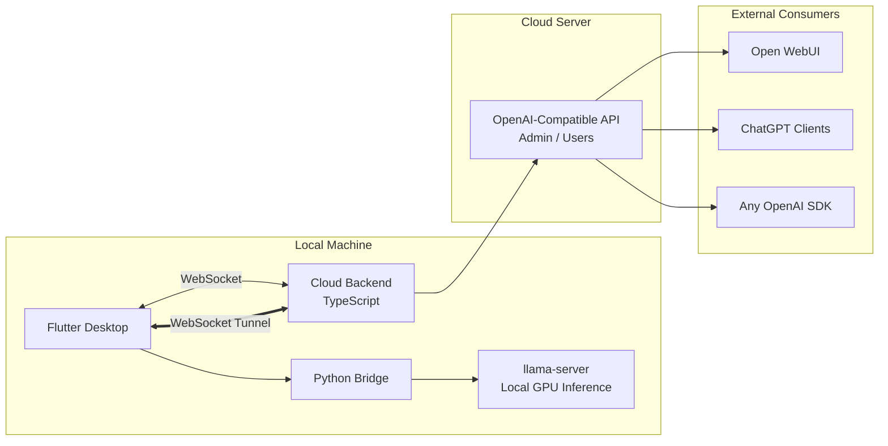

# OpenMyModel

> [**中文**](README.md) | **English**


> **Bring your local GPU compute to the cloud -- accessible via standard OpenAI API.**
>
> OpenMyModel seamlessly tunnels your locally running llama.cpp models to your own cloud server through WebSocket, exposing them as industry-standard OpenAI-compatible endpoints. Whether you are a solo developer with spare GPU cycles, a hobbyist who loves self-hosting, or an operator building private inference nodes for a small team -- OpenMyModel has everything you need. No public IP required, no complex ops: a single WebSocket tunnel turns your local model into a cloud API.
>
> #### Why Self-Host?
> Free online LLM platforms are everywhere, but nearly all serve aggressively quantized models -- a downgraded version of intelligence. I have tested this firsthand: **Qwen 3.5 9B at INT8** running on a consumer GPU consistently outperforms the so-called flagship free-tier online services on logic and mathematical reasoning tasks. Free APIs compress quality for cost at scale -- what you get is merely a shadow of the same model name. When you control precision and parameters yourself, every inference runs on real weights, and the difference exceeds expectations.
>
> #### Beyond Solo Use: Share and Monetize
> OpenMyModel was designed for more than personal use -- it is built for compute sharing. Distribute API keys to teammates, friends, or community users, with per-key quota management and usage tracking. Idle GPUs are no longer sunk cost: start monetizing spare compute with a single `sk-` key.

**Tunnel local llama.cpp compute to the cloud via WebSocket, exposed as an OpenAI-compatible API.**

> Your GPU, your model, your API service -- no public IP needed.

---

## Architecture



### Three Components

| Component | Stack | Role |
|-----------|-------|------|
| **Flutter Desktop** | Flutter + Dart | UI / llama-server management / API Key management (local-only, no cloud storage) / Chat interface |
| **Python Bridge** | Python | Process management / llama-server lifecycle / WebSocket tunnel client |
| **Cloud Backend** | TypeScript + Node.js | WebSocket server / Request transparent proxying to llama-server / CLI management |

---

## Key Features

- **Local GPU Inference**: Full llama.cpp parameter control, Q8 cache, GPU acceleration
- **WebSocket Tunnel**: No public IP needed -- home lab goes cloud
- **Local-Only Key Management**: API keys stored exclusively on your machine, zero cloud storage -- no leaks
- **OpenAI-Compatible API**: `/v1/chat/completions`, `/v1/models`, SSE streaming
- **Multimodal Support**: mmproj vision projector, image understanding
- **Built-in Chat**: Multi-image upload + text, streaming responses
- **Parameter Profiles**: Save multiple inference configs, switch with one click
- **Chinese CLI**: Wizard-driven command-line setup for the cloud backend
- **Real-Time Status**: llama-server health and cloud connection status tracked live

---

## Quick Start

### Prerequisites

- **Flutter** 3.x+ (Windows/macOS/Linux)
- **Python** 3.10+ (conda virtual env recommended)
- **Node.js** 18+ (cloud backend)
- **llama.cpp** compiled `llama-server` binary
- **GGUF model files** (e.g., Qwen 3.5 9B Q8) + optional mmproj

### 1. Frontend (Windows)

```bash
cd frontend
flutter pub get
flutter run -d windows
```

### 2. Python Bridge

```bash
cd python
conda activate myenv
pip install -r requirements.txt
python bridge_server.py
```

### 3. Cloud Backend

```bash
cd backend
npm install
npm run dev
```

### 4. CLI Management

```bash
cd backend
npx ts-node src/cli.ts
```

---

## Security Design

```
API Key Validation Flow:
  User Request -> Cloud Backend -> Extract API Key
                                 -> Look up WebSocket node
                                 -> Send { action: "validate_key", key: "sk-xxx" }
                                 -> Flutter Frontend validates locally
                                 -> Returns validation result
                                 -> If passed, transparently proxy to llama-server

Core principle: Cloud backend NEVER stores API keys.
All key management is controlled by the compute provider.
```

---

## Usage Examples

### Configure Open WebUI

- **API URL**: `https://your-domain/v1`
- **API Key**: An `sk-` prefixed key generated in the desktop app

### curl Test

```bash
curl https://your-domain/v1/chat/completions \
  -H "Content-Type: application/json" \
  -H "Authorization: Bearer sk-your-key" \
  -d '{"model":"qwen","messages":[{"role":"user","content":"Hello!"}]}'
```

---

## License

MIT License -- see [LICENSE](LICENSE)

---

## Acknowledgments

- [llama.cpp](https://github.com/ggerganov/llama.cpp) -- GGUF inference engine
- [Open WebUI](https://github.com/open-webui/open-webui) -- Chat frontend reference
- [unsloth](https://github.com/unslothai/unsloth) -- Parameter design inspiration
