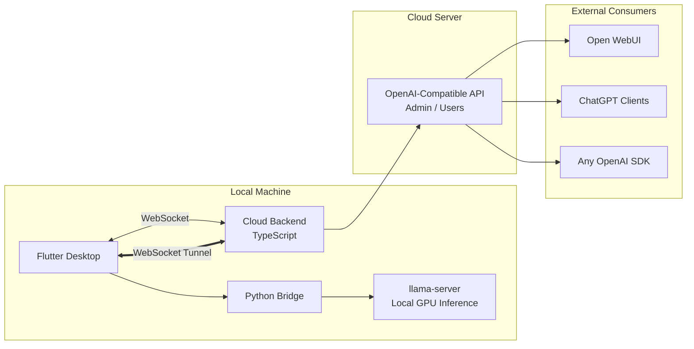

# OpenMyModel

> [**中文**](README.md) | **English**


> **Bring your local GPU compute to the cloud -- accessible via standard OpenAI API.**
>
> OpenMyModel seamlessly tunnels your locally running llama.cpp models to your own cloud server through WebSocket, exposing them as industry-standard OpenAI-compatible endpoints. Whether you are a solo developer with spare GPU cycles, a hobbyist who loves self-hosting, or an operator building private inference nodes for a small team -- OpenMyModel has everything you need. No public IP required, no complex ops: a single WebSocket tunnel turns your local model into a cloud API.
>
> #### Why Self-Host?
> Free online LLM platforms are everywhere, but nearly all serve aggressively quantized models -- a downgraded version of intelligence. I have tested this firsthand: **Qwen 3.5 9B at INT8** running on a consumer GPU consistently outperforms the so-called flagship free-tier online services on logic and mathematical reasoning tasks. Free APIs compress quality for cost at scale -- what you get is merely a shadow of the same model name. When you control precision and parameters yourself, every inference runs on real weights, and the difference exceeds expectations.
>
> #### Beyond Solo Use: Share and Monetize
> OpenMyModel was designed for more than personal use -- it is built for compute sharing. Distribute API keys to teammates, friends, or community users, with per-key quota management and usage tracking. Idle GPUs are no longer sunk cost: start monetizing spare compute with a single `sk-` key.

**Tunnel local llama.cpp compute to the cloud via WebSocket, exposed as an OpenAI-compatible API.**

> Your GPU, your model, your API service -- no public IP needed.

---

## Architecture



### Three Components

| Component | Stack | Role |
|-----------|-------|------|
| **Flutter Desktop** | Flutter + Dart | UI / llama-server management / API Key management (local-only, no cloud storage) / Chat interface |
| **Python Bridge** | Python | Process management / llama-server lifecycle / WebSocket tunnel client |
| **Cloud Backend** | TypeScript + Node.js | WebSocket server / Request transparent proxying to llama-server / CLI management |

---

## Key Features

- **Local GPU Inference**: Full llama.cpp parameter control, Q8 cache, GPU acceleration
- **WebSocket Tunnel**: No public IP needed -- home lab goes cloud
- **Local-Only Key Management**: API keys stored exclusively on your machine, zero cloud storage -- no leaks
- **OpenAI-Compatible API**: `/v1/chat/completions`, `/v1/models`, SSE streaming
- **Multimodal Support**: mmproj vision projector, image understanding
- **Built-in Chat**: Multi-image upload + text, streaming responses
- **Parameter Profiles**: Save multiple inference configs, switch with one click
- **Chinese CLI**: Wizard-driven command-line setup for the cloud backend
- **Real-Time Status**: llama-server health and cloud connection status tracked live

---

## Quick Start

### Prerequisites

- **Flutter** 3.x+ (Windows/macOS/Linux)
- **Python** 3.10+ (conda virtual env recommended)
- **Node.js** 18+ (cloud backend)
- **llama.cpp** compiled `llama-server` binary
- **GGUF model files** (e.g., Qwen 3.5 9B Q8) + optional mmproj

### 1. Frontend (Windows)

```bash
cd frontend
flutter pub get
flutter run -d windows
```

### 2. Python Bridge

```bash
cd python
conda activate myenv
pip install -r requirements.txt
python bridge_server.py
```

### 3. Cloud Backend

```bash
cd backend
npm install
npm run dev
```

### 4. CLI Management

```bash
cd backend
npx ts-node src/cli.ts
```

---


## ☁️ Cloud Backend Deployment Guide (Baota Panel · Step-by-Step)

> **Goal**: Deploy OpenMyModel cloud backend on an Alibaba Cloud / Tencent Cloud server using the Baota panel -- purely via the web UI, no manual PM2 commands needed.
>
> Everything is done through Baota's "Node Projects" and "Reverse Proxy" features.

### Prerequisites

| Condition | Details |
|-----------|---------|
| Server | Alibaba Cloud ECS / Tencent Cloud CVM, min 1 core 2 GB |
| OS | CentOS 7+ / Ubuntu 20.04+ / Debian 11+ |
| Domain | Registered, DNS pointing to server IP |
| Baota Panel | Installed and accessible |
| SSH | Root access (for uploading code) |

---

### Step 1: Install Software via Baota App Store

Login to Baota panel, left sidebar **"App Store"**, search and install the following (click "Install"):

| Software | Purpose | How to Install |
|----------|---------|----------------|
| **Nginx** | Reverse proxy (80/443 -> backend 3000) | App Store -> search Nginx -> click "Install" -> latest stable |
| **Node.js Version Manager** | Manage multiple Node.js versions | App Store -> search Node -> click "Install" |
| **PM2 Manager** | Process monitoring, start/stop via panel | App Store -> search PM2 -> click "Install" |

> **About PM2 Manager**: Baota's PM2 Manager independently manages projects across different Node.js versions through the panel. It works with Node.js Version Manager -- once you install Node, PM2 Manager auto-detects it.

---

### Step 2: Install Node.js

Baota panel, left sidebar **"App Store"**, find installed **"Node.js Version Manager"**, click **"Settings"**:

1. In the popup, you'll see a list of Node.js versions
2. Find **v22.x** (v22 LTS recommended), click **"Install"**
3. Wait for it to finish (status becomes "Installed")
4. Click **"Set as CLI Version"** for v22.x to make it the default

> If other versions (v16, v18) are already installed, that's fine -- they coexist. You can pick the version per project in Node Projects.

---

### Step 3: Cloud Security Group Configuration

Cloud provider console -> Security Groups -> Inbound Rules -> Add:

| Port | Protocol | Source | Purpose |
|------|----------|--------|---------|
| 80 | TCP | 0.0.0.0/0 | HTTP (Nginx public entry) |
| 443 | TCP | 0.0.0.0/0 | HTTPS (SSL, strongly recommended) |
| 22 | TCP | Your IP | SSH management |

> **Do NOT open port 3000 publicly!** Traffic flow:
>
> External request -> Nginx(80) -> reverse proxy -> 127.0.0.1:3000(backend)
>                                                   loopback only
>
> If you previously opened port 3000 publicly, remove that rule now.

---

### Step 4: Upload Backend Code

SSH into your server:

```bash
# Create working directory
mkdir -p /aiapi
cd /aiapi

# Clone the repo
git clone https://github.com/tianxingstarsky/OpenMyModel.git backend
cd backend/backend

# Install dependencies
npm install

# Compile TypeScript (CRITICAL!!!)
npm run build
```

> **You MUST run `npm run build`**: The source is TypeScript. `tsconfig.json` outputs CommonJS format. The compiled `dist/index.js` is the runnable file. Without building, you'll get `Cannot use import statement outside a module`.

Verify the build:
```bash
ls dist/
# Should contain: index.js  config.js  db/  routes/
head -3 dist/index.js
# Expected (CommonJS format):
# "use strict";
# var __importDefault = ...
# const fastify_1 = __importDefault(require("fastify"));
```

---

### Step 5: Start Backend via Baota "Node Projects" (Panel-Only, No Commands!)

#### 5.1 Navigate to Node Projects

Baota panel -> left sidebar **"Websites"** -> top tab bar click **"Node Projects"**:

```
[ Websites ]  [ Node Projects ]  [ ... ]
               ^^^^^^^^^^^^^^^^
               Click this tab
```

#### 5.2 Add a Node Project

Click the **"Add Node Project"** button (usually top-right of the list). Fill in the form:

**Project Directory**:
```
/aiapi/backend/backend
```
-> Click the "Select" button to browse, or paste the path directly.

**Startup Option**:
```
dist/index.js
```
-> Select "Startup File" from the dropdown, enter `dist/index.js`
-> **NOT `src/index.ts`! Must be the compiled file in dist/!**

**Project Name**:
```
openmymodel
```
-> Custom name for identification in the panel.

**Port**:
```
3000
```

**Node Version**:
-> Select **v22.x** from the dropdown

**Notes** (optional):
```
OpenMyModel Cloud API Service
```

**Bind Domain**:
-> Leave empty for now (will configure via reverse proxy later)

**Auto-start on boot**:
-> ✅ Check this

Click **"Submit"** at the bottom.

#### 5.3 Start the Project

Back in the "Node Projects" list, find `openmymodel`:

| Name | Port | Status | Actions |
|------|------|--------|---------|
| openmymodel | 3000 | ● Stopped | [Start] [Restart] [Settings] [Delete] [Logs] |

Click **"Start"**. Status should change to **● Running**.

#### 5.4 Check Logs for Success

Click the **"Logs"** button on the `openmymodel` row. You should see:

```
╔══════════════════════════════════════════════╗
║  OpenMyModel Cloud API Started                ║
║  Address: http://0.0.0.0:3000                ║
║  Domain: aiapi.topofmoon.com                ║
║  WebSocket: /ws/node                         ║
║  API: /v1/chat/completions                   ║
║  Admin: /admin/*                             ║
╚══════════════════════════════════════════════╝
```

#### 5.5 Verify in PM2 Manager (optional)

Baota panel -> left sidebar **"App Store"** -> find **"PM2 Manager"** -> click **"Settings"**:

You'll see the `openmymodel` process listed as `online`. Baota has automatically managed it via PM2.

---

### Step 6: Initialize Configuration (Domain + Password)

The project is running but needs domain and password. Run via SSH:

```bash
cd /aiapi/backend/backend
npm run setup
```

Interactive wizard (Chinese prompts):

```
╔══════════════════════════════════════════════╗
║       OpenMyModel Cloud Backend - Setup       ║
╚══════════════════════════════════════════════╝

Domain: aiapi.topofmoon.com          <- Your domain (no http://)
Admin password: ********             <- Set a strong password (min 6 chars)
Confirm password: ********
Port [3000]:                         <- Press Enter for default 3000

╔══════════════════════════════════════════════╗
║          Setup Complete                       ║
║  Domain: aiapi.topofmoon.com                ║
║  Port: 3000                                  ║
║  Config: data/config.json                    ║
╚══════════════════════════════════════════════╝
```

> The password is stored as SHA-256 + salt hash in `data/config.json`. After setup, go back to Node Projects and click **"Restart"** to apply.

---

### Step 7: Create Website + Reverse Proxy (Exact Button-Level Steps!)

#### 7.1 Add a Website

Baota panel -> left sidebar **"Websites"** -> top tab **"Websites"** (default) -> click **"Add Site"** (green button):

Fill in:

| Field | Value |
|-------|-------|
| Domain | `aiapi.topofmoon.com` |
| Root Directory | `/www/wwwroot/aiapi` |
| PHP Version | **Static** |

Leave other fields as default, click **"Submit"**.

> If `/www/wwwroot/aiapi` doesn't exist, Baota creates it automatically.

#### 7.2 Open Site Settings

In the "Websites" list, find `aiapi.topofmoon.com`:

Click the domain name (or the **"Settings"** link on the right). A settings window pops up with tabs:

```
[ Domain ] [ SSL ] [ Reverse Proxy ] [ Config File ] [ Directory ] [ ... ]
```

#### 7.3 Add Reverse Proxy

Click **"Reverse Proxy"** tab -> click **"Add Reverse Proxy"** (green button):

Fill in:

| Field | Value |
|-------|-------|
| Proxy Name | `openmymodel` |
| Target URL | `http://127.0.0.1:3000` |
| Send Domain | `$host` |
| Content Replace | Leave empty |

Click **"Submit"**.

#### 7.4 Edit Config File (Add WebSocket Support -- Most Critical Step!)

Baota's auto-generated reverse proxy config **lacks WebSocket support**. You MUST add it manually.

In the site settings window, click the **"Config File"** tab. You'll see the Nginx configuration. Find the `location /` block.

Baota's auto-generated config looks something like:
```nginx
location / {
    proxy_pass http://127.0.0.1:3000;
    proxy_set_header Host $host;
    proxy_set_header X-Real-IP $remote_addr;
    ...
}
```

**Replace the entire `location /` block with**:
```nginx
location / {
    proxy_pass http://127.0.0.1:3000;
    proxy_http_version 1.1;

    # ===== WebSocket support (MANDATORY! Missing = instant disconnect) =====
    proxy_set_header Upgrade $http_upgrade;
    proxy_set_header Connection "upgrade";

    # Standard proxy headers
    proxy_set_header Host $host;
    proxy_set_header X-Real-IP $remote_addr;
    proxy_set_header X-Forwarded-For $proxy_add_x_forwarded_for;
    proxy_set_header X-Forwarded-Proto $scheme;

    # Timeouts for long-lived WebSocket connections
    proxy_read_timeout 3600s;
    proxy_send_timeout 3600s;

    # Disable buffering (required for SSE streaming)
    proxy_buffering off;

    # Upload limit
    client_max_body_size 50m;
}
```

> **This is the root cause of the "flash connect then disconnect" bug.** Baota's auto-generated config lacks the `Upgrade` and `Connection` headers. Without them, Nginx drops the WebSocket upgrade request, causing an instant disconnect.

After editing, click **"Save"** at the bottom-right of the config editor. Baota auto-reloads Nginx.

---

### Step 8: HTTPS / SSL Certificate (Strongly Recommended)

In the site settings window, click the **"SSL"** tab:

1. Certificate type: **"Let's Encrypt"**
2. Check your domain `aiapi.topofmoon.com`
3. Click **"Apply"**
4. Wait for completion
5. Enable **"Force HTTPS"**

> **After SSL, RE-CHECK the "Config File" tab!** Baota SSL sometimes overwrites your manual WebSocket config. Verify the `location /` block still has `proxy_set_header Upgrade $http_upgrade;` and `Connection "upgrade";`. If overwritten, redo Step 7.4.

---

### Step 9: Verify Deployment

#### 9.1 Browser Test

Visit `http://aiapi.topofmoon.com/` (or `https://`). Expected response:

```json
{"name":"OpenMyModel Cloud API","version":"1.0.0","domain":"aiapi.topofmoon.com","endpoints":{"models":"/v1/models","chat":"/v1/chat/completions","admin":"/admin/*","websocket":"/ws/node"}}
```

#### 9.2 WebSocket Test

```bash
npm install -g wscat
wscat -c ws://aiapi.topofmoon.com/ws/node

# Type in after connecting:
{"type":"auth","password":"your-admin-password"}

# Expected response:
{"type":"auth_ok","nodeId":"xxx-xxx","message":"Authentication successful, node registered"}
```

#### 9.3 Panel Verification

Go back to **"Websites" -> "Node Projects"**, `openmymodel` should be **● Running**.

---

### Step 10: Connect from Flutter Desktop App

Open the OpenMyModel desktop app -> **"Cloud Connection"** tab:

| Field | Value | Notes |
|-------|-------|-------|
| Server Address | `aiapi.topofmoon.com` | **No http://, no port number!** |
| Password | Your admin password from Step 6 | |

> **Why no port number?**
>
> `aiapi.topofmoon.com:3000` = direct to backend port 3000 = blocked by security group = timeout ❌
> `aiapi.topofmoon.com` = Nginx(80) = reverse proxy to 127.0.0.1:3000 = works ✅

**Success signs**: Status indicator turns green -> "Connected" -> API keys can be generated.

---

## 🐛 Troubleshooting (Real Battle Scars)

### PM2 / Node Projects

| Problem | Cause | Fix |
|---------|-------|-----|
| Project not found in PM2 Manager | You started it manually with `pm2 start` instead of via "Node Projects" | Delete the manual process in PM2 Manager, go back to Node Projects -> Add Node Project |
| `Cannot use import statement outside a module` | Startup file set to `src/index.ts` (source) | Change startup file to `dist/index.js`; run `npm run build` via SSH |
| `ERR_MODULE_NOT_FOUND: ./config` | Old ESM tsconfig residue | Re-run `npm run build` (now CommonJS) |

### WebSocket / Connection

| Problem | Cause | Fix |
|---------|-------|-----|
| Frontend connects then instantly disconnects | Nginx missing WebSocket proxy headers | Step 7.4 -> verify `Upgrade` and `Connection` headers exist |
| Browser shows JSON OK, but desktop app can't connect | HTTP works without WebSocket headers, WebSocket doesn't | Same as above -- only WebSocket exposes the missing config |
| Node Project running, but domain not responding | Wrong target URL in reverse proxy, or security group missing port 80 | Check target URL is `http://127.0.0.1:3000`; check security group |

### API Key

| Problem | Cause | Fix |
|---------|-------|-----|
| `HTTP 401: Invalid API Key` on test | Key not synced to current node | **Create a new key** in the desktop app, then test |
| Old keys don't work, new ones do | Node reconnection invalidates old mappings | Expected behavior -- generate a fresh key after reconnecting |
| Keys exist but always 401 | Key load timing race condition | Fixed in v0.3.1+; upgrade to latest |

### Network / Ports

| Problem | Cause | Fix |
|---------|-------|-----|
| Domain not responding | Security group missing port 80/443 | Cloud console -> Security Groups -> Add inbound rules |
| `wscat` timeout | DNS unresolved or security group issue | `ping your-domain` to verify |
| Nginx config not taking effect after save | Manual reload needed | Baota "Websites" -> Nginx service -> Reload Config |

---

## 🔄 Ongoing Maintenance (All in Baota Panel)

### Start / Stop / Restart

**Path**: Baota -> **"Websites"** -> **"Node Projects"** -> find `openmymodel`:

Click [Start] [Stop] [Restart] [Settings] [Delete] [Logs] buttons.

### View Logs

Click the **"Logs"** button for live runtime logs. Errors also show here.

### Change Configuration

**Change admin password** (via SSH):
```bash
cd /aiapi/backend/backend
npm run setup
# Select "Reset Password"
```
Then back in Node Projects page, click **"Restart"**.

**View current config**:
```bash
cat /aiapi/backend/backend/data/config.json
```
(Password is hashed, safe to view)

### Update Backend Code

```bash
cd /aiapi/backend/backend
git pull origin main
npm install
npm run build        # Must rebuild after every update!
```
Then back in Node Projects page, click **"Restart"**.

### Server Directory Structure

```
/aiapi/
└── backend/
    └── backend/              # Project root
        ├── dist/             # Compiled output (what actually runs)
        │   ├── index.js      # Entry point
        │   ├── config.js
        │   ├── db/
        │   └── routes/
        ├── data/
        │   ├── config.json   # Central config
        │   └── openmymodel.db # SQLite database
        ├── src/              # TypeScript source
        ├── node_modules/
        ├── package.json
        └── tsconfig.json
```

> 💡 Before reinstalling the OS, back up the `data/` directory -- it contains all configuration and database records.

---

### Full Nginx Config Reference

If the Baota config editor gets messy, replace everything with this template:

```nginx
server {
    listen 80;
    server_name aiapi.topofmoon.com;
    client_max_body_size 50m;

    location / {
        proxy_pass http://127.0.0.1:3000;
        proxy_http_version 1.1;
        proxy_set_header Upgrade $http_upgrade;
        proxy_set_header Connection "upgrade";
        proxy_set_header Host $host;
        proxy_set_header X-Real-IP $remote_addr;
        proxy_set_header X-Forwarded-For $proxy_add_x_forwarded_for;
        proxy_set_header X-Forwarded-Proto $scheme;
        proxy_read_timeout 3600s;
        proxy_send_timeout 3600s;
        proxy_buffering off;
    }
}
```

---

## Security Design

```
API Key Validation Flow:
  User Request -> Cloud Backend -> Extract API Key
                                 -> Look up WebSocket node
                                 -> Send { action: "validate_key", key: "sk-xxx" }
                                 -> Flutter Frontend validates locally
                                 -> Returns validation result
                                 -> If passed, transparently proxy to llama-server

Core principle: Cloud backend NEVER stores API keys.
All key management is controlled by the compute provider.
```

---

## Usage Examples

### Configure Open WebUI

- **API URL**: `https://your-domain/v1`
- **API Key**: An `sk-` prefixed key generated in the desktop app

### curl Test

```bash
curl https://your-domain/v1/chat/completions \
  -H "Content-Type: application/json" \
  -H "Authorization: Bearer sk-your-key" \
  -d '{"model":"qwen","messages":[{"role":"user","content":"Hello!"}]}'
```

---

## License

MIT License -- see [LICENSE](LICENSE)

---

## Acknowledgments

- [llama.cpp](https://github.com/ggerganov/llama.cpp) -- GGUF inference engine
- [Open WebUI](https://github.com/open-webui/open-webui) -- Chat frontend reference
- [unsloth](https://github.com/unslothai/unsloth) -- Parameter design inspiration
