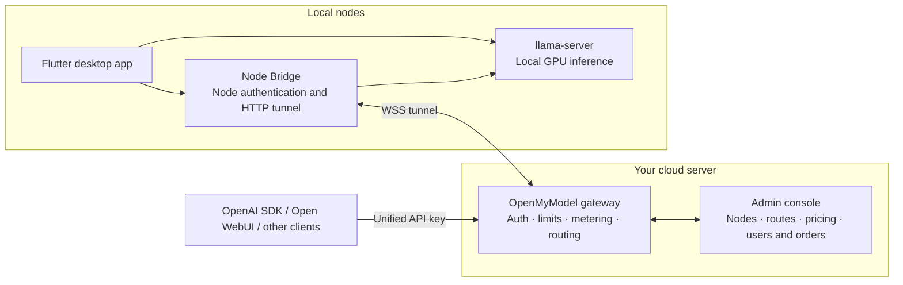

<p align="center">
  
</p>
<h1 align="center">OpenMyModel</h1>
<p align="center"><strong>Run models locally. Serve them through your own OpenAI-compatible cloud gateway.</strong></p>
<p align="center">Local inference · WebSocket tunnels · Multi-node routing · Usage metering</p>
<p align="center"><a href="README.md">中文</a>　|　English</p>

<p align="center"></p>
<p align="center"><sub>Dashboard captured in an isolated preview with two mock nodes and sample usage data.</sub></p>

---

OpenMyModel connects desktop <code>llama-server</code> instances to your cloud server through authenticated WebSocket tunnels. Nodes need no public IP. Clients use one OpenAI-compatible endpoint and gateway key while the server routes each request to an eligible node.

## Features

- **Local GPU inference** — The desktop app manages the bundled llama.cpp engine, model settings, chat and node connection. Windows releases include CPU, CUDA and Vulkan engines.
- **Protected nodes** — Each node has its own llama-server API key. The admin console stores it encrypted and supplies it to that node when routing requests.
- **Unified gateway and model routing** — Issue caller-facing gateway keys, map public model names to upstream names, and configure weighted routes across nodes.
- **OpenAI-compatible API** — <code>GET /v1/models</code> and <code>POST /v1/chat/completions</code>, including streaming SSE. Works with Open WebUI and OpenAI SDKs.
- **Personal and provider modes** — Personal mode has no end-user registration. Provider mode adds email-code accounts, user-owned keys, usage and orders, Alipay top-ups and token billing.
- **Usage and health** — Admin views summarize request volume, token usage and node health. The personal dashboard can show public aggregates without exposing node addresses, keys or conversation content.

## Admin console

<p align="center"></p>
<p align="center"><sub>Captured with a temporary local database. Usage and online nodes are sample data; no real user records or credentials are included.</sub></p>

## Architecture


```mermaid
flowchart LR
    subgraph Local["Local nodes"]
        UI["Flutter desktop app"] --> Engine["llama-server<br/>Local GPU inference"]
        UI --> Bridge["Node Bridge<br/>Node authentication and HTTP tunnel"]
        Bridge --> Engine
    end
    subgraph Cloud["Your cloud server"]
        Gateway["OpenMyModel gateway<br/>Auth · limits · metering · routing"]
        Admin["Admin console<br/>Nodes · routes · pricing · users and orders"]
        Gateway <--> Admin
    end
    Clients["OpenAI SDK / Open WebUI / other clients"] -->|"Unified API key"| Gateway
    Bridge <-->|"WSS tunnel"| Gateway
```

A node key protects the llama-server HTTP service on its machine. A gateway key identifies API callers for access control, rate limits and metering.

| Component | Role |
| --- | --- |
| Flutter desktop app | Manages the inference process, GGUF models, settings, local API keys and cloud connection |
| Node Bridge | Authenticated WebSocket tunnel between desktop and cloud; relays HTTP and SSE |
| Cloud backend | Node.js 22, Fastify and SQLite; model routing, API gateway, admin console and user portal |

## Quick start

### Download the desktop app

Download a Windows installer or archive from [GitHub Releases](https://github.com/tianxingstarsky/OpenMyModel/releases/latest). Windows 10 or later is supported. The inference engine is bundled; Python is not required.

### Run the desktop app from source

Requires Node.js 22+, stable Flutter with Dart 3.11+, CMake 3.28+, and the Visual Studio 2022 C++ toolchain.

```bash
npm --prefix scripts ci
cd frontend
flutter pub get
flutter run -d windows
```

### Start the cloud backend

Install Node.js 22+ on your server or development machine, initialize an administrator password, then start the backend:

```bash
cd backend
npm ci
npm run setup
npm run dev
```

The default port is <code>3000</code>. You may set <code>ADMIN_PASSWORD</code> before startup instead. Connect the desktop app from **Cloud Connection** with the server address and administrator password. Public deployments should use HTTPS/WSS.

## Modes and entry points

| Mode | How it works |
| --- | --- |
| Personal | No end-user sign-up. Admins create gateway keys at <code>/admin</code>. <code>/dashboard</code> shows aggregate usage; <code>/</code> shows public node status. Desktop-managed node keys can also access their corresponding node directly. |
| Service provider | Requires an HTTPS public base URL, SMTP and Alipay settings before activation. Users register and sign in with email codes, then manage their account, API keys, usage and orders, and top up from <code>/console</code>. |

Provider mode requires an SMTP host, sender account and password, plus the Alipay app ID, seller ID, RSA2 app private key and Alipay public key. The mode stays unavailable until all required settings are present. Admins configure input and output prices per million tokens; cached tokens have no separate price. Provider prebilling currently accepts text chat messages, and nodes need llama-server <code>/apply-template</code> and <code>/tokenize</code> endpoints.

## Use an OpenAI-compatible client

Create a gateway key in the admin console and set the server URL with <code>/v1</code>. Replace <code>qwen</code> with a public model name configured by the admin:

```bash
curl https://api.example.com/v1/chat/completions -H "Content-Type: application/json" -H "Authorization: Bearer sk-your-gateway-key" -d '{"model":"qwen","messages":[{"role":"user","content":"Hello"}]}'
```

For Open WebUI and compatible clients:

- **API URL:** <code>https://api.example.com/v1</code>
- **API key:** an <code>sk-</code> gateway key created by the admin

## Deploy the backend

### Docker Compose

Copy <code>.env.example</code> to <code>.env</code>, set a strong administrator password, then start from the repository root:

```bash
docker compose up -d --build
```

### Node.js with Nginx / Baota Panel

1. Clone the repository on a Linux server. In <code>backend/</code>, run <code>npm ci && npm run build</code>.
2. Run <code>backend/dist/index.js</code> with Node.js 22 on the default port <code>3000</code>. Configure a persistent data directory.
3. Reverse proxy to <code>http://127.0.0.1:3000</code>. Enable WebSocket Upgrade, disable proxy buffering and install an HTTPS certificate for public domains.
4. Run <code>npm run setup</code> before first launch. Preserve the data directory and server encryption key to retain node credentials and user data.

At minimum, the WebSocket proxy needs:

```nginx
proxy_http_version 1.1;
proxy_set_header Upgrade $http_upgrade;
proxy_set_header Connection "upgrade";
proxy_read_timeout 600s;
proxy_buffering off;
```

See [development, verification and release notes](docs/DEVELOPMENT.md) and the [verification record](docs/VERIFICATION.md) for setup and troubleshooting.

## Security and data

- Use HTTPS/WSS in production; do not connect remote nodes over plaintext HTTP/WebSocket.
- Node keys are encrypted at rest on the server. Gateway keys are stored as hashes and shown only once when created.
- Protect and back up the server database, encryption key file and data directory.
- Public pages expose aggregate status only; they do not return node IDs, names, addresses or keys.

## Development checks

```bash
npm --prefix scripts ci
npm --prefix scripts test
npm --prefix scripts run check:release
npm --prefix backend ci
npm --prefix backend run build
npm --prefix backend test
cd frontend
flutter analyze
flutter test
```

See [docs/DEVELOPMENT.md](docs/DEVELOPMENT.md) for Windows engine builds, packaging and troubleshooting.

## Acknowledgments and license

- [llama.cpp](https://github.com/ggml-org/llama.cpp) provides the GGUF inference engine.
- [Open WebUI](https://github.com/open-webui/open-webui) is an example OpenAI-compatible client.

This project is licensed under the [MIT License](LICENSE).