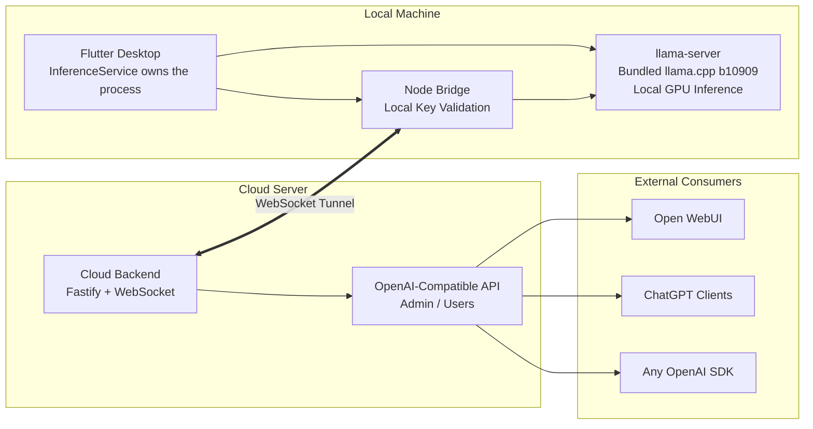

# OpenMyModel

> [**中文**](README.md) | **English**


> **Bring your local GPU compute to the cloud -- accessible via standard OpenAI API.**
>
> OpenMyModel seamlessly tunnels your locally running llama.cpp models to your own cloud server through WebSocket, exposing them as industry-standard OpenAI-compatible endpoints. Whether you are a solo developer with spare GPU cycles, a hobbyist who loves self-hosting, or an operator building private inference nodes for a small team -- OpenMyModel has everything you need. No public IP required, no complex ops: a single WebSocket tunnel turns your local model into a cloud API.
>
> #### Why Self-Host?
> Free online LLM platforms are everywhere, but nearly all serve aggressively quantized models -- a downgraded version of intelligence. I have tested this firsthand: **Qwen 3.5 9B at INT8** running on a consumer GPU consistently outperforms the so-called flagship free-tier online services on logic and mathematical reasoning tasks. Free APIs compress quality for cost at scale -- what you get is merely a shadow of the same model name. When you control precision and parameters yourself, every inference runs on real weights, and the difference exceeds expectations.
>
> #### Beyond Solo Use: Share and Monetize
> OpenMyModel was designed for more than personal use -- it is built for compute sharing. Distribute API keys to teammates, friends, or community users and enable, disable or delete them locally. Token quotas, billing and usage metering are not implemented; do not rely on this version for metered commercial service.

**Tunnel local llama.cpp compute to the cloud via WebSocket, exposed as an OpenAI-compatible API.**

> Your GPU, your model, your API service -- no public IP needed.

---

## Architecture


```mermaid
flowchart LR
    subgraph Local Machine
        A[Flutter Desktop<br/>InferenceService owns the process] --> C[llama-server<br/>Bundled llama.cpp b10909<br/>Local GPU Inference]
        A --> N[Node Bridge<br/>Local Key Validation]
        N --> C
    end

    subgraph Cloud Server
        D[Cloud Backend<br/>Fastify + WebSocket] --> E[OpenAI-Compatible API<br/>Admin / Users]
    end

    subgraph External Consumers
        E --> F[Open WebUI]
        E --> G[ChatGPT Clients]
        E --> H[Any OpenAI SDK]
    end

    D <== WebSocket Tunnel ==> N
```

### Components

| Component | Stack | Role |
|-----------|-------|------|
| **Flutter Desktop** | Flutter + Dart | UI / bundled llama-server process management (start, health check, stop) / API Key management (local-only, no cloud storage) / Chat connecting directly to the engine's OpenAI API |
| **Bundled Engine** | llama.cpp b10909 (pinned Git submodule) | Official OpenAI-compatible HTTP API; CPU/CUDA backends built from source, Vulkan backend from the official prebuilt archive (all SHA-256 verified), backend auto-selected per GPU -- no Python or any runtime installation required |
| **Node Bridge** | Node.js + ws | Desktop stdin/stdout control / local key validation / WebSocket HTTP tunnel |
| **Cloud Backend** | TypeScript + Node.js | WebSocket server / Request transparent proxying to llama-server / CLI management |

> Historical note: earlier versions managed llama-server through a local Python HTTP
> bridge. The desktop app now manages the engine process directly via Dart
> (`InferenceService`) and requires no Python; the legacy bridge code has been
> removed from the repository (see Git history for the old implementation).

---

## Key Features

- **Bundled Inference Engine**: llama.cpp b10909 ships with the app (CPU/CUDA built from source + Vulkan official prebuilt, all SHA-256 verified), ready to run with no Python installation; the backend is auto-selected per hardware, so NVIDIA, AMD and Intel GPUs all get GPU acceleration
- **Local GPU Inference**: full llama.cpp parameter surface (GPU layers auto/all, `--fit` VRAM adaptation, KV cache quantization, tri-state Flash Attention)
- **WebSocket Tunnel**: No public IP needed -- home lab goes cloud; bounded exponential reconnect after drops, no auto-reconnect after a manual disconnect
- **Local Key Storage**: Keys are persisted locally, not in the cloud database. Validation still passes through the cloud and tunnel; use HTTPS/WSS and protect local user data.
- **OpenAI-Compatible API**: `/v1/chat/completions`, `/v1/models`, SSE streaming; `reasoning_content` from thinking models is displayed separately in the chat UI
- **Multimodal Support**: mmproj vision projector, image understanding
- **Built-in Chat**: Multi-image upload + text, streaming responses, stop-generation cuts the underlying connection
- **Parameter Profiles**: Saved locally (compatible with profile files exported by older versions), switch with one click
- **Chinese CLI**: Wizard-driven command-line setup for the cloud backend
- **Real-Time Status**: Engine start/loading/ready/error states and cloud connection status tracked live

---

## Quick Start

### Prerequisites

- **Desktop (release package)**: Windows 10+, no Python installation required; CPU/CUDA/Vulkan engines are bundled and the backend is auto-selected per GPU
- **Building the desktop from source**: Flutter 3.x+, CMake 3.28+, Visual Studio 2022 C++ toolset (CUDA backend additionally needs the CUDA toolkit; Vulkan backend needs the Vulkan SDK)
- **Node.js** 22+ (cloud backend and local cloud tunnel)
- **GGUF model files** (e.g., Qwen 3.5 9B Q8) + optional mmproj

### 1. Desktop (Windows)

```bash
npm --prefix scripts ci            # cloud Node bridge dependency
cd frontend
flutter pub get
flutter run -d windows
```

Build engines from source into `artifacts/engine/` (the packager collects them automatically):

```bash
python scripts/build_llama_windows.py --backends cpu,cuda
python scripts/fetch_official_engine.py --backend vulkan   # official prebuilt when no Vulkan SDK
```

### 2. Cloud Backend

```bash
cd backend
npm ci
npm run setup                      # Configure admin password before first launch
npm run dev
```

### 3. CLI Management

```bash
cd backend
npm run setup
```

---


## ☁️ Cloud Backend Deployment Guide (Baota Panel)

> Deploy the OpenMyModel backend on a cloud server using Baota Panel in three steps.

### Prerequisites

- Cloud server (1 core 2 GB min) + domain with DNS pointing to server IP
- Baota Panel installed
- Security group: ports 80/443 open
- App Store installed: **Nginx**, **Node.js Version Manager**, **PM2 Manager**

---

### Step 1: Build on Server

```bash
ssh root@your-server
cd /aiapi
git clone https://github.com/tianxingstarsky/OpenMyModel.git backend
cd backend/backend

npm install
npm run build
```

> ⚠️ `npm install` MUST run on the server (better-sqlite3 is a native C++ module).
> If `NODE_MODULE_VERSION` error: `rm -rf node_modules && npm install`

---

### Step 2: Baota Node Project

"Websites" -> "Node Projects" -> Add Project:

| Setting | Value |
|---------|-------|
| Project Dir | `/aiapi/backend/backend` |
| Startup File | `dist/index.js` |
| Project Name | `openmymodel` |
| Port | `3000` |

**Critical**: Select **v22.x** in the Node version dropdown.

Before the first launch, set `ADMIN_PASSWORD` in the process environment or run `npm run setup` in `backend/`. Passwords are never printed to logs.

> Existing `data/config.json` is preserved. Changing the environment does not replace an existing password; use `npm run setup` to reset it without deleting the database.

---

### Step 3: Reverse Proxy

"Websites" -> "Reverse Proxy" tab -> Add:

| Setting | Value |
|---------|-------|
| Domain | `api.your-domain.com` |
| Target URL | `http://127.0.0.1:3000` |
| Send Domain | `$host` |

Then edit the site's Nginx config, ensure the `location /` block has:

```nginx
proxy_http_version 1.1;
proxy_set_header Upgrade $http_upgrade;
proxy_set_header Connection "upgrade";
proxy_read_timeout 600s;
proxy_buffering off;
```

And add before the `server` block:

```nginx
map $http_upgrade $connection_upgrade {
    default upgrade;
    ''      close;
}
```

---

### Verify

Visit `http://your-domain/` — should return JSON.

---

### Update

```bash
cd /aiapi/backend/backend
git pull && npm install && npm run build
```
Then click "Restart" in Baota Node Projects.

---

### Common Issues

| Problem | Cause | Fix |
|---------|-------|-----|
| Crashes on start | Source not compiled / wrong Node version | `npm run build`, select v22 |
| `NODE_MODULE_VERSION` | node_modules from wrong platform | `rm -rf node_modules && npm install` |
| WebSocket disconnects | Missing Upgrade header in Nginx | Add `proxy_set_header Upgrade $http_upgrade;` |
| Domain unreachable | Wrong target IP in proxy | Must be `http://127.0.0.1:3000` not `172.0.0.1` |
| API Key 401 | Key is disabled or its owning node is offline | Check the original key's node and enabled state; do not regenerate blindly |
| First launch refused | No admin password configured | Set `ADMIN_PASSWORD` or run `npm run setup` |
| Bridge protocol error | Desktop/cloud version mismatch | Update both cloud backend and desktop Node bridge |


---

## Security Design

```
API Key Validation Flow:
  User Request -> Cloud Backend -> Extract API Key
                                 -> Look up WebSocket node
                                 -> Send { action: "validate_key", key: "sk-xxx" }
                                 -> Local Node bridge checks keys supplied by Flutter
                                 -> Returns validation result
                                 -> If passed, transparently proxy to llama-server

Core principle: Cloud backend NEVER stores API keys.
All key management is controlled by the compute provider.
```

---

## Usage Examples

### Configure Open WebUI

- **API URL**: `https://your-domain/v1`
- **API Key**: An `sk-` prefixed key generated in the desktop app

### curl Test

```bash
curl https://your-domain/v1/chat/completions \
  -H "Content-Type: application/json" \
  -H "Authorization: Bearer sk-your-key" \
  -d '{"model":"qwen","messages":[{"role":"user","content":"Hello!"}]}'
```

---

## Development and releases

See [development, testing and packaging notes](docs/DEVELOPMENT.md) for the relay protocol, bundled engine builds, troubleshooting, automated tests and traceable Windows packaging. Update the cloud backend and desktop Node bridge together; old bridges cannot report upstream HTTP status correctly.

```bash
npm --prefix scripts ci
npm --prefix scripts test
npm --prefix scripts run check:release
npm --prefix backend ci
npm --prefix backend run build
npm --prefix backend test
cd frontend && flutter analyze && flutter test && flutter build windows --release
python scripts/build_llama_windows.py --backends cpu,cuda   # bundled engine source build
python scripts/package_windows.py --output artifacts/OpenMyModel-win-x64-<rev>
```

For Docker, copy `.env.example` to `.env`, set a strong password, then run `docker compose up -d --build`. Public deployments require TLS at the reverse proxy and an `https://` desktop server URL; the bundled nginx example does not supply certificates.

## License

MIT License -- see [LICENSE](LICENSE)

---

## Acknowledgments

- [llama.cpp](https://github.com/ggerganov/llama.cpp) -- GGUF inference engine
- [Open WebUI](https://github.com/open-webui/open-webui) -- Chat frontend reference
- [unsloth](https://github.com/unslothai/unsloth) -- Parameter design inspiration
