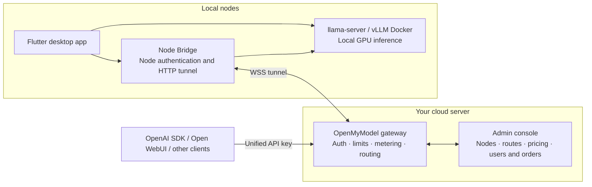

<p align="center">
  
</p>
<h1 align="center">OpenMyModel</h1>
<p align="center"><strong>Run models locally. Serve them through your own OpenAI-compatible cloud gateway.</strong></p>
<p align="center">Local inference · WebSocket tunnels · Multi-node routing · Usage metering</p>
<p align="center"><a href="README.md">中文</a>　|　English</p>

<p align="center"></p>
<p align="center"><sub>Dashboard captured in an isolated preview with two mock nodes and sample usage data.</sub></p>

---

OpenMyModel connects local inference nodes to your cloud server through authenticated WebSocket tunnels. The Windows desktop app runs <code>llama-server</code>; the Linux desktop app can manage an NVIDIA vLLM node through Docker, and Linux servers can run a headless node package. Nodes need no public IP. Clients use one OpenAI-compatible endpoint and gateway key while the server routes each request to an eligible node.

## Features

- **Local GPU inference** — The Windows desktop app manages llama.cpp (CPU, CUDA and Vulkan); the Linux desktop app manages NVIDIA vLLM through Docker and accepts Hugging Face model IDs or local model directories.
- **Protected nodes** — Each node has its own API key. The admin console stores it encrypted and supplies it to that node when routing requests.
- **Unified gateway and model routing** — Issue caller-facing gateway keys, map public model names to upstream names, and configure weighted routes across nodes.
- **OpenAI-compatible API** — <code>GET /v1/models</code> and <code>POST /v1/chat/completions</code>, including streaming SSE. Works with Open WebUI and OpenAI SDKs.
- **Personal, provider and relay-only modes** — Provider mode adds email-code accounts, user-owned keys, Alipay top-ups and token billing. Relay-only mode routes each account only to its own nodes, with free or monthly subscription billing.
- **Usage and health** — Admin views summarize request volume, token usage and node health. The personal dashboard can show public aggregates without exposing node addresses, keys or conversation content.

## Admin console

<p align="center"></p>
<p align="center"><sub>Captured with a temporary local database. Usage and online nodes are sample data; no real user records or credentials are included.</sub></p>

## Illustrated setup guide

Follow these steps in order: start a node, connect it to the server, configure model routes, create a gateway key, then connect a client and review usage. Node names, model names, prices and usage shown below are demonstration data; replace them with your own values.

### 1. Start a local model

On Windows, open the desktop app, choose an inference engine, model directory and GGUF file, then click **Start Model**. Expand the inference settings to tune context length, GPU layers and other options.

On Linux, install the vLLM desktop node manager. The default image is the official <code>vllm/vllm-openai:v0.30.0</code> NVIDIA CUDA image. Install Docker Engine and NVIDIA Container Toolkit first, and verify Docker can access the GPU. In the app, enter a Hugging Face model ID (for example <code>Qwen/Qwen3-8B</code>) or select a local model directory. Set the served model name, context length, concurrency, port and node API key; add a Hugging Face token for gated models. Click **Start Model** and wait for the model to load. The first image and model downloads can take time and disk space.

<p align="center"></p>
<p align="center"><sub>Settings screen captured in an Ubuntu test session. The node key is hidden; this screenshot does not connect to a server or start a model.</sub></p>

Build Linux x86_64 packages from source:

```bash
npm ci --prefix scripts
python3 scripts/package_linux.py --output dist/linux --format both --node "$(command -v node)"
```

Install the Debian package from the repository root:

```bash
sudo apt install ./dist/linux/openmymodel_1.0.0-1_amd64.deb
```

Or extract and launch the portable archive:

```bash
tar -xzf dist/linux/openmymodel-1.0.0-linux-x86_64.tar.gz
./openmymodel/openmymodel
```

You can also start OpenMyModel from the applications menu and connect it to your server as on Windows. vLLM listens only on the local loopback address; the desktop cloud connector carries requests through the authenticated tunnel. This package targets Linux x86_64. Running vLLM also requires Docker configured to use an NVIDIA GPU; the app does not bundle Docker, CUDA drivers or model weights.

<p align="center"></p>

To let the server access this node securely, set a node API key in the inference settings and restart the model. You will enter the same key in the server console in the next step. This key protects the node's llama-server HTTP API; it is not the unified gateway key given to OpenAI clients.

### 2. Connect the desktop node to your server

Open **Cloud Connection** in the desktop app, enter your deployed server address and administrator password, then click **Connect**. Use an HTTPS URL for a public service. After the tunnel connects, the desktop node appears under **Nodes** in the admin console. Never give the administrator password to API clients.

<p align="center"></p>
<p align="center"><sub>This image shows where to find the connection settings; the model and cloud were disconnected when it was captured. Start the model, enter your own server address and click **Connect** when following the steps.</sub></p>

The local API key manager on this desktop page is for direct access to the node. Those keys stay on the desktop and do not provide server-side token metering. Use a gateway key when you need unified routing, caller limits and server usage statistics.

### 3. Set the node key in the admin console

Open `https://your-domain/admin` in a browser and sign in with the administrator password. Go to **Nodes**, find the connected desktop node and click **Set** or **Replace**. Enter the exact same value configured for the desktop node API key. The page shows whether a key is configured, but never displays the full value again. Configure it once per node; all model routes for that node use this key.

<p align="center"></p>

The `smoke-node` name and node ID in this image are isolated demo data. In a real deployment, the desktop connection supplies the node name. A node must be online with its engine ready before it can serve traffic.

### 4. Configure a public model name and node routes

Open **Model Scheduling** and first create a public model name for callers, such as `chat-balanced`. Add a model remark and input/output prices in currency units per million tokens. You can leave prices at zero in personal mode. Set your billing rates before enabling sales in provider mode.

Next, add a node route: choose the public model and compute node, enter the model's actual name on that node, and set its weight. One public model can have several routes. Nodes can use different upstream model names and different node API keys while callers continue to use one public model name. The gateway schedules across available routes by weight and switches to another available node if one becomes unavailable.

<p align="center"></p>

### 5. Create a gateway API key

In personal mode, open **API Keys**. Enter a key name and optionally set a requests-per-minute limit, total token limit and allowed models, then click **Create Key**. The complete key is shown only once; copy it immediately to a secure password manager. The page later shows total requests, tokens and recent request frequency. You can edit limits or revoke a key.

<p align="center"></p>

This gateway key is the client credential and is separate from the desktop node key: callers receive the gateway key, while the server uses its stored node key when it calls llama-server.

### 6. Connect a client and send a request

In Open WebUI or another OpenAI-compatible client, enter:

- **API URL:** `https://your-domain/v1`
- **API key:** the `sk-` gateway key you just created
- **Model:** the public model name from step 4, such as `chat-balanced`

You can also verify with `curl`. Replace the domain, key and model with your own values:

```bash
curl https://api.example.com/v1/chat/completions \
  -H "Content-Type: application/json" \
  -H "Authorization: Bearer sk-your-gateway-key" \
  -d '{"model":"chat-balanced","messages":[{"role":"user","content":"Hello. Please introduce yourself briefly."}]}'
```

Streaming clients use the same URL and key. After a successful request, review request frequency and input/output tokens under **Usage** in the admin console. In personal mode, `/dashboard` shows public aggregates and `/` shows public node status.

### Provider mode: enable accounts, billing and user consoles

In **System Settings**, an administrator must configure an HTTPS public base URL, SMTP host/port/username/sender/password, Alipay app ID and seller ID, the RSA2 app private key, and the Alipay public key. Save all required settings before selecting **Provider mode**. Provider mode cannot be activated while any required field is missing. The server encrypts stored secrets and does not return the saved private key or SMTP password to the browser.

<p align="center"></p>

After activation:

1. Set input and output prices for each model in **Model Scheduling**, in currency units per million tokens. Cached tokens do not have separate pricing yet.
2. Users open `https://your-domain/console`, register or sign in with an email verification code, and manage their own usage, orders, top-ups and API keys.
3. Users call `/v1` with their own API keys. Admins can review users and orders under **Users & Orders**, and inspect platform request and token activity under **Usage**.

Provider-mode prebilling currently supports text chat messages. llama.cpp nodes use `/apply-template` and `/tokenize`; vLLM nodes use its chat `/tokenize` endpoint. Before opening registration and payments, test SMTP delivery and Alipay asynchronous notifications on the HTTPS domain.

### Relay-only mode: users bring their own nodes

An administrator selects **Relay-only mode** in **System Settings**. The free plan requires an HTTPS public URL and SMTP. Monthly subscriptions also require Alipay RSA2 settings, a subscription price and a request allowance. Accounts remain unavailable until the selected plan's required settings are complete. Relay-only mode does not charge input or output tokens and has no separate cached-token price; users and administrators can still review request, token and access-frequency statistics.

Users register or sign in at `https://your-domain/console`, create a node under **My Nodes**, and copy its one-time connector token. Paste the token into the desktop app's **Cloud Connection** page, or put it in `NODE_TOKEN` for a headless Linux node. The local inference engine should still use its own node API key: the relay connector token authenticates the tunnel, while the engine API key protects the local inference service.

Users create public aliases and add routes to one or more of their own nodes. Upstream model names can differ between nodes: an alias such as `team-chat` can route to `Qwen3-8B` on one node and `my-local-qwen` on another. Gateway keys reveal only that account's available aliases, and requests can reach only that account's online, ready nodes. Other accounts' models, nodes and local engine keys are outside its routing scope. Admins can review accounts, node counts, orders and platform statistics, but cannot read or edit the local engine key stored on a user's node.

## Architecture


```mermaid
flowchart LR
    subgraph Local["Local nodes"]
        UI["Flutter desktop app"] --> Engine["llama-server / vLLM Docker<br/>Local GPU inference"]
        UI --> Bridge["Node Bridge<br/>Node authentication and HTTP tunnel"]
        Bridge --> Engine
    end
    subgraph Cloud["Your cloud server"]
        Gateway["OpenMyModel gateway<br/>Auth · limits · metering · routing"]
        Admin["Admin console<br/>Nodes · routes · pricing · users and orders"]
        Gateway <--> Admin
    end
    Clients["OpenAI SDK / Open WebUI / other clients"] -->|"Unified API key"| Gateway
    Bridge <-->|"WSS tunnel"| Gateway
```

A node key protects the inference service on its machine. A gateway key identifies API callers for access control, rate limits and metering. Since vLLM API keys protect only some API paths, the Linux app binds its local port to loopback and exposes it through the cloud tunnel.

| Component | Role |
| --- | --- |
| Flutter desktop app | Manages llama.cpp on Windows and a vLLM Docker container on Linux; both provide chat and cloud connection |
| Node Bridge | Authenticated WebSocket tunnel between desktop and cloud; relays HTTP and SSE |
| Cloud backend | Node.js 22, Fastify and SQLite; model routing, API gateway, admin console and user portal |

## Quick start

### Download the desktop app

Download a Windows installer or archive from [GitHub Releases](https://github.com/tianxingstarsky/OpenMyModel/releases/latest). Windows 10 or later is supported; the llama.cpp engine is bundled and Python is not required. Linux users can build the vLLM desktop package with the command above; Docker and NVIDIA Container Toolkit must be installed on the host.

### Run the desktop app from source

Windows development requires Node.js 22+, stable Flutter, CMake 3.28+ and the Visual Studio 2022 C++ toolchain. Linux desktop builds require stable Flutter, CMake, Ninja, GTK 3 development libraries and Node.js 22+.

```bash
npm --prefix scripts ci
cd frontend
flutter pub get
flutter run -d windows
```

### Start the cloud backend

Install Node.js 22+ on your server or development machine, initialize an administrator password, then start the backend:

```bash
cd backend
npm ci
npm run setup
npm run dev
```

The default port is <code>3000</code>. You may set <code>ADMIN_PASSWORD</code> before startup instead. Connect the desktop app from **Cloud Connection** with the server address and administrator password. Public deployments should use HTTPS/WSS.

## Modes and entry points

| Mode | How it works |
| --- | --- |
| Personal | No end-user sign-up. Admins create gateway keys at <code>/admin</code>. <code>/dashboard</code> shows aggregate usage; <code>/</code> shows public node status. Desktop-managed node keys can also access their corresponding node directly. |
| Service provider | Requires an HTTPS public base URL, SMTP and Alipay settings before activation. Users register and sign in with email codes, then manage their account, API keys, usage and orders, and top up from <code>/console</code>. |
| Relay-only | Users register at <code>/console</code> and manage their own nodes, model aliases, routes and gateway keys. Requests go only to the user's own ready nodes. Token use is free or covered by a monthly request subscription. |

Provider mode requires an SMTP host, sender account and password, plus the Alipay app ID, seller ID, RSA2 app private key and Alipay public key. The mode stays unavailable until all required settings are present. Admins configure input and output prices per million tokens; cached tokens have no separate price. Provider prebilling currently accepts text chat messages; llama.cpp nodes use <code>/apply-template</code> and <code>/tokenize</code>, while vLLM nodes use its chat <code>/tokenize</code> endpoint.

## Use an OpenAI-compatible client

Create a gateway key in the admin console and set the server URL with <code>/v1</code>. Replace <code>qwen</code> with a public model name configured by the admin:

```bash
curl https://api.example.com/v1/chat/completions -H "Content-Type: application/json" -H "Authorization: Bearer sk-your-gateway-key" -d '{"model":"qwen","messages":[{"role":"user","content":"Hello"}]}'
```

For Open WebUI and compatible clients:

- **API URL:** <code>https://api.example.com/v1</code>
- **API key:** an <code>sk-</code> gateway key created by the admin

## Deploy the backend

### Linux vLLM compute node

The repository includes a headless Linux node package: Docker runs the official vLLM OpenAI server, while a small Connector joins your OpenMyModel server over HTTPS/WSS. This package targets Linux x86_64 with an NVIDIA GPU. vLLM does not natively support Windows, and the GPU, driver and vLLM image must meet [the official requirements](https://docs.vllm.ai/en/latest/getting_started/installation/gpu/). This node package does not install or launch the Windows desktop app and does not replace the cloud gateway.

Install Docker Engine, the Compose plugin and NVIDIA Container Toolkit on the Linux host, then confirm Docker can access the GPU. Clone this repository and run:

```bash
cd OpenMyModel/deploy/vllm-node
cp .env.example .env
chmod 600 .env
```

Edit <code>.env</code> and set <code>CLOUD_URL</code>. For a personal or provider shared node, set <code>ADMIN_PASSWORD</code>, a unique <code>NODE_ID</code> and readable <code>NODE_NAME</code>. For relay-only mode, create a node in the user's console, put its one-time connector token in <code>NODE_TOKEN</code>, and leave <code>ADMIN_PASSWORD</code>, <code>NODE_ID</code> and <code>NODE_NAME</code> empty. Choose exactly one credential method. Set a GPU-compatible <code>VLLM_MODEL</code>, its <code>PUBLIC_MODEL_NAME</code> and a long random <code>NODE_API_KEY</code>. Generate a key with <code>openssl rand -hex 32</code>. For gated Hugging Face models, also set <code>HF_TOKEN</code>.

Start the node:

```bash
docker compose up -d
docker compose logs -f vllm connector
```

The first run downloads the model; startup time depends on model size and network speed. The vLLM API stays on the private Compose network and is not published on a host port. vLLM's API key protects only some endpoints; utilities such as <code>/tokenize</code> are unauthenticated, so do not add a port mapping. See [vLLM security guidance](https://docs.vllm.ai/en/latest/usage/security.html#api-key-authentication-limitations). The Connector waits for the model to become ready, then establishes its tunnel. In personal or provider mode it uses the administrator credential and the node appears in the admin console; save its <code>NODE_API_KEY</code> there, then configure shared routes. In relay-only mode it uses the user's one-time node token. The node appears in that user's <code>/console</code>, where the user adds routes for the actual model name; the admin does not need or receive the local <code>NODE_API_KEY</code>.

The image is pinned to vLLM v0.30.0; change <code>VLLM_IMAGE</code> in <code>.env</code> to upgrade. GPU, driver, model and CUDA image combinations have different requirements, so check [vLLM GPU installation requirements](https://docs.vllm.ai/en/latest/getting_started/installation/gpu/) first. The [official vLLM releases](https://github.com/vllm-project/vllm/releases) list available versions and image tags. The default <code>VLLM_MAX_MODEL_LEN</code> is 8192; adjust it for the model, context needs and available GPU memory.

### Docker Compose

Copy <code>.env.example</code> to <code>.env</code>, set a strong administrator password, then start from the repository root:

```bash
docker compose up -d --build
```

### Node.js with Nginx / Baota Panel

1. Clone the repository on a Linux server. In <code>backend/</code>, run <code>npm ci && npm run build</code>.
2. Run <code>backend/dist/index.js</code> with Node.js 22 on the default port <code>3000</code>. Configure a persistent data directory.
3. Reverse proxy to <code>http://127.0.0.1:3000</code>. Enable WebSocket Upgrade, disable proxy buffering and install an HTTPS certificate for public domains.
4. Run <code>npm run setup</code> before first launch. Preserve the data directory and server encryption key to retain node credentials and user data.

At minimum, the WebSocket proxy needs:

```nginx
proxy_http_version 1.1;
proxy_set_header Upgrade $http_upgrade;
proxy_set_header Connection "upgrade";
proxy_read_timeout 600s;
proxy_buffering off;
```

See [development, verification and release notes](docs/DEVELOPMENT.md) and the [verification record](docs/VERIFICATION.md) for setup and troubleshooting.

## Security and data

- Use HTTPS/WSS in production; do not connect remote nodes over plaintext HTTP/WebSocket.
- Node keys are encrypted at rest on the server. Gateway keys are stored as hashes and shown only once when created.
- Protect and back up the server database, encryption key file and data directory.
- Public pages expose aggregate status only; they do not return node IDs, names, addresses or keys.

## Development checks

```bash
npm --prefix scripts ci
npm --prefix scripts test
npm --prefix scripts run check:release
npm --prefix backend ci
npm --prefix backend run build
npm --prefix backend test
cd frontend
flutter analyze
flutter test
```

See [docs/DEVELOPMENT.md](docs/DEVELOPMENT.md) for Windows engine builds, packaging and troubleshooting.

## Acknowledgments and license

- [llama.cpp](https://github.com/ggml-org/llama.cpp) provides the GGUF inference engine.
- [Open WebUI](https://github.com/open-webui/open-webui) is an example OpenAI-compatible client.

This project is licensed under the [MIT License](LICENSE).
