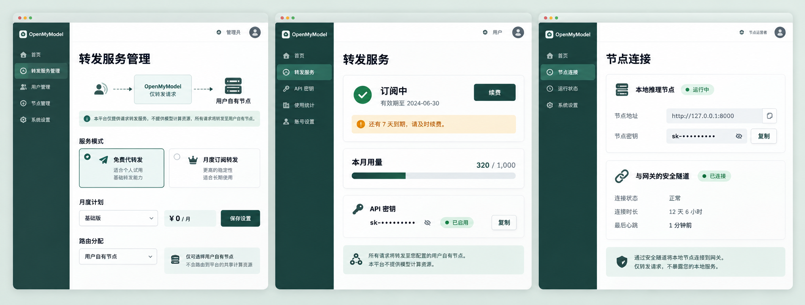
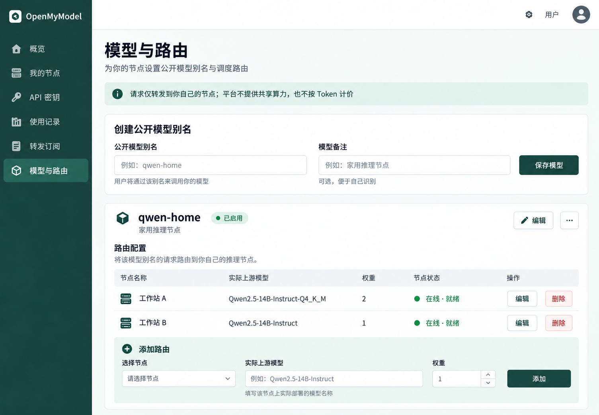
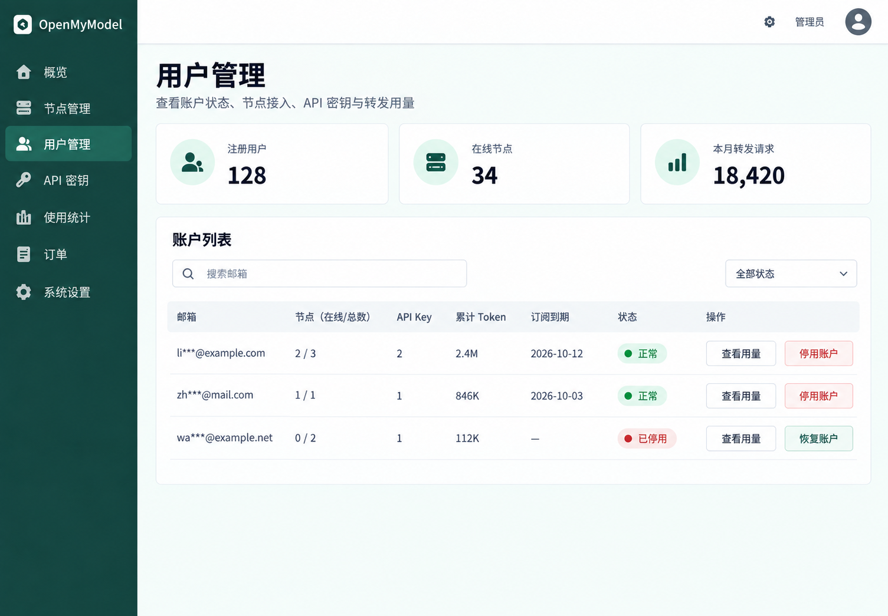

# Relay-only service mode

## Product boundary

Relay mode provides authenticated access to inference nodes owned and operated by each account holder. The gateway does not publish a shared compute pool, route one user's key to another user's node, or sell model tokens. It records requests and token counts for operational visibility. User API keys are scoped to the owner's configured model aliases and node routes.

This describes product behavior only; it does not make a legal or carrier-policy determination.

## Operating choices

- **Free forwarding**: no payment is required. Admin settings provide an optional monthly request ceiling; each user API key also has a per-minute limit.
- **Monthly subscription forwarding**: a successful Alipay order grants one month of access. Renewals are manual, and an early renewal begins after the current paid period. The admin sets the current price and optional request ceiling for each purchased month. Relay usage has no per-token charge.
- Both choices use email verification because users need an isolated account to enroll nodes and manage their own gateway keys. SMTP is required. Alipay configuration is required only for the paid choice.

## Isolation and lifecycle rules

1. A user creates a named node enrollment in their console. The server returns a high-entropy connector token once and permanently binds its hash to one node ID and one user.
2. The desktop app detects relay mode from the server's public configuration and asks for the node connector token instead of the administrator password. The token is distinct from the local model API key and from the caller-facing gateway API key.
3. Node credentials can be rotated or revoked. Revocation disconnects the live tunnel, disables routes to the node and takes effect on subsequent requests.
4. A user can route a public model alias only to their own enrolled nodes. Models and nodes owned by other users, and legacy admin-managed shared nodes, never appear as relay candidates.
5. Every gateway request checks account status and the selected billing mode. Subscription expiry and configured request ceilings are enforced before forwarding. Metered token counts remain visible, but relay request costs stay zero.
6. Existing personal/provider behavior remains isolated. In relay mode, admin-issued gateway keys and shared model routes are disabled.
7. Admins can change the active operating mode only when doing so will not strand an outstanding paid period or pending relay payment. Price/quota edits affect new purchases; each paid period stores its own price and ceiling snapshot.

## UI reference

The single generated reference sheet shows three different pages in one shared design system: admin relay mode/plan controls, the user's subscription and API usage, and the desktop node's protected local endpoint plus tunnel state.

Additional references cover the two detailed workflows not shown on that sheet: account-owned model routing and administrator user support.

Generated with the built-in imagegen tool. Prompt labels and component roles were specified explicitly; the image is a visual reference, not production UI copy.

The latest page prompts and the shared visual language are recorded in [relay-ui-prompts.md](relay-ui-prompts.md). They reuse the same deep teal sidebar, pale mint canvas, white cards, emerald states, restrained icons, and slate typography; each generated image represents a different page.
